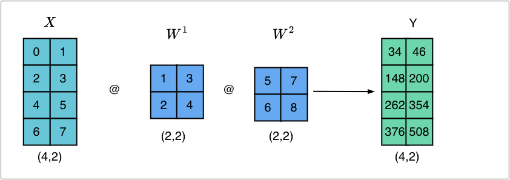
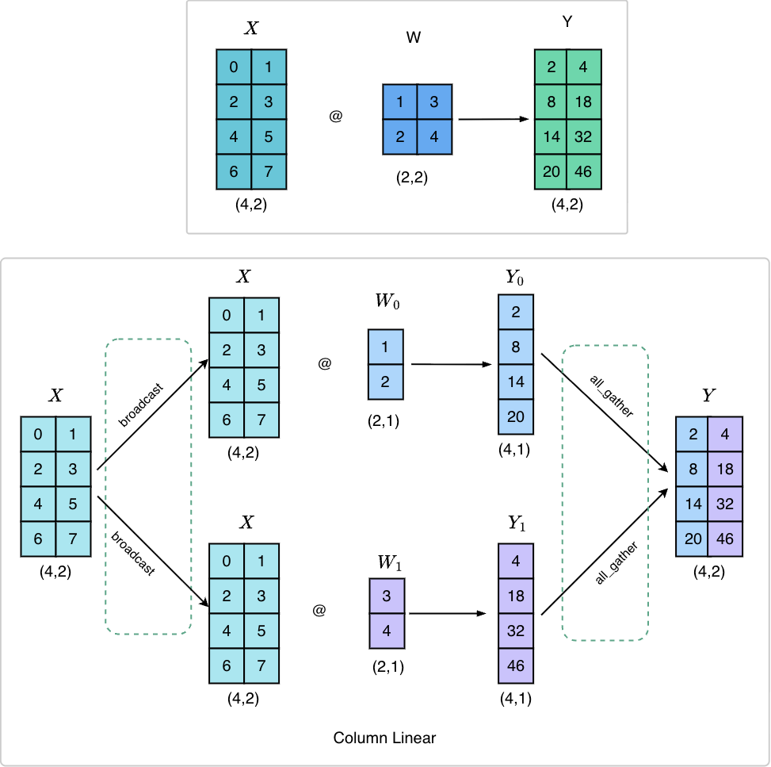
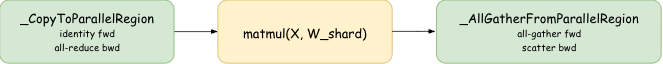
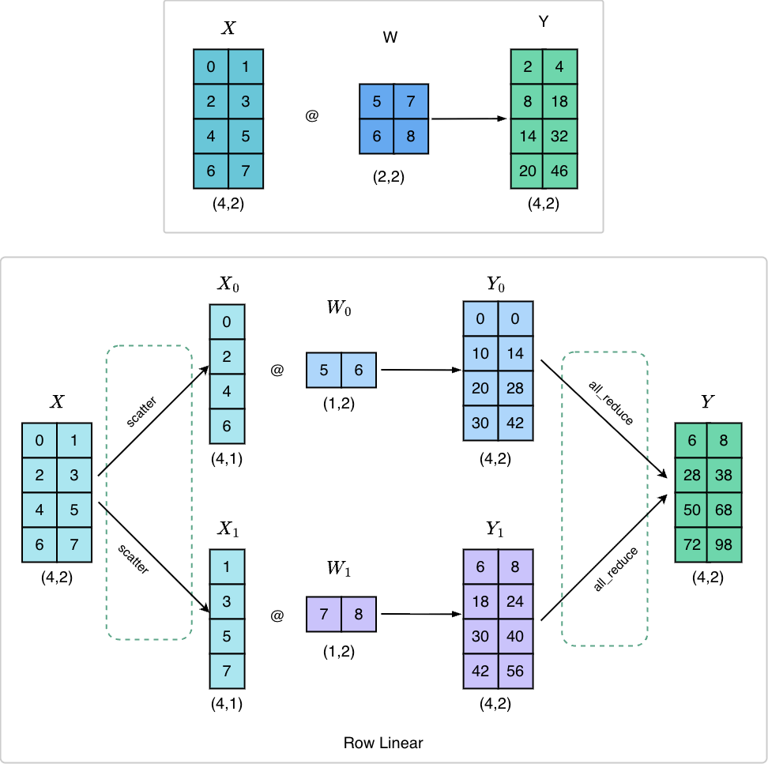
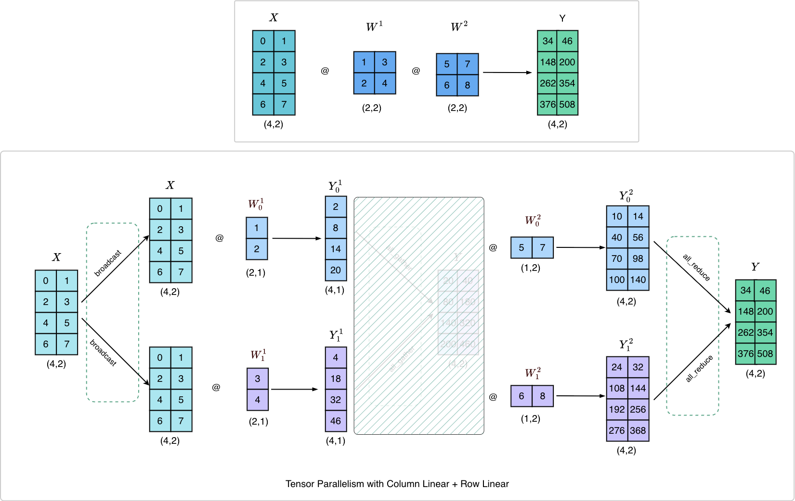

# Parallelism Strategies for Training Large Language Models

Understanding scaling LLM training - with concrete code, hand-drawn diagrams, and reproducible benchmarks.

> Inspired by the [Ultra-Scale Playbook](https://huggingface.co/spaces/nanotron/ultra-scale-playbook)
> by Hugging Face. Rewritten based on the HF blog with original implementations,
> diagrams, and numerical walkthroughs.

---

## Table of Contents

1. [High Level Overview](#high-level-overview)
2. [First Steps: Training on One GPU](#first-steps-training-on-one-gpu)
3. [Data Parallelism](#data-parallelism)
4. [Tensor Parallelism](#tensor-parallelism)
5. [Context Parallelism](#context-parallelism)
6. [Pipeline Parallelism](#pipeline-parallelism)
7. [Expert Parallelism](#expert-parallelism)
8. [5D Parallelism in a Nutshell](#5d-parallelism-in-a-nutshell)
9. [Finding the Best Training Configuration](#finding-the-best-training-configuration)
10. [Diving in the GPUs -- Fusing, Threading, Mixing](#diving-in-the-gpus----fusing-threading-mixing)
11. [Appendix](#appendix)

---


## High Level Overview

TODO


---


## First Steps: Training on One GPU

TODO

### Memory Usage in Transformers

TODO

### Activation Recomputation

TODO

### Gradient Accumulation

TODO


---


## Data Parallelism

TODO

### Revisit Global Batch Size

TODO

### Our Journey Up to Now

TODO

### ZeRO (Zero Redundancy Optimizer)

TODO


---


## Tensor Parallelism

When a model is too large for a single GPU, we split its weight matrices across multiple GPUs. This is **Tensor Parallelism (TP)**. But splitting matrices introduces a coordination problem - GPUs need to communicate to reassemble the correct result. The primitives that manage this communication are subtle, and the payoff for understanding them is a beautiful optimization: when we chain two layers together, an entire communication round disappears.

Tensor Parallelism leverages two fundamental properties of matrix multiplication $A \cdot B$:

$$\text{1. Column split:} \quad A \cdot B = A \cdot \begin{bmatrix} B_1 & B_2 & \cdots \end{bmatrix} = \begin{bmatrix} AB_1 & AB_2 & \cdots \end{bmatrix}$$

$$\text{2. Row split:} \quad A \cdot B = \begin{bmatrix} A_1 & A_2 & \cdots \end{bmatrix} \begin{bmatrix} B_1 \\\\ B_2 \\\\ \vdots \end{bmatrix} = \sum_{i=1}^n A_i B_i$$

We can compute a matrix product by either (1) multiplying each column of $B$ individually, or (2) multiplying each row individually and summing the results. Choosing column vs. row sharding requires different communication primitives.

We walk through TP step by step using concrete matrices on 2 GPUs: first Column-Parallel Linear, then Row-Parallel Linear, then both combined - revealing the cancellation that makes TP efficient in real Transformers.


### Setup: The Matrices



Every example uses the same input matrix $X$ and two weight matrices $W^1$ and $W^2$:

$$X = \begin{bmatrix} 0 & 1 \\\\ 2 & 3 \\\\ 4 & 5 \\\\ 6 & 7 \end{bmatrix}_{4 \times 2} \quad W^1 = \begin{bmatrix} 1 & 3 \\\\ 2 & 4 \end{bmatrix}_{2 \times 2} \quad W^2 = \begin{bmatrix} 5 & 7 \\\\ 6 & 8 \end{bmatrix}_{2 \times 2}$$

On a single GPU:

$$Y_1 = X \cdot W^1 = \begin{bmatrix} 2 & 4 \\\\ 8 & 18 \\\\ 14 & 32 \\\\ 20 & 46 \end{bmatrix} \qquad Y = Y_1 \cdot W^2 = \begin{bmatrix} 34 & 46 \\\\ 148 & 200 \\\\ 262 & 354 \\\\ 376 & 508 \end{bmatrix}$$

Our goal: get the same results when the weights are split across 2 GPUs.


### The Autograd Primitives

TP communication is implemented as `torch.autograd.Function` subclasses. Each one defines what happens in the forward pass and what happens in the backward pass, so gradients flow correctly through the distributed computation.

<details>
<summary><code>_CopyToParallelRegion</code> - identity in forward, all-reduce in backward (Click to expand)</summary>

Placed *before* column-parallel layers.

```python
class _CopyToParallelRegion(torch.autograd.Function):
    @staticmethod
    def forward(ctx, x):
        return x

    @staticmethod
    def backward(ctx, grad):
        dist.all_reduce(grad, op=dist.ReduceOp.SUM)
        return grad
```

</details>

<details>
<summary><code>_ReduceFromParallelRegion</code> - all-reduce in forward, identity in backward (Click to expand)</summary>

Placed *after* row-parallel layers to combine partial sums.

```python
class _ReduceFromParallelRegion(torch.autograd.Function):
    @staticmethod
    def forward(ctx, x):
        dist.all_reduce(x, op=dist.ReduceOp.SUM)
        return x

    @staticmethod
    def backward(ctx, grad):
        return grad
```

</details>

<details>
<summary><code>_ScatterToParallelRegion</code> - scatter in forward, all-gather in backward (Click to expand)</summary>

Placed *before* row-parallel layers to split the input across ranks.
Conjugate of `_AllGatherFromParallelRegion`.

```python
class _ScatterToParallelRegion(torch.autograd.Function):
    @staticmethod
    def forward(ctx, x):
        ws = dist.get_world_size()
        rank = dist.get_rank()
        ctx.ws = ws
        chunks = x.chunk(ws, dim=-1)
        return chunks[rank].contiguous()

    @staticmethod
    def backward(ctx, grad):
        gathered = [torch.zeros_like(grad) for _ in range(ctx.ws)]
        dist.all_gather(gathered, grad.contiguous())
        return torch.cat(gathered, dim=-1)
```

</details>

<details>
<summary><code>_AllGatherFromParallelRegion</code> - all-gather in forward, scatter in backward (Click to expand)</summary>

Placed *after* column-parallel layers to reconstruct full output.
Conjugate of `_ScatterToParallelRegion`.

```python
class _AllGatherFromParallelRegion(torch.autograd.Function):
    @staticmethod
    def forward(ctx, y):
        ws = dist.get_world_size()
        ctx.ws = ws
        gathered = [torch.zeros_like(y) for _ in range(ws)]
        dist.all_gather(gathered, y.contiguous())
        return torch.cat(gathered, dim=-1)

    @staticmethod
    def backward(ctx, grad):
        rank = dist.get_rank()
        chunks = grad.chunk(ctx.ws, dim=-1)
        return chunks[rank].contiguous()
```

</details>


### Column-Parallel Linear

**Key idea:** Split $W$ by *columns*. Each GPU holds a vertical slice. Every GPU receives the full input $X$, multiplies by its local shard, and produces a *slice* of the output.



$W^1$ is $(2,2)$. We split it by columns into two $(2,1)$ shards:

$$\text{GPU 0: } W^1_0 = \begin{bmatrix} 1 \\\\ 2 \end{bmatrix} \qquad \text{GPU 1: } W^1_1 = \begin{bmatrix} 3 \\\\ 4 \end{bmatrix}$$

Each GPU computes its local output:

$$\text{GPU 0: } X \cdot W^1_0 = \begin{bmatrix} 2 \\\\ 8 \\\\ 14 \\\\ 20 \end{bmatrix}_{4 \times 1} \qquad \text{GPU 1: } X \cdot W^1_1 = \begin{bmatrix} 4 \\\\ 18 \\\\ 32 \\\\ 46 \end{bmatrix}_{4 \times 1}$$

Each GPU holds one column of $Y$. To reconstruct the full $(4,2)$ result, we **all-gather** the outputs:

$$Y_{\text{full}} = \begin{bmatrix} 2 & 4 \\\\ 8 & 18 \\\\ 14 & 32 \\\\ 20 & 46 \end{bmatrix} = X \cdot W^1$$


<details>
<summary>Code: Column-Parallel Linear test</summary>

```python
def test_column_linear(self):
    W1_local = self.W1.chunk(self.ws, dim=1)[self.rank]

    X_local = _CopyToParallelRegion.apply(self.X)
    Y_local = X_local @ W1_local

    Y_local_expected = (self.X @ self.W1).chunk(self.ws, dim=1)[self.rank]
    assert torch.allclose(Y_local, Y_local_expected, atol=1e-4)

    Y_full = _AllGatherFromParallelRegion.apply(Y_local)
    assert torch.allclose(Y_full, self.X @ self.W1, atol=1e-4)
```

</details>




### Row-Parallel Linear

**Key idea:** Split $W$ by *rows*. Each GPU holds a horizontal slice. The *input* must also be split - each GPU gets the columns of $X$ that align with its rows of $W$. The outputs are *partial sums* that must be added together.



$W^2$ is $(2,2)$. We split it by rows into two $(1,2)$ shards:

$$\text{GPU 0: } W^2_0 = \begin{bmatrix} 5 & 7 \end{bmatrix} \qquad \text{GPU 1: } W^2_1 = \begin{bmatrix} 6 & 8 \end{bmatrix}$$

$X$ must also be split -- each GPU gets one column:

$$\text{GPU 0: } X_0 = \begin{bmatrix} 0 \\\\ 2 \\\\ 4 \\\\ 6 \end{bmatrix}_{4 \times 1} \qquad \text{GPU 1: } X_1 = \begin{bmatrix} 1 \\\\ 3 \\\\ 5 \\\\ 7 \end{bmatrix}_{4 \times 1}$$

Each GPU computes a *partial result*:

$$\text{GPU 0: } X_0 \cdot W^2_0 = \begin{bmatrix} 0 & 0 \\\\ 10 & 14 \\\\ 20 & 28 \\\\ 30 & 42 \end{bmatrix}_{4 \times 2} \qquad \text{GPU 1: } X_1 \cdot W^2_1 = \begin{bmatrix} 6 & 8 \\\\ 18 & 24 \\\\ 30 & 40 \\\\ 42 & 56 \end{bmatrix}_{4 \times 2}$$

These are partial sums. To get the full $Y$, we **all-reduce** (sum across GPUs):

$$Y_{\text{full}} = \begin{bmatrix} 0{+}6 & 0{+}8 \\\\ 10{+}18 & 14{+}24 \\\\ 20{+}30 & 28{+}40 \\\\ 30{+}42 & 42{+}56 \end{bmatrix} = \begin{bmatrix} 6 & 8 \\\\ 28 & 38 \\\\ 50 & 68 \\\\ 72 & 98 \end{bmatrix} = X \cdot W^2$$

<details>
<summary>Code: Row-Parallel Linear test</summary>

```python
def test_row_linear(self):
    X_local = _ScatterToParallelRegion.apply(self.X)
    W2_local = self.W2.chunk(self.ws, dim=0)[self.rank]

    Y_partial = X_local @ W2_local

    Y_full = _ReduceFromParallelRegion.apply(Y_partial)

    assert torch.allclose(Y_full, self.X @ self.W2, atol=1e-4)
```

</details>


### Column Parallel + Row Prallel Combined: The Cancellation

In an MLP block, $W^1$ is Column-Parallel and $W^2$ is Row-Parallel. When chained, **a full communication round disappears**.



If used standalone, the all-gather after Column Linear and the scatter before Row Linear sit back-to-back. They are *conjugate* operations - one undoes the other. The column output is already in the form that row input needs.

**One all-reduce per forward pass. One all-reduce per backward pass.** That is all the communication a two-layer MLP needs.

The final all-reduce produces the correct result:

$$Y = \begin{bmatrix} 10{+}24 & 14{+}32 \\\\ 40{+}108 & 56{+}144 \\\\ 70{+}192 & 98{+}256 \\\\ 100{+}276 & 140{+}368 \end{bmatrix} = \begin{bmatrix} 34 & 46 \\\\ 148 & 200 \\\\ 262 & 354 \\\\ 376 & 508 \end{bmatrix} = X \cdot W^1 \cdot W^2$$

<details>
<summary>Code: Column + Row combined test</summary>

```python
def test_column_then_row(self):
    Y_expected = (self.X @ self.W1) @ self.W2

    X_local = _CopyToParallelRegion.apply(self.X)

    W1_local = self.W1.chunk(self.ws, dim=1)[self.rank]
    Y_col_local = X_local @ W1_local

    # NO all-gather or scatter here -- they cancel out.
    # Y_col_local is already split, which is what Row Linear needs.

    W2_local = self.W2.chunk(self.ws, dim=0)[self.rank]
    Y_row_local = Y_col_local @ W2_local

    Y_full = _ReduceFromParallelRegion.apply(Y_row_local)

    assert torch.allclose(Y_full, Y_expected, atol=1e-4)
```

</details>


### Tensor Parallelism in a Transformer Block

In a Transformer block, this pattern appears **twice**:

1. **Attention**: Q/K/V projections are Column-Parallel (split heads across GPUs). The output projection $W_o$ is Row-Parallel. The all-gather/scatter between them cancels. &rarr; **1 all-reduce per attention block**.

2. **FFN/MLP**: $W^1$ (up-projection) is Column-Parallel. $W^2$ (down-projection) is Row-Parallel. The intermediate all-gather/scatter cancels. &rarr; **1 all-reduce per MLP block**.

Total communication per Transformer layer: **2 all-reduces in forward, 2 all-reduces in backward.** This is the Megatron-LM TP scheme.

```mermaid
flowchart LR
    subgraph Attention["Attention Block"]
        direction LR
        LN1["LayerNorm"] --> Copy1["Copy<br/><i>identity</i>"]
        Copy1 --> QKV["Q,K,V<br/>(col-parallel)"]
        QKV --> Wo["W_o<br/>(row-parallel)"]
        Wo --> Reduce1["Reduce<br/><i>all-reduce</i>"]
    end

    subgraph MLP["MLP Block"]
        direction LR
        LN2["LayerNorm"] --> Copy2["Copy<br/><i>identity</i>"]
        Copy2 --> W1["W1<br/>(col-parallel)"]
        W1 --> Act["Activation"]
        Act --> W2["W2<br/>(row-parallel)"]
        W2 --> Reduce2["Reduce<br/><i>all-reduce</i>"]
    end

    X["x"] --> Attention
    Attention -- "+ residual" --> MLP
    MLP -- "+ residual" --> Out["output"]

    style Copy1 fill:#cfc,stroke:#090
    style Reduce1 fill:#cfc,stroke:#090
    style Copy2 fill:#cfc,stroke:#090
    style Reduce2 fill:#cfc,stroke:#090
```



For multi-head attention, column parallelism has a natural interpretation: each GPU computes attention for a subset of heads. This works equally well for Multi-Query Attention (MQA) and Grouped Query Attention (GQA), where K/V heads are shared between queries. The TP degree should not exceed the number of K/V heads - otherwise heads must be duplicated across GPUs with additional sync.

TODO: Implement Tp benchmarks and TP for Multi-Query Attention (MQA) and Grouped Query Attention (GQA)

TODO: diagram for full transformer block TP, TP scaling graphs

<!-- TODO: implement Tp benchmarks and TP for Multi-Query Attention (MQA) and Grouped Query Attention (GQA)  -->

<!-- TODO: diagram for full transformer block TP, TP scaling graphs -->


### TP Communication Summary

| Scenario              | Forward comm.       | Backward comm.     | Comm. rounds (fwd) |
|-----------------------|---------------------|--------------------|---------------------|
| Column Linear alone   | 1 all-gather        | 1 all-reduce + 1 scatter | 1              |
| Row Linear alone      | 1 scatter + 1 all-reduce | 1 all-gather   | 2                   |
| Column + Row combined | 1 all-reduce        | 1 all-reduce       | 1                   |

In practice, TP communication overhead becomes noticeable beyond 8 GPUs. Within
a single node, fast NVLink interconnects keep overhead low. Going across nodes
requires slower network connections and throughput drops significantly.


### Running the TP Tests

```bash
torchrun --nproc_per_node=2 tensor-parallelism/src/tp_primitives.py
```

### Sequence Parallelism

TODO


---


## Context Parallelism

TODO

### Discovering Ring Attention

TODO

### Zig-Zag Ring Attention

TODO


---


## Pipeline Parallelism

TODO

### Splitting Layers on Various Nodes - All Forward, All Backward

TODO

### One-Forward-One-Backward and LLama 3.1 Schemes

TODO

### Interleaving Stages

TODO

### Zero Bubble and DualPipe

TODO


---


## Expert Parallelism

TODO


---


## 5D Parallelism in a Nutshell

TODO


---


## Finding the Best Training Configuration

TODO

### Step 1: Fitting a Training Step in Memory

TODO

### Step 2: Achieving Target Global Batch Size

TODO

### Step 3: Optimizing Training Throughput

TODO

### Benchmarking Thousands of Configurations

TODO

### Lessons Learned on Benchmarking

TODO


---


## Diving in the GPUs -- Fusing, Threading, Mixing

TODO

### A Primer on GPU

TODO

### How to Improve Performance with Kernels

TODO

### Fused Kernels

TODO

### Flash Attention 1-3

TODO

### Mixed Precision Training

TODO


---


## Appendix

### A0: Parallel Programming Crash Course

TODO

### A1: Distributed Training Profiling

TODO

### A2: Typical Scales in LLM Training

TODO

### A3: Math for Compute/Communication Overlap

TODO


---


## References

TODO


---

> Adapted from the [Ultra-Scale Playbook](https://huggingface.co/spaces/nanotron/ultra-scale-playbook)
> (Apache 2.0) by Hugging Face. All code, diagrams, and numerical examples are
> original work.
