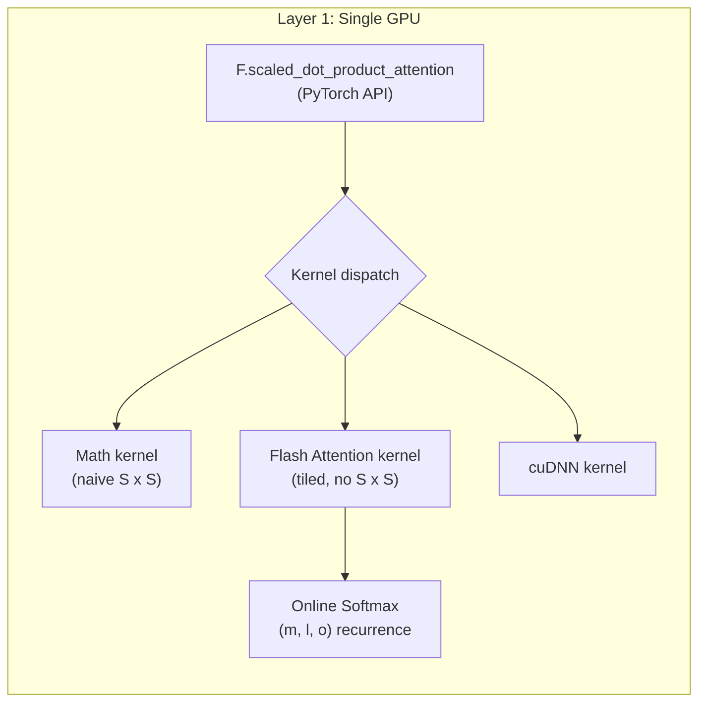
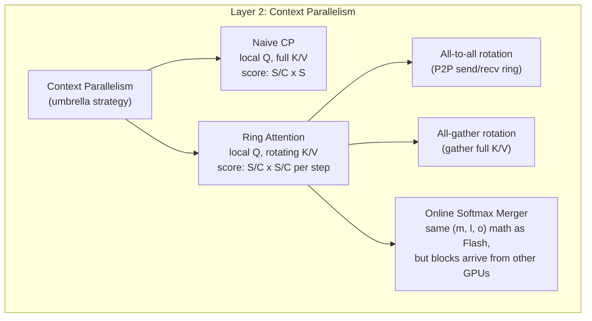
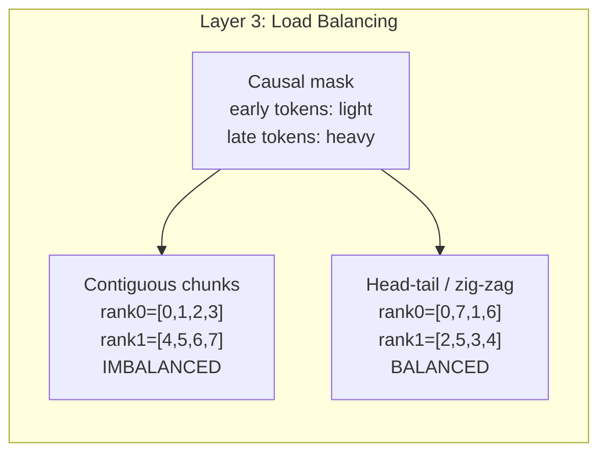
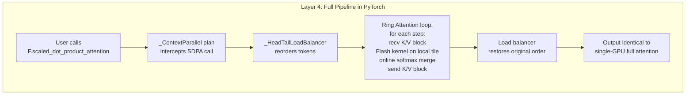
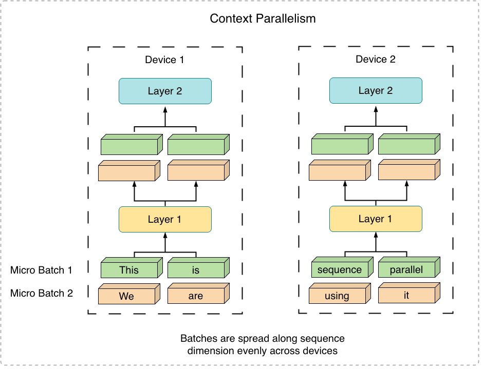
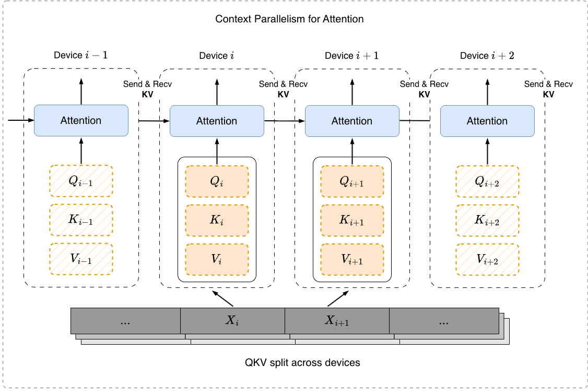
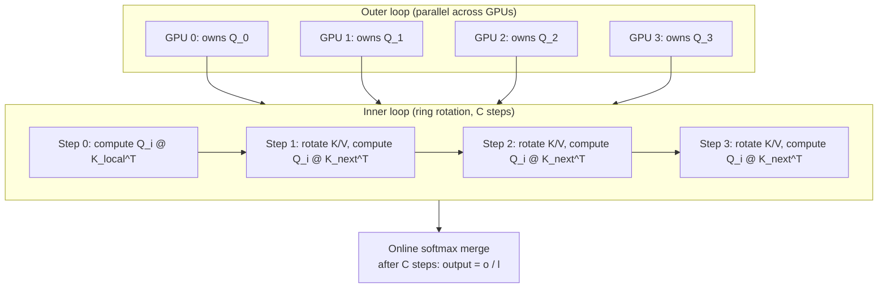
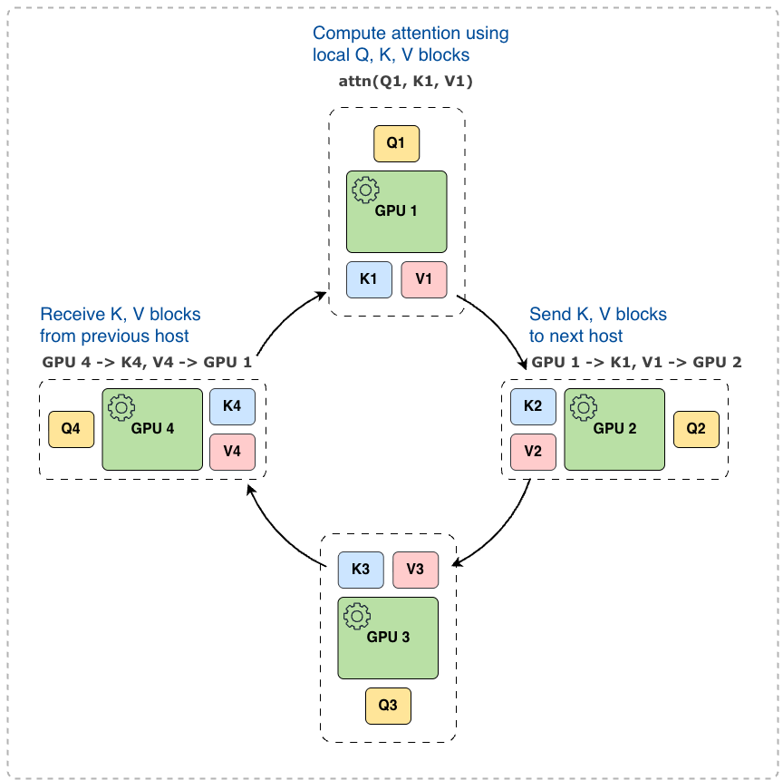

## Context Parallelism from Scratch: Ring Attention for Million-Token Sequences

*This is Part 5 of a six-part series on model parallelism. Parts [1](tensor-parallelism-blog.md) and [2](tensor-parallelism-dtensor.md) cover Tensor Parallelism. Parts [3](sequence-parallelism-blog.md) and [4](sequence-parallelism-dtensor.md) cover Sequence Parallelism. [Part 6](context-parallelism-dtensor.md) translates this hand-written implementation to PyTorch's DTensor Context Parallel API.*

Context length in large language models has grown from 2K tokens (GPT-2) to 128K (Llama 3.1) to over 1M (Gemini 1.5 Pro). But inside the attention layer, every query must touch every key it is allowed to attend to, and the intermediate score matrix scales as $O(S^2)$. Tensor Parallelism splits heads, Sequence Parallelism splits activations outside the TP region - but neither touches the quadratic attention bottleneck. Context Parallelism (CP) does.

This article builds ring attention from scratch: the P2P rotation of K/V blocks around a ring of GPUs, the online softmax that merges partial results without ever materializing the full score matrix, and the load balancing that makes causal masking efficient. The baseline GPT-2 model lives in [train_gpt.py](context-parallelism/src/train_gpt.py) and the ring attention version in [train_gpt_cp.py](context-parallelism/src/train_gpt_cp.py) (both under [context-parallelism/src/](context-parallelism/src/)). The naive CP microbenchmark is in [step2_cp_comparison.py](context-parallelism/src/step2_cp_comparison.py).


### A Map Before the Territory

The terminology around long-context attention is dense: SDPA, Flash Attention, Ring Attention, Context Parallelism, zig-zag attention, online softmax, load balancer. These are not competing alternatives - they are layers in a stack. Understanding which layer each concept belongs to is the key to clarity.

We organize them into four layers, then five implementation components, and then deep-dive into each.


### Layer 1: The Single-GPU Problem

Standard attention computes $\mathrm{softmax}(QK^\top / \sqrt{d})\, V$. The naive way materializes the full $S \times S$ score matrix in GPU memory.

**SDPA** (`F.scaled_dot_product_attention`) is PyTorch's API for attention. It is just a function signature. Under the hood, PyTorch picks a *kernel* based on the inputs and hardware.

**Flash Attention** is a specific kernel (Dao et al.) that computes attention on a single GPU without materializing the full $S \times S$ matrix. It tiles Q into blocks, streams K/V blocks from HBM to SRAM, and uses **online softmax** to merge partial results. Peak memory drops from $O(S^2)$ to $O(S)$.

**Online softmax** is the mathematical technique that makes tiling possible. Softmax requires a global normalizer (the partition function $Z = \sum e^{s_i}$), but tiling means we only see one block of scores at a time. Online softmax solves this by keeping three running quantities - the current maximum $m$ (for numerical stability), the sum of exponentials $\ell$ (the partition function, relative to $m$), and the unnormalized output accumulator $\tilde{o}$ - and rescaling whenever a new block shifts the maximum. After all blocks, $\tilde{o} / \ell$ gives the exact softmax-weighted output. The [Online Softmax Merger](#online-softmax-merger) section below derives this in full.



The takeaway: SDPA is the interface, Flash is the implementation, online softmax is the math. All on one GPU.


### Layer 2: The Multi-GPU Problem - Context Parallelism

When S is so large that even Flash Attention on one GPU runs out of memory - the Q/K/V tensors themselves don't fit, or we need the memory budget for other activations - we split the sequence across GPUs.

**Context Parallelism (CP)** is the umbrella term for any strategy that shards the sequence dimension across GPUs for the attention computation. It has two main implementations:

**Naive CP:** Each GPU holds local Q ($S/C$ rows) but full K and V (all $S$ columns). The score tile per GPU is $(S/C) \times S$. Memory savings are linear in C, but we store full K/V everywhere. The [step2_cp_comparison.py](context-parallelism/src/step2_cp_comparison.py) benchmark in this repo implements this variant.

**Ring Attention:** Each GPU holds local Q ($S/C$ rows) and local K/V ($S/C$ columns). K/V blocks rotate around a ring of GPUs in $C$ steps. At each step, the score tile is only $(S/C) \times (S/C)$. Memory savings are quadratic in $C$. Ring attention uses the same online softmax from Layer 1 to merge partial results across ring steps - the identical $(m, \ell, o)$ math, but blocks arrive from other GPUs instead of from SRAM.



Two transport variants exist for the ring:
- **All-to-all rotation (P2P ring):** Each GPU sends its current K/V to the next neighbor and receives from the previous. After $C$ steps, every GPU has seen every block. This is what we build in this article.
- **All-gather rotation:** Each GPU all-gathers the full K/V, computes, and discards. Simpler but higher peak memory. Used in Llama 3 training.


### Layer 3: Load Balancing

With causal masking, early tokens attend to few keys and late tokens attend to many. If we assign contiguous chunks to GPUs, the last rank does far more work than the first.

**No load balancing (contiguous):** rank 0 gets tokens `[0,1,2,3]`, rank 1 gets `[4,5,6,7]`. With S=8 and C=2, rank 0 computes 10 score entries, rank 1 computes 26. Rank 1 is 2.6x slower.

**Head-tail / zig-zag:** rank 0 gets `[0,7,1,6]`, rank 1 gets `[2,5,3,4]`. Each rank pairs an early token (few keys) with a late token (many keys): 18 entries each. Perfectly balanced.



Load balancing is orthogonal to the ring vs naive choice. It requires `seq_len % (2 * CP) == 0` because each rank must get an equal count of head and tail tokens. The "zig-zag attention" and "striped attention" names in the literature refer to ring attention with this load-balanced token assignment.


### Layer 4: How PyTorch Wires It All Together

In production (torchtitan, PyTorch 2.7+), the user writes plain `F.scaled_dot_product_attention`. The `_ContextParallel` plan intercepts the call, applies load balancing, runs ring attention (which internally calls Flash kernels per step), merges via online softmax, restores original token order, and returns the output. The user never sees any of this.



Part 6 of this series will show this Layer 4 integration in detail. This article focuses on Layers 1-3: building ring attention by hand.


### The 5 Implementation Components

The torchtitan blog identifies five components that make up a Context Parallel implementation. They map onto our four layers:

| # | Component | Layer | "Understand it" | "Implement it" |
|---|-----------|-------|-----------------|----------------|
| i | Tensor sharding | 2 | How to partition `[B, S]` inputs across the CP group | `_context_parallel_shard()` |
| ii | Attention op dispatch | 4 | Intercepting SDPA and routing to ring attention | `_ContextParallel` plan |
| iii | Shard rotation | 2 | Moving K/V blocks between GPUs (all-to-all or all-gather) | `_ring_rotate()` with `batch_isend_irecv` |
| iv | Load balancer | 3 | Reordering tokens for balanced causal work | `_HeadTailLoadBalancer` |
| v | SDPA merger | 1 | Combining partial results via online softmax | $(m, \ell, o)$ recurrence |

The layered view tells us *why* each component exists. The 5-component view tells us *what to build*. We now deep-dive into each, bottom-up.


### The Bottleneck TP and SP Leave Behind

Attention (single head, schematic):

$$
\mathrm{Attention}(Q, K, V) = \mathrm{softmax}\!\left(\frac{Q K^\top}{\sqrt{d}}\right) V
$$

Shapes (batch $B$, heads $H$, sequence $S$, head dim $d$):

- $Q, K, V$: $(B, H, S, d)$
- Scores $Q K^\top$: $(B, H, S, S)$

**Tensor parallelism** splits heads: local scores are $(B, H/N, S, S)$. Smaller in $H$ but still $O(S^2)$ in the sequence dimensions.

**Sequence parallelism** (Megatron-style) keeps the TP region at full $S$. Attention scores stay at $(B, H/N, S, S)$ inside the TP region. SP saves memory on LayerNorm, Dropout, and residuals - not on the quadratic attention tile.



The memory table makes the bottleneck concrete:

| Sequence Length | Attention Memory (per layer, B=1, H=32, bf16) |
|---|---|
| 1,024 | 64 MB |
| 4,096 | 1 GB |
| 16,384 | 16 GB |
| 65,536 | 256 GB - impossible on any single GPU |
| 131,072 | 1,024 GB |

For very large $S$, the limiting object is the attention score matrix, not the linear layers.


### Naive CP: The Simple Baseline

The simplest form of context parallelism: shard Q across GPUs, but replicate full K and V everywhere.

Each GPU computes attention for its local queries against all keys:

```
Without CP:  Each GPU computes (S x S) attention scores
With CP=C:   Each GPU computes (S/C x S) attention scores

Score tile shrinks by C on one axis only.
```

The [step2_cp_comparison.py](context-parallelism/src/step2_cp_comparison.py) benchmark measures this directly. With 2 GPUs and S=4096, memory drops roughly in half because the score matrix goes from $(S, S)$ to $(S/2, S)$.

**Why naive CP is limited:**
- Memory for scores is $O(S^2/C)$ - linear savings only.
- Full K and V are replicated on every GPU - no savings on K/V storage.
- No inter-GPU communication during attention, but a big all-gather or broadcast of K/V is needed up front.

Ring attention solves all three problems.


### Ring Attention: The Efficient Solution



Ring attention restructures the computation as two nested loops ([Coconut Mode](https://coconut-mode.com/posts/ring-attention/)):

- **Outer loop** over Q chunks: fully parallel across GPUs. Each GPU owns one $Q_i$ permanently.
- **Inner loop** over K/V chunks: computed iteratively via the ring. At each step, a new $(K_j, V_j)$ block arrives from the previous neighbor.

**Why splitting Q is easy:** Each output row depends on only one query row. Assign query chunks to GPUs and the outputs are independent.

**Why splitting K/V is hard:** Softmax normalizes over the entire key axis. We cannot compute the normalization constant without seeing all keys. Online softmax resolves this by accumulating the normalizer incrementally.




#### Ring KV Rotation



At each ring step, every GPU sends its current K/V block to the next neighbor and receives from the previous. After $C$ steps, every GPU has seen every K/V block.

The rotation uses `torch.distributed.batch_isend_irecv` for efficient P2P (from [train_gpt_cp.py](context-parallelism/src/train_gpt_cp.py)):

```python
def _ring_rotate(self, k, v):
    """Rotate KV one step around the ring: send to next, receive from previous.

    Args:
        k: [B, H, T_local, d_head]
        v: [B, H, T_local, d_head]
    Returns:
        k_new, v_new: [B, H, T_local, d_head] received from previous rank
    """
    cp_rank = dist.get_rank(self.cp_group)
    cp_size = dist.get_world_size(self.cp_group)

    next_rank = (cp_rank + 1) % cp_size
    prev_rank = (cp_rank - 1 + cp_size) % cp_size

    global_ranks = dist.get_process_group_ranks(self.cp_group)
    next_global = global_ranks[next_rank]
    prev_global = global_ranks[prev_rank]

    k_new = torch.empty(k.shape, dtype=k.dtype, device=k.device)
    v_new = torch.empty(v.shape, dtype=v.dtype, device=v.device)

    p2p_ops = [
        dist.P2POp(dist.isend, k.contiguous(), next_global),
        dist.P2POp(dist.irecv, k_new, prev_global),
        dist.P2POp(dist.isend, v.contiguous(), next_global),
        dist.P2POp(dist.irecv, v_new, prev_global),
    ]
    reqs = dist.batch_isend_irecv(p2p_ops)
    for req in reqs:
        req.wait()

    return k_new, v_new
```

Note: we use `torch.empty(k.shape, ...)` instead of `torch.empty_like(k)` for the receive buffers. `empty_like` copies the strides of the source tensor, which may be non-contiguous after `.transpose()`. Using explicit `shape` guarantees contiguous receive buffers, avoiding NCCL warnings.

Each call performs four non-blocking operations in a batch: two sends and two receives. The `batch_isend_irecv` groups them into a single NCCL call for efficiency.


#### Communication-Computation Overlap

The key performance insight: while GPU $i$ computes `Q_i @ K_j^T`, it can simultaneously send $K_j, V_j$ to GPU $i+1$ and receive $K_{j-1}, V_{j-1}$ from GPU $i-1$. If the compute takes longer than the transfer, communication is completely hidden.

The overlap condition ([Coconut Mode](https://coconut-mode.com/posts/ring-attention/#memory-and-arithmetic-complexity)): communication time is $4 \cdot c \cdot d / B$ (transferring K and V blocks at bandwidth $B$). Compute time is approximately $4 \cdot d \cdot c^2 / F$ (two matmuls at $F$ flops/sec). Communication is fully hidden when:

$$
\frac{4 \cdot c \cdot d}{B} \le \frac{4 \cdot d \cdot c^2}{F} \quad \Longrightarrow \quad c \ge \frac{F}{B} \quad \Longrightarrow \quad \frac{S}{C} \ge \frac{F}{B}
$$

where $c = S/C$ is the chunk size per GPU. For the long sequences where we need CP (32K+ tokens), this is easily satisfied on modern hardware. The ring overhead is effectively zero.


#### Causal Masking in a Ring

With causal attention, a query at position $i$ can only attend to keys at positions $\le i$. When K/V blocks arrive from different ranks, the masking rule depends on which chunk the block came from:

| Source rank vs current rank | Masking rule |
|---|---|
| `source_rank < cp_rank` | Past chunk: no masking (attend to everything) |
| `source_rank == cp_rank` | Same chunk: standard upper-triangular causal mask |
| `source_rank > cp_rank` | Future chunk: full mask (attend to nothing, skip computation) |

In code, this is a simple conditional inside the ring loop (from [train_gpt_cp.py](context-parallelism/src/train_gpt_cp.py)):

```python
# Causal mask depends on the relative position of source vs local chunk
if source_rank == cp_rank:
    # Diagonal tile: same chunk -> standard causal mask within the chunk
    causal_mask = torch.triu(
        torch.ones(T_local, T_local, device=q_local.device, dtype=torch.bool),
        diagonal=1,
    )
    scores.masked_fill_(causal_mask.unsqueeze(0).unsqueeze(0), float('-inf'))
elif source_rank > cp_rank:
    # Future tokens: mask everything (no query should attend to future KV)
    scores.fill_(float('-inf'))
# else: source_rank < cp_rank -> past tokens, attend fully (no mask)
```

Future-chunk blocks can be skipped entirely (no compute needed), which is an optimization opportunity.


#### Online Softmax Merger

**The problem.** Softmax normalizes over the *entire* key axis. For a single query row with scores $s \in \mathbb{R}^T$ against $T$ keys:

$$
\text{Attn}(q) = \sum_{i=1}^{T} \frac{e^{s_i}}{Z} \, V_i, \qquad Z = \sum_{j=1}^{T} e^{s_j}
$$

$Z$ is the **partition function** - the normalizing denominator that makes the weights sum to 1. Computing $Z$ requires seeing every key. In ring attention, keys arrive one block at a time. We need a way to build $Z$ incrementally.

**Numerical stability: the max-shift trick.** Computing $e^{s_i}$ directly overflows for large scores. The standard fix: subtract the maximum score $m = \max_i s_i$ from every exponent. Since $e^{s_i - m} = e^{s_i} / e^m$, the $e^m$ cancels between numerator and denominator:

$$
\frac{e^{s_i}}{Z} = \frac{e^{s_i - m}}{\sum_j e^{s_j - m}}
$$

This keeps all exponents $\le 0$, preventing overflow. But in a streaming setting, the global max $m$ is unknown until all blocks have been seen - so we must update $m$ as new blocks arrive and **rescale** everything accumulated so far.

**The three running quantities.** We maintain per-query-position accumulators, all referenced to the current running maximum $m$:

| Symbol | Meaning | Initialized to |
|--------|---------|----------------|
| $m$ | Running maximum of all scores seen so far | $-\infty$ |
| $\ell$ | $\sum_{i \in \text{seen}} e^{s_i - m}$ - partition function relative to current $m$ | $0$ |
| $\tilde{o}$ | $\sum_{i \in \text{seen}} e^{s_i - m} V_i$ - unnormalized weighted sum at current $m$ | $\mathbf{0}$ |

**Phase 1: Block-local computation.** When a new block of scores $s'$ (with values $V'$) arrives from the ring, compute its local statistics independently:

$$
m_b = \max_{i \in \text{block}} s'_i, \qquad
\ell_b = \sum_{i \in \text{block}} e^{s'_i - m_b}, \qquad
\tilde{o}_b = \sum_{i \in \text{block}} e^{s'_i - m_b}\, V'_i
$$

Each quantity is computed relative to the block's own max $m_b$, so all exponents are $\le 0$ and numerically safe.

**Phase 2: Merge into global state.** The old accumulators are referenced to $m$ and the new block is referenced to $m_b$. To combine them, we establish a new shared reference point:

$$
m_{\text{new}} = \max(m, \; m_b)
$$

Then rescale both sides to this new maximum:

$$
\ell_{\text{new}} = \underbrace{\ell \cdot e^{m - m_{\text{new}}}}_{\text{old sum, rescaled}} + \underbrace{\ell_b \cdot e^{m_b - m_{\text{new}}}}_{\text{new block sum, rescaled}}
$$

$$
\tilde{o}_{\text{new}} = \underbrace{\tilde{o} \cdot e^{m - m_{\text{new}}}}_{\text{old output, rescaled}} + \underbrace{\tilde{o}_b \cdot e^{m_b - m_{\text{new}}}}_{\text{new block output, rescaled}}
$$

The rescaling factor $e^{m - m_{\text{new}}}$ is what makes this work: it retroactively adjusts everything accumulated under the old maximum to be consistent with the new, larger maximum. Since $m_{\text{new}} \ge m$, this factor is $\le 1$ - it shrinks old contributions when a new block raises the max.

**Final normalization.** After all $C$ blocks have been merged:

$$
\text{Attention} = \frac{\tilde{o}}{\ell}
$$

This is exact - the $e^{-m}$ factors cancel identically between numerator and denominator, just as in the standard max-shift trick. The recurrence simply defers the cancellation until the end.

**From math to code.** The correspondence in `_ring_attention` is direct:

| Math | Code variable | Shape |
|------|--------------|-------|
| $m_b$ | `block_max` | `[B, H, T_local, 1]` |
| $\ell_b$ | `block_sum` | `[B, H, T_local, 1]` |
| $\tilde{o}_b$ | `block_out` | `[B, H, T_local, d_head]` |
| $e^{m - m_{\text{new}}}$ | `exp_old` | `[B, H, T_local, 1]` |
| $e^{m_b - m_{\text{new}}}$ | `exp_new` | `[B, H, T_local, 1]` |
| $\ell_{\text{new}}$ | `l` (updated in-place) | `[B, H, T_local, 1]` |
| $\tilde{o}_{\text{new}}$ | `o_acc` (updated in-place) | `[B, H, T_local, d_head]` |

One implementation detail: `block_max` is clamped to `-1e30` (line 201 in the code) to prevent the fully-masked future-chunk case (`scores.fill_(-inf)`) from producing `nan` in `torch.exp`.

**The same math powers both Flash Attention (tiling within one GPU's SRAM) and Ring Attention (tiling across GPUs).** The only difference is where the blocks come from - and whether the rescaling happens in a CUDA kernel or in Python.

**Connection to LSE.** PyTorch's internal implementation tracks $\text{LSE} = m + \log \ell$ (log-sum-exp) instead of $(m, \ell)$ separately. This is a compact equivalent: $\text{LSE} = \log \sum_i e^{s_i}$. Merging two LSE values uses the same max-stabilized log-add: $\text{LSE}_{\text{total}} = m' + \log(e^{\text{LSE}_1 - m'} + e^{\text{LSE}_2 - m'})$ where $m' = \max(\text{LSE}_1, \text{LSE}_2)$. If we read PyTorch's `_attention.py`, this is the representation we will see.


#### Putting It Together

The full ring attention forward combines rotation, causal masking, and online softmax into a single loop (from [train_gpt_cp.py](context-parallelism/src/train_gpt_cp.py)):

```python
def _ring_attention(self, q_local, k_local, v_local):
    """Compute causal self-attention via ring attention across CP ranks.

    Args:
        q_local: [B, H, T_local, d_head] - queries for this rank's chunk
        k_local: [B, H, T_local, d_head] - keys for this rank's chunk
        v_local: [B, H, T_local, d_head] - values for this rank's chunk
    Returns:
        output: [B, H, T_local, d_head]
    """
    cp_rank = dist.get_rank(self.cp_group)
    cp_size = dist.get_world_size(self.cp_group)

    B, H, T_local, d_head = q_local.shape
    scale = d_head ** -0.5

    # KV buffers that rotate around the ring
    k_recv = k_local.clone()  # [B, H, T_local, d_head]
    v_recv = v_local.clone()  # [B, H, T_local, d_head]

    # Online softmax accumulators (fp32 for numerical stability)
    o_acc = torch.zeros(B, H, T_local, d_head, device=q_local.device, dtype=torch.float32)
    m = torch.full((B, H, T_local, 1), float('-inf'), device=q_local.device, dtype=torch.float32)
    l = torch.zeros(B, H, T_local, 1, device=q_local.device, dtype=torch.float32)

    for step in range(cp_size):
        # Which rank's KV are we currently holding?
        source_rank = (cp_rank - step + cp_size) % cp_size

        # Attention scores for this tile: Q_local @ K_source^T
        scores = (q_local @ k_recv.transpose(-2, -1)) * scale  # [B, H, T_local, T_local]

        # Causal mask depends on the relative position of source vs local chunk
        if source_rank == cp_rank:
            causal_mask = torch.triu(
                torch.ones(T_local, T_local, device=q_local.device, dtype=torch.bool),
                diagonal=1,
            )
            scores.masked_fill_(causal_mask.unsqueeze(0).unsqueeze(0), float('-inf'))
        elif source_rank > cp_rank:
            scores.fill_(float('-inf'))

        # - Online softmax: merge this tile into running (m, l, o_acc) -
        block_max = scores.max(dim=-1, keepdim=True).values  # [B, H, T_local, 1]
        block_max = block_max.clamp(min=-1e30)

        block_exp = torch.exp(scores - block_max)         # [B, H, T_local, T_local]
        block_sum = block_exp.sum(dim=-1, keepdim=True)    # [B, H, T_local, 1]
        block_out = block_exp @ v_recv                     # [B, H, T_local, d_head]

        # Rescale old and new contributions to the new global max
        m_new = torch.maximum(m, block_max)                # [B, H, T_local, 1]
        exp_old = torch.exp(m - m_new)                     # [B, H, T_local, 1]
        exp_new = torch.exp(block_max - m_new)             # [B, H, T_local, 1]

        l = exp_old * l + exp_new * block_sum              # [B, H, T_local, 1]
        o_acc = exp_old * o_acc + exp_new * block_out      # [B, H, T_local, d_head]
        m = m_new

        # Rotate KV to the next rank (skip on last step)
        if step < cp_size - 1:
            k_recv, v_recv = self._ring_rotate(k_recv, v_recv)

    # Normalize by the accumulated denominator
    output = o_acc / l.clamp(min=1e-8)  # [B, H, T_local, d_head]
    return output.to(q_local.dtype)
```

**Walkthrough with 4 GPUs (C=4, S=16):**

| Step | GPU 0 holds K/V from | GPU 1 holds K/V from | GPU 2 holds K/V from | GPU 3 holds K/V from |
|---|---|---|---|---|
| 0 | rank 0 (local) | rank 1 (local) | rank 2 (local) | rank 3 (local) |
| 1 | rank 3 | rank 0 | rank 1 | rank 2 |
| 2 | rank 2 | rank 3 | rank 0 | rank 1 |
| 3 | rank 1 | rank 2 | rank 3 | rank 0 |

After 4 steps, every GPU has seen every K/V block. The online softmax accumulators hold the exact attention output.


### Load Balancing: Contiguous vs Head-Tail

With contiguous token assignment and causal masking, the computational imbalance is severe. For S=8, C=2:

```
Contiguous assignment:
  rank 0: tokens [0,1,2,3]  ->  1+2+3+4 = 10 score entries
  rank 1: tokens [4,5,6,7]  ->  5+6+7+8 = 26 score entries
  Rank 1 does 2.6x more work!
```

**Head-tail reordering** (also called zig-zag) pairs tokens from both ends of the sequence:

```
Head-tail assignment:
  rank 0: tokens [0,7,1,6]  ->  1+8+2+7 = 18 score entries
  rank 1: tokens [2,5,3,4]  ->  3+6+4+5 = 18 score entries
  Perfectly balanced!
```

The reordering indices for S=8, C=2 are `[0, 7, 1, 6, 2, 5, 3, 4]`. In general, for rank $r$:

```python
k = seq_len // (2 * cp_world_size)
for rank in range(cp_world_size):
    reordered[rank * 2*k : (rank+1) * 2*k] = cat(
        tokens[rank * k : (rank+1) * k],           # head chunk
        tokens[-(rank+1) * k : -rank * k or None]  # tail chunk
    )
```

This is exactly what PyTorch's `_HeadTailLoadBalancer` implements. The constraint `seq_len % (2 * CP) == 0` ensures equal pairing. In torchtitan, this shows up as the validation `seq_len % (TP * 2 * CP) == 0`.

The causal mask under head-tail reordering (from PyTorch's `_load_balancer.py`):

```
Contiguous (imbalanced):          Head-tail (balanced):
  rank 0: [1,0,0,0,0,0,0,0]        rank 0: [1,0,0,0,0,0,0,0]
          [1,1,0,0,0,0,0,0]                [1,1,1,1,1,1,1,1]
          [1,1,1,0,0,0,0,0]                [1,1,0,0,0,0,0,0]
          [1,1,1,1,0,0,0,0]                [1,1,1,1,1,1,1,0]
  ---------------------------       ---------------------------
  rank 1: [1,1,1,1,1,0,0,0]        rank 1: [1,1,1,0,0,0,0,0]
          [1,1,1,1,1,1,0,0]                [1,1,1,1,1,1,0,0]
          [1,1,1,1,1,1,1,0]                [1,1,1,1,0,0,0,0]
          [1,1,1,1,1,1,1,1]                [1,1,1,1,1,0,0,0]
```

Count the 1s: contiguous gives 10 vs 26. Head-tail gives 18 vs 18.

Our hand-written implementation uses contiguous assignment for simplicity. The DTensor version in [Part 6](context-parallelism-dtensor.md) uses `_HeadTailLoadBalancer` automatically.


### Full Model Integration

Ring attention replaces standard attention inside the GPT model's transformer blocks. The rest of the model (embeddings, LayerNorm, FFN, output projection) operates on sequence-sharded tensors at $[B, S/C, h]$.

In our implementation ([train_gpt_cp.py](context-parallelism/src/train_gpt_cp.py)), the `cp_group` is passed through `__init__` at model construction time. The `Attention` class stores it and uses it internally - the `forward()` signatures remain unchanged from the baseline:

```python
class Attention(nn.Module):
    def __init__(self, config: GPTConfig, cp_group):
        super().__init__()
        self.cp_group = cp_group
        # ... weight definitions unchanged ...

    def forward(self, x):                         # <-- same signature as baseline
        Q = self.W_q(x).view(B, T, H, d).transpose(1, 2)
        K = self.W_k(x).view(B, T, H, d).transpose(1, 2)
        V = self.W_v(x).view(B, T, H, d).transpose(1, 2)
        out = self._ring_attention(Q, K, V)       # <-- replaces Q @ K^T
        return self.resid_dropout(self.W_o(out))

class GPT(nn.Module):
    def __init__(self, config: GPTConfig, cp_group):
        # ...
        self.blocks = nn.ModuleList(
            [TransformerBlock(config, cp_group) for _ in range(config.n_layers)]
        )
```

The key design choice: CP is wired at construction (`__init__`) so that `forward()` stays clean. This sets up the contrast with [Part 6](context-parallelism-dtensor.md), where even `__init__` requires no changes - DTensor handles everything externally.

The input sequence is split before entering the model, and each GPU gets the correct positional embeddings for its chunk:

```python
chunk_len = seq_len // cp_size
input_ids = input_ids[:, cp_rank * chunk_len:(cp_rank + 1) * chunk_len].contiguous()
position_ids = position_ids[:, cp_rank * chunk_len:(cp_rank + 1) * chunk_len].contiguous()
labels = labels[:, cp_rank * chunk_len:(cp_rank + 1) * chunk_len].contiguous()
```

Loss is computed locally on each chunk, then all-reduced for correct global gradients:

```python
loss = F.cross_entropy(logits.view(-1, vocab_size), labels.view(-1))
loss.backward()
# All-reduce a detached copy for logging (gradients are already correct
# because ring attention's P2P graph is part of the autograd computation)
loss_avg = loss.detach().clone()
dist.all_reduce(loss_avg, op=dist.ReduceOp.AVG, group=cp_group)
```

```bash
# Run baseline (no CP) - OOMs on medium at seq_len=1024
torchrun --standalone --nproc_per_node=4 src/train_gpt.py --config medium --seq-len 1024

# Run with CP=4 - fits comfortably
torchrun --standalone --nproc_per_node=4 src/train_gpt_cp.py --config medium --seq-len 1024 --cp-size 4
```


### Activation Shape Trace

For a transformer block with CP degree $C$, batch $B$, hidden dim $h$, $H$ heads, head dim $d = h/H$:

| Location | Shape | Notes |
|----------|-------|-------|
| Block input | $(B, S/C, h)$ | Sequence-sharded |
| LayerNorm output | $(B, S/C, h)$ | Local operation |
| Q, K, V projections | $(B, S/C, H, d)$ | Local linear layers |
| **Ring step score tile** | $(B, H, S/C, S/C)$ | **Per step** - not $(S/C, S)$ |
| Online softmax state | $m, \ell$: $(B, H, S/C, 1)$; $o$: $(B, H, S/C, d)$ | Running accumulators |
| Attention output | $(B, S/C, h)$ | After all $C$ ring steps |
| FFN | $(B, S/C, h)$ | Local computation |
| Residual | $(B, S/C, h)$ | Sequence stays sharded |

The residual stream stays at $(B, S/C, h)$ throughout. No all-gather is needed between layers - each layer's ring attention independently processes the sharded sequence.


### Communication Cost and Memory Savings

**Memory scaling:**

| Strategy | Peak score tile | Scaling |
|---|---|---|
| No CP | $(S \times S)$ per GPU | $O(S^2)$ |
| Naive CP (C GPUs) | $(S/C \times S)$ per GPU | $O(S^2/C)$ |
| Ring CP (C GPUs) | $(S/C \times S/C)$ per step | $O(S^2/C^2)$ |

**Communication per layer (ring):**
- $C$ ring steps, each transferring 2 tensors (K and V) of size $(B \times S/C \times d)$
- Total bytes per layer: $2 \times C \times B \times (S/C) \times d \times 2 = 4BSD$ bytes (independent of $C$!)
- The total data moved equals the full K/V once - CP doesn't increase aggregate bandwidth, it just streams it

**The overlap condition:** Communication is fully hidden when $S/C \ge F/B$ (chunk size exceeds the flops-to-bandwidth ratio). On H100s with NVLink ($B \approx 450$ GB/s, $F \approx 990$ TFLOP/s), $F/B \approx 2200$ elements. For S=32K and C=8, the chunk is 4096 - well above the threshold.

**Per-device memory:** $6 \times d \times c$ floats - Q local + K current + V current + K receive buffer + V receive buffer + output accumulator.

**torchtitan benchmarks (PR [#592](https://github.com/pytorch/torchtitan/pull/592)):** Llama 3 8B on H100s, FSDP=8:

| CP degree | GPUs | Max seq_len | WPS/device |
|---|---|---|---|
| 1 | 8 | 32K | baseline |
| 2 | 16 | 80K | ~0.6x |
| 4 | 32 | 144K | ~0.35x |
| 8 | 64 | 300K | ~0.2x |

Max sequence length scales linearly with CP degree. MFU stays roughly constant - the WPS drop is expected because attention flops scale quadratically with sequence length.


### Experimental Results: From OOM to Training

We built a GPT-2 model ([train_gpt.py](context-parallelism/src/train_gpt.py)) with three configurations and ran it on a g5.12xlarge instance with 4x A10G GPUs (24 GB each). The goal: demonstrate that the medium model at seq_len=1024 OOMs without CP, and trains successfully with CP=4.

**Model configurations:**

| Config | d_model | n_heads | d_ff | n_layers | vocab | Params |
|--------|---------|---------|------|----------|-------|--------|
| mini   | 512     | 8       | 2048 | 6        | 10K   | ~19M   |
| small  | 768     | 12      | 3072 | 12       | 50,257| ~117M  |
| medium | 1024    | 16      | 4096 | 24       | 50,257| ~345M  |

**The OOM experiment (baseline, no CP):**

```bash
# This OOMs - attention scores need ~48 GB per GPU
torchrun --standalone --nproc_per_node=4 src/train_gpt.py --config medium --seq-len 1024
# torch.OutOfMemoryError: CUDA out of memory.
```

Why it fails: each GPU independently computes the full `[B, H, 1024, 1024]` attention matrix across 24 layers. At B=8, H=16, that's `8 * 16 * 1024 * 1024 * 4 bytes = 2 GB` per layer, times 24 layers = ~48 GB for attention scores alone - more than double the A10G's 24 GB.

**The CP=4 experiment (ring attention):**

```bash
# This works - each GPU computes [B, H, 256, 256] tiles per ring step
torchrun --standalone --nproc_per_node=4 src/train_gpt_cp.py --config medium --seq-len 1024 --cp-size 4
```

```
GPT-2 benchmark - config: medium, world_size: 4, cp_size: 4
d_model=1024, n_heads=16, d_ff=4096, n_layers=24, vocab=50257, cp_size=4
Model params: 406,286,336
Model size: 1549.86 MB
--- Benchmark (10 steps) ---
  step 1/10  loss=8.6324  fwd=642.2ms  bwd=351.9ms  total=1058.4ms
  step 2/10  loss=7.9428  fwd=643.9ms  bwd=351.7ms  total=1059.9ms
  step 3/10  loss=7.3220  fwd=646.3ms  bwd=352.9ms  total=1063.9ms
  ...
  step 10/10 loss=3.9569  fwd=644.6ms  bwd=353.4ms  total=1062.4ms
============================================================
  GPT-2 MEDIUM - Context Parallelism (CP=4) - 4 GPU(s)
============================================================
  Params Per Gpu             406,286,336
  Mem Model Mb                   1549.86
  Mem Peak Mb                   15491.67
  Fwd Ms                          644.48
  Bwd Ms                          352.81
  Step Ms                        1061.62
  Tokens Per Sec                 7716.50
  Loss                              3.96
============================================================
```

**The key numbers:**

| Metric | Baseline (1 GPU) | CP=4 (4 GPUs) |
|--------|-----------------|----------------|
| seq_len=1024 | **OOM** | 15.1 GB peak |
| Attention tile | `[B, H, 1024, 1024]` | `[B, H, 256, 256]` per step |
| Attention memory | ~48 GB | ~3 GB (16x reduction) |
| Model + optimizer | ~5.5 GB | ~5.5 GB (same - CP doesn't shard weights) |
| Loss (10 steps) | - | 8.63 -> 3.96 |

The math checks out: with CP=4, each GPU computes `(S/4) x (S/4) = 256 x 256` attention tiles per ring step, a 16x reduction from the full `1024 x 1024`. The 15.1 GB peak includes model weights (5.5 GB fixed) plus the reduced activations, well within the A10G's 24 GB budget.

**Baseline vs CP on a configuration that fits (small, seq_len=512):**

We also ran both modes on the small config where the baseline fits, to compare overhead:

| Metric | Baseline (4 GPUs) | CP=4 (4 GPUs) |
|--------|-------------------|----------------|
| Peak memory | 5,773 MB | 4,130 MB |
| Step time | 242 ms | 197 ms |
| Tokens/sec | 16,917 | 20,841 |

CP=4 uses less peak memory (each GPU only materializes `128 x 128` tiles instead of `512 x 512`) and is actually faster because the smaller tiles are more cache-friendly. The P2P ring overhead is negligible on intra-node NVLink.


### What's Next

All the code in this article - the P2P ring rotation, the online softmax merger, the causal masking logic, the load balancer - totals roughly 115 lines of Python. In [Part 6](context-parallelism-dtensor.md), we replace all of it with a single `_ContextParallel(seq_dim=1)` plan applied via `parallelize_module`. The model stays a plain `nn.Module` with standard `F.scaled_dot_product_attention`, and PyTorch handles the ring, the merging, and the load balancing transparently.


### References

- [Ring Attention with Blockwise Transformers for Near-Infinite Context](https://arxiv.org/abs/2310.01889) (Liu et al., 2023)
- [Coconut Mode: Ring Attention Explained](https://coconut-mode.com/posts/ring-attention/) - pedagogical walkthrough of two-loop structure and overlap condition
- [Megatron-LM: Training Multi-Billion Parameter Language Models Using Model Parallelism](https://arxiv.org/abs/1909.08053) (Shoeybi et al., 2019)
- [FlashAttention: Fast and Memory-Efficient Exact Attention with IO-Awareness](https://arxiv.org/abs/2205.14135) (Dao et al., 2022)
- [torchtitan PR #592: enable Context Parallel](https://github.com/pytorch/torchtitan/pull/592) - benchmarks and implementation
- [PyTorch Context Parallel Tutorial](https://github.com/pytorch/tutorials/blob/main/unstable_source/context_parallel.rst)
- [Striped Attention](https://arxiv.org/abs/2311.09431) (Brandon et al., 2023) - load-balanced ring attention for causal models
- Technical notes: [context-parallelism.md](context-parallelism.md), [context_parallelism_concrete_walkthrough.md](context-parallelism/context_parallelism_concrete_walkthrough.md)
