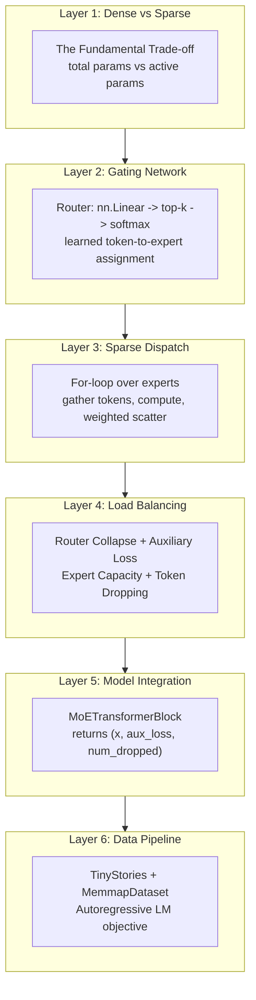
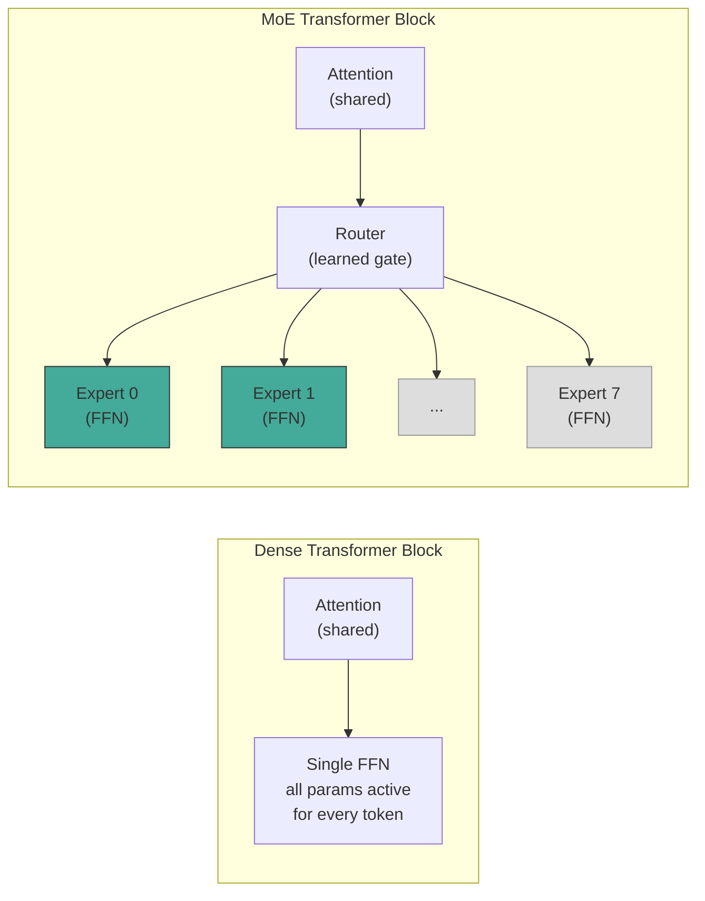
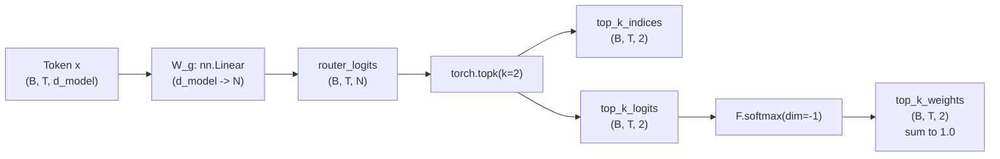

## Mixture of Experts from Scratch: Sparse Gating for Conditional Computation

*This is Part 7 of a nine-part series on model parallelism. Parts [1](tensor-parallelism-blog.md) and [2](tensor-parallelism-dtensor.md) cover Tensor Parallelism. Parts [3](sequence-parallelism-blog.md) and [4](sequence-parallelism-dtensor.md) cover Sequence Parallelism. Parts [5](context-parallelism-blog.md) and [6](context-parallelism-dtensor.md) cover Context Parallelism. [Part 8](expert-parallelism-ep-blog.md) distributes experts across GPUs with hand-written all-to-all dispatch. [Part 9](expert-parallelism-dtensor-blog.md) translates that to PyTorch's DTensor ExpertParallel API.*

The previous six parts of this series solve a single problem from different angles: the model or its activations are too large for one GPU, so we split them. Tensor Parallelism splits weight matrices. Sequence Parallelism splits activations outside the TP region. Context Parallelism splits the attention sequence dimension. All three keep every parameter active on every forward pass -- they are *dense* parallelism strategies.

Mixture of Experts (MoE) takes a fundamentally different approach. Instead of splitting an existing dense model, it builds a model that is *conditionally sparse*: for each input token, a learned gating network selects a small subset of "expert" sub-networks, and only those experts run. The total parameter count grows (more experts means more weights), but the per-token compute stays fixed. This is the core idea behind Mixtral 8x7B, DeepSeek-V2, and the Switch Transformer.

This article builds a complete MoE GPT from scratch on a single GPU. We start with the intuition for why sparsity helps, then implement the gating network (router), the sparse dispatch loop, the load-balancing loss, and the full model integration. The implementation lives in [train_gpt_moe.py](expert-parallelism/src/train_gpt_moe.py), with the data pipeline in [data.py](expert-parallelism/src/data.py) and utilities in [utils.py](expert-parallelism/src/utils.py), all under [expert-parallelism/src/](expert-parallelism/src/). In [Part 8](expert-parallelism-ep-blog.md), we take these single-GPU experts and distribute them across GPUs using all-to-all communication -- Expert Parallelism proper.


### A Map Before the Territory

MoE adds several moving parts to a transformer: routers, expert capacity, auxiliary losses, token dropping. These are not independent concepts -- they form a layered stack where each layer solves a problem introduced by the layer below it. Understanding the stack is the key to clarity.

We organize them into six layers, then deep-dive into each.




### Layer 1: Dense vs Sparse -- The Fundamental Trade-off

A standard transformer block has two sub-layers: multi-head attention and a feed-forward network (FFN). In GPT-2 and Llama, the FFN is a simple two-layer MLP:

$$
\text{FFN}(x) = W_2 \cdot \text{GELU}(W_1 \cdot x)
$$

where $W_1 \in \mathbb{R}^{d_\text{model} \times d_\text{ff}}$ and $W_2 \in \mathbb{R}^{d_\text{ff} \times d_\text{model}}$. With $d_\text{ff} = 4 \cdot d_\text{model}$ (the standard ratio), the FFN accounts for roughly two-thirds of each block's parameters.

In a dense model, *every* token flows through *every* FFN parameter. In a Mixture of Experts model, we replace the single FFN with $N$ independent copies (experts), but each token only uses the top-$k$ of them. The parameter count scales with $N$, but the compute per token scales with $k$.

**The Mixtral 8x7B example.** Mixtral has 8 experts per layer and selects top-2 per token:

| Metric | Dense 7B (Llama 2) | Mixtral 8x7B |
|--------|---------------------|--------------|
| Total (sparse) params | 7B | 46.7B |
| Active params per token | 7B | 12.8B |
| FFN params per layer | $2 \cdot d \cdot 4d$ | $8 \cdot 2 \cdot d \cdot 4d$ |
| FFN compute per token | $2 \cdot d \cdot 4d$ | $2 \cdot 2 \cdot d \cdot 4d$ |
| Inference quality | Baseline | Matches or beats Llama 2 70B |

Mixtral has 6.7x more FFN parameters than a dense 7B model, but only 1.8x more active compute per token (2 experts instead of 1, plus the shared attention and embedding layers). The sparse parameters act as a larger "memory" that the model can selectively consult, while keeping the computational budget manageable.



The key insight: attention layers are shared across all tokens (they are not sparsified). Only the FFN layers become sparse. This is because attention computes pairwise interactions between all tokens in the sequence -- sparsifying it would break the global context. FFN layers, by contrast, operate independently on each token position, making them natural candidates for conditional computation.

In our implementation, the `ExpertFFN` class (line 130) is architecturally identical to the dense `FFN` class (line 324). The only difference is how many copies exist and how tokens are routed to them:

```python
class ExpertFFN(nn.Module):
    def __init__(self, config: MoEGPTConfig):
        super().__init__()
        self.W1 = nn.Linear(config.d_model, config.d_ff, bias=config.bias)
        self.W2 = nn.Linear(config.d_ff, config.d_model, bias=config.bias)
        self.resid_dropout = nn.Dropout(config.dropout)

    def forward(self, x: torch.Tensor) -> torch.Tensor:
        return self.resid_dropout(self.W2(F.gelu(self.W1(x))))  # (*, d_model)
```

**Parameter economics for our configs:**

| Config | Dense Params | Sparse Params (8 experts) | Active Params (top-2) | Sparse/Dense |
|--------|-------------|---------------------------|----------------------|--------------|
| mini | ~19M | ~57M | ~28M | 3.0x |
| small | ~117M | ~352M | ~176M | 3.0x |
| medium | ~345M | ~1B | ~517M | 2.9x |

The `count_active_parameters` function in [utils.py](expert-parallelism/src/utils.py) computes this: non-expert parameters are always active, expert parameters are scaled by $k / N$:

```python
def count_active_parameters(model: nn.Module, num_experts: int, top_k: int) -> int:
    expert_params = 0
    non_expert_params = 0
    for name, p in model.named_parameters():
        if ".experts." in name:
            expert_params += p.numel()
        else:
            non_expert_params += p.numel()
    active_expert_params = int(expert_params * top_k / num_experts)  # top_k/N fraction
    return non_expert_params + active_expert_params
```


### Layer 2: The Gating Network (Router)

The router is the decision-maker. Given a token's hidden representation, it produces a probability distribution over experts and selects the top-$k$.

**Architecture.** The router is a single linear projection with no bias (line 152):

$$
\text{router\_logits} = x \cdot W_g, \quad W_g \in \mathbb{R}^{d_\text{model} \times N}
$$

This maps each token from $d_\text{model}$ dimensions to $N$ scores -- one per expert. The simplicity is deliberate: the router should be cheap relative to the experts it gates.

**Top-k selection.** From the $N$ scores, we keep only the top-$k$ (line 156-158):

```python
top_k_logits, top_k_indices = torch.topk(
    router_logits, self.top_k, dim=-1
)                                                           # (B, T, top_k) each
```

**Softmax over top-k only.** The softmax is computed over the $k$ selected logits, not over all $N$ experts (line 159):

```python
top_k_weights = F.softmax(top_k_logits, dim=-1)            # (B, T, top_k)
```

This is a critical detail. If we softmaxed over all $N$ experts first, the selected weights would not sum to 1 (they would sum to some fraction). By softmaxing over only the top-$k$ logits, the weights for each token's selected experts always sum to 1, giving us a proper convex combination.

The full Router class (lines 146-160):

```python
class Router(nn.Module):
    """Learned gating network that assigns tokens to top-k experts."""

    def __init__(self, d_model: int, num_experts: int, top_k: int):
        super().__init__()
        self.top_k = top_k
        self.gate = nn.Linear(d_model, num_experts, bias=False)

    def forward(self, x: torch.Tensor):
        router_logits = self.gate(x)                        # (B, T, num_experts)
        top_k_logits, top_k_indices = torch.topk(
            router_logits, self.top_k, dim=-1
        )                                                   # (B, T, top_k) each
        top_k_weights = F.softmax(top_k_logits, dim=-1)    # (B, T, top_k)
        return top_k_weights, top_k_indices, router_logits
```

The router returns three things: (1) the normalized weights for the selected experts, (2) the indices of which experts were selected, and (3) the raw logits over all experts -- needed later for the auxiliary load-balancing loss.



**Why top-k=2?** Top-1 (Switch Transformer style) is the most computationally efficient -- each token visits exactly one expert. But it is also the most fragile: the router has no "second opinion" and is prone to collapse (where all tokens route to the same expert). Top-2 (Mixtral, GShard) gives the router a smoother gradient signal and better utilization, at the cost of 2x the expert compute per token. In our implementation, top-$k$ is a configurable hyperparameter (`config.top_k`).


### Layer 3: Sparse Expert Dispatch

With routing decisions in hand, we need to actually run each expert on its assigned tokens. The dispatch loop is the most mechanically complex part of the MoE layer.

**The challenge.** Different experts receive different subsets of tokens, and the subsets can overlap (a token selected by expert 0 and expert 3 with top-2 routing). We need to: (1) gather the right tokens for each expert, (2) run the expert, (3) scatter the weighted results back to the original token positions.

**The for-loop.** Our implementation iterates over experts one at a time (lines 207-228). This is the simplest correct approach -- production systems like Megablocks use a fused grouped-GEMM kernel instead, but the for-loop makes the data flow explicit:

```python
output = torch.zeros_like(x_flat)                           # (B*T, d_model)
num_dropped = 0

for i, expert in enumerate(self.experts):
    mask = (experts_flat == i)                               # (B*T, top_k)
    token_mask = mask.any(dim=-1)                            # (B*T,)

    if not token_mask.any():
        continue

    token_indices = token_mask.nonzero(as_tuple=True)[0]     # (num_selected,)

    # ... capacity check (Layer 4) ...

    expert_input = x_flat[token_mask]                        # (num_selected, d_model)
    expert_output = expert(expert_input)                     # (num_selected, d_model)

    expert_weights = (weights_flat * mask.float()).sum(dim=-1)  # (B*T,)
    expert_weights = expert_weights[token_mask]                 # (num_selected,)

    output[token_mask] += expert_output * expert_weights.unsqueeze(-1)
```

Let us trace through this step by step.

**Step 1: Flatten.** We reshape from `(B, T, d_model)` to `(B*T, d_model)` to treat tokens as a flat collection (line 190). The routing weights and expert indices are similarly flattened to `(B*T, top_k)`.

**Step 2: Build per-expert masks.** For expert $i$, `experts_flat == i` produces a boolean tensor of shape `(B*T, top_k)` -- True wherever a token selected expert $i$ as one of its top-k choices. `any(dim=-1)` collapses across the top-k dimension to get a per-token mask of shape `(B*T,)`.

**Step 3: Gather.** `x_flat[token_mask]` selects only the tokens assigned to this expert. If 50 out of 2048 tokens selected expert $i$, the expert runs on a `(50, d_model)` tensor.

**Step 4: Compute.** The expert processes its tokens -- a standard FFN forward pass.

**Step 5: Weight and scatter.** The expert's output is multiplied by the routing weight for this expert-token pair, then accumulated into the output tensor at the original token positions. The `+=` handles the case where a token is routed to multiple experts: each expert's weighted contribution is added.

**Shape trace through the full dispatch (B=8, T=256, d_model=512, N=8, k=2):**

| Variable | Shape | Description |
|----------|-------|-------------|
| `x` | `(8, 256, 512)` | Input to MoE layer |
| `x_flat` | `(2048, 512)` | Flattened tokens |
| `weights_flat` | `(2048, 2)` | Routing weights per token |
| `experts_flat` | `(2048, 2)` | Expert indices per token |
| `mask` (expert i) | `(2048, 2)` | True where expert i is selected |
| `token_mask` | `(2048,)` | True for tokens assigned to expert i |
| `expert_input` | `(~512, 512)` | Tokens for expert i (~2048*2/8) |
| `expert_output` | `(~512, 512)` | Expert i's output |
| `output` | `(2048, 512)` | Accumulated weighted outputs |

With uniform routing and top-2, each expert gets approximately $B \cdot T \cdot k / N = 2048 \cdot 2 / 8 = 512$ tokens. In practice, the distribution is rarely uniform -- which is where Layer 4 comes in.


### Layer 4: Load Balancing

Left to its own devices, the router will collapse. This is the central training challenge of MoE models, and solving it requires three interlocking mechanisms.


#### The Router Collapse Problem

Consider a freshly initialized router. By random chance, one expert (say expert 3) gets slightly more tokens than the others. It trains on more data, becomes slightly better, and the router learns to send even more tokens to it. This positive feedback loop converges to a degenerate state where one or two experts handle all tokens and the rest are never used.

This is not a theoretical concern -- it happens reliably in practice without countermeasures. The Switch Transformer paper (Fedus et al., 2022) and GShard (Lepikhin et al., 2020) both document this phenomenon.

Three mechanisms work together to prevent it:


#### Mechanism 1: Noisy Top-k Gating (KeepTopK)

The original MoE paper (Shazeer et al., 2017) adds tunable Gaussian noise to the router logits before the top-k selection:

$$
H(x) = W_g \cdot x + \text{noise} \cdot \text{Softplus}(W_\text{noise} \cdot x)
$$

The noise is a learned per-expert scale. During training, this encourages exploration: even if expert 3 has the highest logit, the noise might boost expert 5 above it for some tokens. Our implementation does not include a separate noise module, relying instead on the auxiliary loss and dropout for regularization. More sophisticated implementations (e.g., GShard) add an explicit noise term.


#### Mechanism 2: Auxiliary Load-Balancing Loss

The auxiliary loss is the primary mechanism for balancing expert utilization. It penalizes configurations where some experts get many tokens and others get few.

The Switch Transformer formulation (lines 237-254) defines:

$$
L_\text{aux} = N \cdot \sum_{i=1}^{N} f_i \cdot P_i
$$

where:
- $f_i$ = fraction of tokens routed to expert $i$ (the *actual* load)
- $P_i$ = average router probability for expert $i$ (the *intended* load)
- $N$ = number of experts (scaling factor)

The product $f_i \cdot P_i$ is minimized when both $f_i$ and $P_i$ are uniform at $1/N$. The $N$ scaling factor ensures the loss magnitude is independent of the number of experts.

**Why multiply $f_i$ and $P_i$?** Using $f_i$ alone would have zero gradient (it is a discrete count). Using $P_i$ alone would ignore the actual routing decisions. The product creates a differentiable signal: $P_i$ provides the gradient (it flows through the softmax), and $f_i$ weights it by actual usage.

In code:

```python
def _load_balancing_loss(
    self, router_logits: torch.Tensor, selected_experts: torch.Tensor
) -> torch.Tensor:
    """Switch Transformer auxiliary loss: L_aux = N * sum(f_i * P_i)."""
    B, T, _ = router_logits.shape
    num_tokens = B * T

    flat_experts = selected_experts.view(-1, self.top_k)     # (B*T, top_k)
    expert_mask = torch.zeros(
        num_tokens, self.num_experts, device=router_logits.device
    )                                                        # (B*T, num_experts)
    expert_mask.scatter_(1, flat_experts, 1.0)
    f = expert_mask.mean(dim=0)                              # (num_experts,)

    P = F.softmax(router_logits, dim=-1).mean(dim=(0, 1))   # (num_experts,)

    aux_loss = self.num_experts * (f * P).sum()
    return aux_loss
```

**Walkthrough:** `expert_mask` is a one-hot encoding of which experts each token selected. `scatter_` places 1.0 at the selected expert positions. `f = expert_mask.mean(dim=0)` averages over all tokens to get the fraction routed to each expert. `P` is the mean router probability (after softmax over *all* $N$ experts, not just top-k). The final loss is $N \cdot \sum f_i \cdot P_i$.

Note: $P_i$ uses `F.softmax(router_logits, dim=-1)` -- the softmax over all experts -- not the top-k softmax from the router's forward pass. This gives the auxiliary loss a complete picture of the router's probability landscape, not just the truncated top-k view.

The total training loss combines the language modeling loss with the auxiliary loss (line 535):

```python
total_loss = lm_loss + config.aux_loss_weight * aux_loss
```

The weight `config.aux_loss_weight` (default 0.01) controls the trade-off. Too low and the router collapses. Too high and the model sacrifices language quality to keep experts balanced. The Switch Transformer paper uses 0.01; Mixtral uses 0.001.


#### Mechanism 3: Expert Capacity and Token Dropping

Even with the auxiliary loss, the router may temporarily overload specific experts -- especially early in training. Expert capacity is a hard ceiling on how many tokens each expert can process per batch.

**Capacity formula** (line 198-201):

$$
\text{expert\_capacity} = \left\lfloor \frac{B \cdot T \cdot k}{N} \cdot C_f \right\rfloor
$$

where $C_f$ is the capacity factor (default 1.25). With uniform routing, each expert would get exactly $B \cdot T \cdot k / N$ tokens. The capacity factor provides 25% headroom above uniform.

If an expert receives more tokens than its capacity, the overflow tokens are *dropped* -- they contribute zero to the output (lines 216-220):

```python
if use_capacity and len(token_indices) > expert_capacity:
    num_dropped += len(token_indices) - expert_capacity
    token_indices = token_indices[:expert_capacity]
    token_mask = torch.zeros_like(token_mask)
    token_mask[token_indices] = True
```

Dropped tokens pass through the residual connection unchanged (since `output` is initialized to zeros and the dropped tokens' positions receive no expert contribution). The residual `x + moe_out` means the token still has its pre-MoE representation -- it just misses the expert computation for this layer.

**Capacity factor trade-offs:**

| Capacity Factor | Behavior |
|----------------|----------|
| 0 (disabled) | No dropping -- every token is processed. Memory varies with imbalance. |
| 1.0 | Tight capacity -- tokens dropped even with mild imbalance. |
| 1.25 (default) | 25% headroom -- moderate balance between waste and overflow. |
| 2.0+ | Very loose -- almost no dropping, but wasted memory on empty expert slots. |

The `num_dropped` count is tracked per forward pass and reported during training, giving visibility into how well the auxiliary loss is working.


### Layer 5: Model Integration

The `MoETransformerBlock` replaces the standard transformer block's FFN with a `SparseMoELayer`. Its forward signature changes to return auxiliary information alongside the hidden states (lines 262-274):

```python
class MoETransformerBlock(nn.Module):
    def __init__(self, config: MoEGPTConfig):
        super().__init__()
        self.ln1 = nn.LayerNorm(config.d_model)
        self.attn = Attention(config)
        self.ln2 = nn.LayerNorm(config.d_model)
        self.moe = SparseMoELayer(config)

    def forward(self, x: torch.Tensor) -> tuple[torch.Tensor, torch.Tensor, int]:
        x = x + self.attn(self.ln1(x))                      # (B, T, d_model)
        moe_out, aux_loss, num_dropped = self.moe(self.ln2(x))  # (B, T, d_model)
        x = x + moe_out                                     # (B, T, d_model)
        return x, aux_loss, num_dropped
```

Each block returns a tuple of three values: the hidden state, the auxiliary loss for this layer's MoE, and the count of dropped tokens. This is the minimal API change from a dense transformer block -- the residual and LayerNorm structure is identical.

The full model (`MoEGPT`, lines 282-316) aggregates these across layers:

```python
class MoEGPT(nn.Module):
    def __init__(self, config: MoEGPTConfig):
        super().__init__()
        self.config = config
        self.tok_emb = nn.Embedding(config.vocab_size, config.d_model)
        self.pos_emb = nn.Embedding(config.max_seq_len, config.d_model)
        self.emb_dropout = nn.Dropout(config.dropout)
        self.blocks = nn.ModuleList(
            [MoETransformerBlock(config) for _ in range(config.n_layers)]
        )
        self.ln_f = nn.LayerNorm(config.d_model)
        self.lm_head = nn.Linear(config.d_model, config.vocab_size, bias=False)

    def forward(
        self, input_ids: torch.Tensor
    ) -> tuple[torch.Tensor, torch.Tensor, int]:
        B, T = input_ids.shape                               # (B, T)
        pos = torch.arange(T, device=input_ids.device).unsqueeze(0)  # (1, T)
        x = self.emb_dropout(
            self.tok_emb(input_ids) + self.pos_emb(pos)
        )                                                    # (B, T, d_model)

        total_aux_loss = torch.tensor(0.0, device=x.device)
        total_dropped = 0

        for block in self.blocks:
            x, aux_loss, num_dropped = block(x)
            total_aux_loss = total_aux_loss + aux_loss
            total_dropped += num_dropped

        total_aux_loss = total_aux_loss / self.config.n_layers  # average over layers

        x = self.ln_f(x)                                    # (B, T, d_model)
        logits = self.lm_head(x)                             # (B, T, vocab_size)
        return logits, total_aux_loss, total_dropped
```

The auxiliary loss is averaged over layers (line 312) so that its magnitude is stable regardless of model depth. The total dropped count is summed (not averaged) to give the true overflow count for the batch.

**Activation shape trace through one MoE transformer block:**

| Location | Shape | Notes |
|----------|-------|-------|
| Block input | $(B, T, d_\text{model})$ | Token embeddings |
| LayerNorm 1 | $(B, T, d_\text{model})$ | Pre-attention norm |
| Attention Q, K, V | $(B, H, T, d_\text{head})$ | Multi-head projections |
| Attention scores | $(B, H, T, T)$ | Full causal attention (not sparsified) |
| Attention output | $(B, T, d_\text{model})$ | After output projection |
| Residual 1 | $(B, T, d_\text{model})$ | x + attn(ln1(x)) |
| LayerNorm 2 | $(B, T, d_\text{model})$ | Pre-MoE norm |
| Router logits | $(B, T, N)$ | One score per expert |
| Router weights | $(B, T, k)$ | Softmax over top-k |
| Expert input | $(\text{selected}, d_\text{model})$ | Variable per expert |
| Expert hidden | $(\text{selected}, d_\text{ff})$ | $W_1$ projection |
| Expert output | $(\text{selected}, d_\text{model})$ | $W_2$ projection |
| MoE output | $(B, T, d_\text{model})$ | Weighted sum of expert outputs |
| Residual 2 | $(B, T, d_\text{model})$ | x + moe(ln2(x)) |

**The contrast with a dense block:** The only shape that differs is the expert input/output -- instead of `(B*T, d_model)` flowing through one FFN, we have variable-size slices flowing through $k$ of $N$ FFNs. Everything outside the MoE layer is identical.


### Layer 6: Data Pipeline -- TinyStories and MemmapDataset

Training an MoE model requires a dataset large enough to observe meaningful learning dynamics. We use [TinyStories](https://huggingface.co/datasets/roneneldan/TinyStories) (Eldan & Li, 2023) -- a synthetic dataset of short stories generated by GPT-3.5 and GPT-4, using vocabulary that a typical 3-to-4-year-old would understand. The dataset is small enough to iterate quickly (~474M tokens) but rich enough to show real learning curves.

**Data format.** The raw stories are tokenized with the GPT-2 tokenizer and stored as flat binary files (`train.bin`, `validation.bin`) containing uint16 numpy arrays. Each file is a contiguous stream of token IDs with no separators between stories.

**Memory-mapped loading.** The training file is 901 MB. Loading it entirely into RAM would work, but `np.memmap` is more efficient -- the OS pages data from disk on demand, and the same file can be shared across DataLoader workers without duplication (from [data.py](expert-parallelism/src/data.py)):

```python
class MemmapDataset(Dataset):
    """Token dataset backed by a memory-mapped binary file."""

    def __init__(self, data_path: str, seq_len: int):
        self.data = np.memmap(data_path, dtype=np.uint16, mode="r")
        self.seq_len = seq_len
        self.n_samples = (len(self.data) - 1) // seq_len

    def __len__(self) -> int:
        return self.n_samples

    def __getitem__(self, idx: int) -> tuple[torch.Tensor, torch.Tensor]:
        start = idx * self.seq_len
        chunk = self.data[start : start + self.seq_len + 1].astype(np.int64)
        x = torch.from_numpy(chunk[:-1])                    # (seq_len,)
        y = torch.from_numpy(chunk[1:])                     # (seq_len,)
        return x, y
```

Each sample extracts `seq_len + 1` contiguous tokens. The first `seq_len` tokens are the input (`x`), and the last `seq_len` tokens (shifted by one) are the labels (`y`). This is the standard autoregressive LM objective: predict the next token at every position.

**The training step** (lines 530-546) shows how the MoE model's three outputs are combined:

```python
if is_moe:
    logits, aux_loss, num_dropped = model(input_ids)         # (B, T, V)
    lm_loss = F.cross_entropy(
        logits.view(-1, config.vocab_size), labels.view(-1)
    )
    total_loss = lm_loss + config.aux_loss_weight * aux_loss
else:
    logits = model(input_ids)                                # (B, T, V)
    lm_loss = F.cross_entropy(
        logits.view(-1, config.vocab_size), labels.view(-1)
    )
    total_loss = lm_loss
```

The dense baseline uses the same data pipeline, training loop, and hyperparameters -- only the model class differs. This makes the Dense vs MoE comparison fair.

**Running experiments:**

```bash
# MoE model (8 experts, top-2)
torchrun --nproc_per_node=1 src/train_gpt_moe.py --config mini --mode moe

# Dense baseline (same architecture minus experts)
torchrun --nproc_per_node=1 src/train_gpt_moe.py --config mini --mode dense

# Ablation: disable auxiliary loss
torchrun --nproc_per_node=1 src/train_gpt_moe.py --config mini --aux-loss-weight 0

# Ablation: disable capacity limits
torchrun --nproc_per_node=1 src/train_gpt_moe.py --config mini --capacity-factor 0
```


### The Experimental Plan

The code is designed to answer three questions about MoE training dynamics on TinyStories. Each experiment isolates a single variable while keeping all others fixed.


#### Experiment 1: Dense vs MoE Learning Curves

**Question:** Does a 57M-sparse / 28M-active MoE model learn faster than a 19M dense model with the same architecture?

| Setting | Dense (mini) | MoE (mini, 8 experts, top-2) |
|---------|-------------|------------------------------|
| Sparse params | ~19M | ~57M |
| Active params per token | ~19M | ~28M |
| Training steps | 1000 | 1000 |
| Batch size | 8 | 8 |
| seq_len | 256 | 256 |
| Learning rate | 3e-4 | 3e-4 |

**What to look for:** The MoE model should achieve lower validation loss with fewer steps because each token accesses a larger total parameter space (through its top-2 experts) while keeping per-step compute modest. The training loss curves should diverge early, with MoE pulling ahead.

**Commands:**

```bash
torchrun --nproc_per_node=1 src/train_gpt_moe.py --config mini --mode dense --num-steps 1000
torchrun --nproc_per_node=1 src/train_gpt_moe.py --config mini --mode moe --num-steps 1000
```


#### Experiment 2: Auxiliary Loss Ablation

**Question:** What happens when the load-balancing loss is disabled?

| Setting | aux_loss_weight=0.01 | aux_loss_weight=0 |
|---------|---------------------|-------------------|
| Load balancing | Active | Disabled |

**What to look for:** Without the auxiliary loss, the router should collapse within a few hundred steps. Observable symptoms: (1) the `aux_loss` metric stays at the value for perfect imbalance instead of decreasing, (2) the drop rate increases as one or two experts are overloaded and the rest are idle, (3) validation loss plateaus or degrades because most experts never train.

**Commands:**

```bash
torchrun --nproc_per_node=1 src/train_gpt_moe.py --config mini --aux-loss-weight 0.01
torchrun --nproc_per_node=1 src/train_gpt_moe.py --config mini --aux-loss-weight 0
```


#### Experiment 3: Capacity Factor Ablation

**Question:** How does the capacity factor affect token dropping and final loss?

| Setting | C_f=0 (disabled) | C_f=1.0 | C_f=1.25 (default) | C_f=2.0 |
|---------|------|---------|----------|---------|
| Headroom above uniform | None | 0% | 25% | 100% |

**What to look for:** With $C_f=0$ (disabled), no tokens are ever dropped, but memory usage may spike if one expert gets a disproportionate share. With $C_f=1.0$ (tight), even mild imbalance causes dropping -- the `dropped` metric in the training logs should be consistently nonzero. With $C_f=1.25$ (default), dropping should be rare once the auxiliary loss kicks in. With $C_f=2.0$, dropping should be near zero but memory is wasted on empty expert slots.

**Commands:**

```bash
torchrun --nproc_per_node=1 src/train_gpt_moe.py --config mini --capacity-factor 0
torchrun --nproc_per_node=1 src/train_gpt_moe.py --config mini --capacity-factor 1.0
torchrun --nproc_per_node=1 src/train_gpt_moe.py --config mini --capacity-factor 1.25
torchrun --nproc_per_node=1 src/train_gpt_moe.py --config mini --capacity-factor 2.0
```

The training script writes JSON results (including per-step history) to the `outputs/` directory. The companion notebook [SLM_Dense_vs_MoE_TinyStories.ipynb](expert-parallelism/SLM_Dense_vs_MoE_TinyStories.ipynb) visualizes the learning curves, expert utilization distributions, and ablation results.


### What's Next

Everything in this article runs on a single GPU. Each expert is a full copy of the FFN, and every token passes through the router and the selected experts on the same device. For the mini config with 8 experts, the 57M sparse parameters fit comfortably in memory.

But consider the medium config: ~1B sparse parameters with 8 experts. Or a production model like Mixtral with 46.7B sparse parameters. At some point, the experts themselves do not fit on a single GPU.

In [Part 8](expert-parallelism-ep-blog.md), we distribute experts across GPUs. Each GPU owns a subset of experts (e.g., 2 of 8 on 4 GPUs). The router still runs on all tokens everywhere, but tokens must be *dispatched* to the GPU that holds their selected expert -- via `all-to-all` communication -- and the results must be *combined* back. This is Expert Parallelism (EP), and it introduces a new communication pattern that is fundamentally different from the all-reduce (TP), reduce-scatter/all-gather (SP), and P2P ring (CP) we have seen in Parts 1-6.

The hand-written all-to-all dispatch in Part 8 makes this communication explicit. In [Part 9](expert-parallelism-dtensor-blog.md), PyTorch's DTensor `ExpertParallel` API replaces it entirely -- the model stays a plain `nn.Module`, and `parallelize_module` handles the sharding, dispatch, and combination transparently.


### References

- [Outrageously Large Neural Networks: The Sparsely-Gated Mixture-of-Experts Layer](https://arxiv.org/abs/1701.06538) (Shazeer et al., 2017) -- the original MoE formulation with noisy top-k gating
- [GShard: Scaling Giant Models with Conditional Computation and Automatic Sharding](https://arxiv.org/abs/2006.16668) (Lepikhin et al., 2020) -- scales MoE to 600B params with top-2 gating and expert capacity
- [Switch Transformers: Scaling to Trillion Parameter Models with Simple and Efficient Sparsity](https://arxiv.org/abs/2101.03961) (Fedus et al., 2022) -- top-1 routing with simplified load balancing, the auxiliary loss formula used in our implementation
- [Mixtral of Experts](https://arxiv.org/abs/2401.04088) (Jiang et al., 2024) -- 46.7B sparse / 12.8B active, open-weight MoE matching Llama 2 70B
- [DeepSeek-V2: A Strong, Economical, and Efficient Mixture-of-Experts Language Model](https://arxiv.org/abs/2405.04434) (DeepSeek-AI, 2024) -- fine-grained experts with shared experts and DeepSeekMoE architecture
- [MegaBlocks: Efficient Sparse Training with Mixture-of-Experts](https://arxiv.org/abs/2211.15841) (Gale et al., 2023) -- fused grouped-GEMM kernels replacing the expert for-loop
- [TinyStories: How Small Can Language Models Be and Still Speak Coherent English?](https://arxiv.org/abs/2305.07759) (Eldan & Li, 2023) -- the dataset used in our experiments
- Implementation: [train_gpt_moe.py](expert-parallelism/src/train_gpt_moe.py), [data.py](expert-parallelism/src/data.py), [utils.py](expert-parallelism/src/utils.py)
