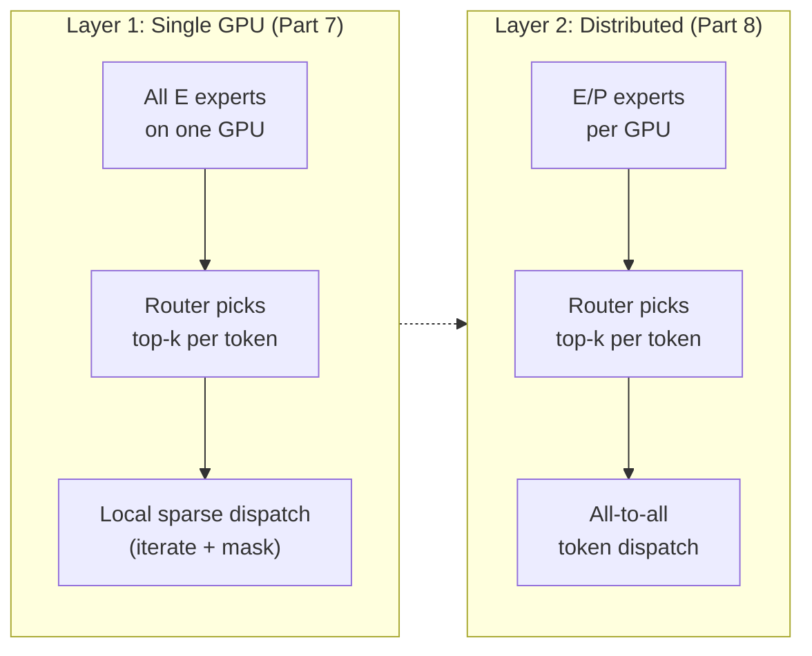
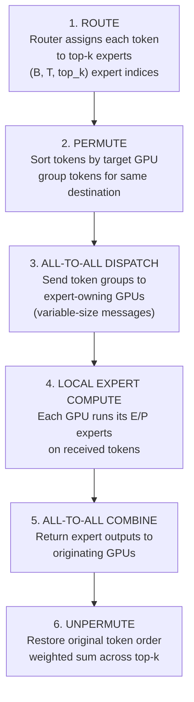
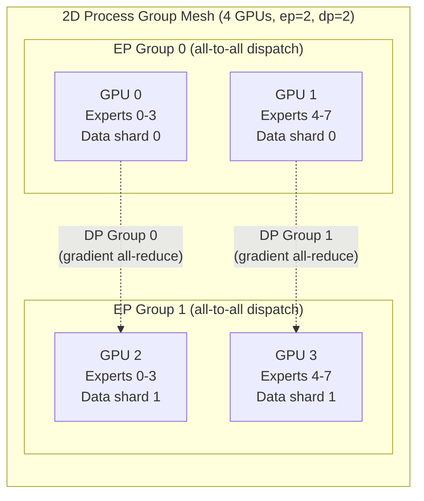

## Expert Parallelism from Scratch: Distributing MoE Experts with All-to-All Dispatch

*This is Part 8 of a nine-part series on model parallelism. Parts [1](tensor-parallelism-blog.md) and [2](tensor-parallelism-dtensor.md) cover Tensor Parallelism. Parts [3](sequence-parallelism-blog.md) and [4](sequence-parallelism-dtensor.md) cover Sequence Parallelism. Parts [5](context-parallelism-blog.md) and [6](context-parallelism-dtensor.md) cover Context Parallelism. [Part 7](expert-parallelism/SLM_Dense_vs_MoE_TinyStories.ipynb) builds single-GPU MoE from scratch. [Part 9](expert-parallelism-ep-dtensor.md) translates this hand-written EP implementation to PyTorch's DTensor ExpertParallel API.*

Part 7 showed that replacing the dense FFN with a Mixture of Experts (MoE) layer enables sparse computation: a router picks $k$ experts per token, and only those experts run. With 8 experts and top-2 routing, each token activates 25% of the FFN parameters while the model retains the capacity of all 8. The problem is scale. Mixtral 8x7B has 8 experts, each the size of a 7B dense FFN -- roughly 56 billion expert parameters total. DeepSeek-V3 pushes to 256 experts. No single GPU holds all of them.

Expert Parallelism (EP) solves this by distributing experts across GPUs and using all-to-all communication to dispatch tokens to the GPU that owns their target expert. The communication pattern is fundamentally different from TP's all-reduce and CP's ring rotation: EP moves *tokens*, not *activations* or *weight shards*, and the message sizes are *variable* because they depend on routing decisions that change every forward pass.

This article builds EP from scratch: the token permutation, the all-to-all dispatch-compute-combine pipeline, the split count exchange that makes variable-size messages work, and the 2D process group mesh that composes EP with data parallelism. The single-GPU MoE baseline lives in [train_gpt_moe.py](expert-parallelism/src/train_gpt_moe.py) and the EP version in [train_gpt_ep.py](expert-parallelism/src/train_gpt_ep.py) (both under [expert-parallelism/src/](expert-parallelism/src/)).


### A Map Before the Territory

The terminology around distributed MoE training involves several moving parts: routers, expert sharding, all-to-all collectives, split counts, token permutation, auxiliary loss, capacity factors. These are not competing alternatives -- they are layers in a stack. Understanding which layer each concept belongs to is the key to clarity.

We organize them into five layers, then deep-dive into each.

| Layer | Concept | Core question |
|-------|---------|---------------|
| 1 | Single-GPU bottleneck | Why can't all experts live on one GPU? |
| 2 | Distribution strategy | How do we split experts and route tokens? |
| 3 | All-to-all dispatch | What is the 6-step pipeline that moves tokens to experts and back? |
| 4 | Split counts | How does variable-size all-to-all actually work? |
| 5 | EP + DP composition | How do we compose expert sharding with data parallelism on a 2D mesh? |


### Layer 1: The Single-GPU Bottleneck -- Why Distribute Experts?

In Part 7, we built a Sparse MoE layer that lives entirely on one GPU. The router picks top-$k$ experts per token, and we iterate over all experts, masking and computing (from [train_gpt_moe.py](expert-parallelism/src/train_gpt_moe.py)):

```python
for i, expert in enumerate(self.experts):
    mask = (experts_flat == i)                              # (B*T, top_k)
    token_mask = mask.any(dim=-1)                           # (B*T,)
    if not token_mask.any():
        continue
    expert_input = x_flat[token_mask]                       # (num_selected, d_model)
    expert_output = expert(expert_input)                    # (num_selected, d_model)
    output[token_mask] += expert_output * expert_weights.unsqueeze(-1)
```

This works because all experts fit in GPU memory. For our mini config with $d_{\text{model}} = 512$, $d_{\text{ff}} = 2048$, and 8 experts, each expert FFN has two weight matrices ($512 \times 2048$ and $2048 \times 512$) for roughly 4M parameters. Total expert parameters: $8 \times 4M \approx 32M$ -- about 128 MB in fp32. Comfortable on any modern GPU.

But real MoE models are orders of magnitude larger:

| Model | Experts | Expert Size | Total Expert Params | Fits on 1 GPU? |
|-------|---------|-------------|---------------------|----------------|
| Our mini (Part 7) | 8 | ~4M | ~32M | YES (~128 MB) |
| Mixtral 8x7B | 8 | ~7B | ~56B | NO (~224 GB) |
| DeepSeek-V3 | 256 | ~1.6B | ~410B | NO (~1.6 TB) |

The sparse activation pattern -- only $k$ of $E$ experts fire per token -- gives us the hint. If each token only touches 2 experts, why must every GPU hold all 256? Distribute them: give each GPU a subset, and move tokens to where their experts live.



The takeaway: MoE gives us sparse activation; EP exploits it by distributing experts across GPUs so that each device holds only a fraction of the total expert parameters.


### Layer 2: The Distribution Strategy -- Split Experts, Route Tokens

With $E$ experts and $P$ GPUs in the EP group, each GPU holds $E/P$ local experts. The mapping is a contiguous shard: GPU $r$ owns experts $[r \cdot E/P, \; (r+1) \cdot E/P - 1]$. Given a global expert index $e$, the owning GPU is $\lfloor e \;/\; (E/P) \rfloor$.

```python
experts_per_rank = num_experts // ep_size
target_rank = expert_indices // experts_per_rank                 # (N,)
```

The router runs identically on every GPU -- it is a single linear layer ($d_{\text{model}} \to E$ logits), cheap to replicate. Every GPU sees the same input tokens and computes the same routing decisions. This replicated routing means every GPU knows which tokens need to go where, which is essential for constructing the permutation and split counts.

The challenge: tokens live on the GPU that produced them, but they need to reach the GPU that owns their target expert. The solution is all-to-all communication -- the topic of the next two layers.

| Component | Where it lives | Why |
|-----------|---------------|-----|
| Router weights | Replicated on all GPUs | Cheap (~$d \times E$ params), ensures consistent routing |
| Expert FFN weights | Sharded: $E/P$ per GPU | The whole point of EP |
| Input tokens | Local to producing GPU | Need to be dispatched |
| Output tokens | Returned to originating GPU | Must match original order for residual add |


### Layer 3: The All-to-All Dispatch -- A 6-Step Pipeline

The heart of Expert Parallelism is a six-step pipeline. Each MoE layer, every forward pass, executes this sequence:



Let us trace each step with concrete shapes. Assume batch $B$, sequence length $T$, top-$k$ routing, $E$ total experts, and $P$ GPUs in the EP group.

**Step 1: Route.** The router produces routing decisions for all tokens:

```python
routing_weights, selected_experts, router_logits = self.router(x)
# routing_weights:   (B, T, top_k)  -- softmax weights for selected experts
# selected_experts:  (B, T, top_k)  -- global expert IDs in [0, E)
# router_logits:     (B, T, E)      -- raw logits for auxiliary loss
```

Since each token is routed to $k$ experts, we expand to $N = B \times T \times k$ token-slots:

```python
x_expanded = x_flat.unsqueeze(1).expand(-1, self.top_k, -1)  # (B*T, top_k, d_model)
x_expanded = x_expanded.reshape(-1, C)                       # (N, d_model) where N = B*T*top_k
expert_indices = experts_flat.reshape(-1)                     # (N,)
weights_expanded = weights_flat.reshape(-1)                   # (N,)
```

**Step 2: Permute.** Group tokens by target GPU for efficient communication:

```python
target_rank = expert_indices // experts_per_rank               # (N,)
sort_indices = torch.argsort(target_rank, stable=True)         # (N,)
x_sorted = x_flat[sort_indices]                                # (N, d_model)
```

After sorting, all tokens destined for GPU 0 are contiguous, followed by all tokens for GPU 1, and so on. The `stable=True` preserves relative order within each group -- important for deterministic unpermutation later.

**Step 3: All-to-All Dispatch.** Send sorted token groups to expert-owning GPUs:

```python
dist.all_to_all_single(
    recv_tokens, x_sorted, output_splits, input_splits, group=ep_group
)
# x_sorted:     (N, d_model) -- grouped by target rank
# recv_tokens:  (total_recv, d_model) -- tokens arriving for this GPU's local experts
```

This is where the variable-size messaging happens -- Layer 4 details how `input_splits` and `output_splits` are computed.

**Step 4: Local Expert Compute.** Each GPU iterates over its $E/P$ local experts:

```python
expert_output = torch.zeros_like(recv_tokens)               # (total_recv, d_model)

for i, expert in enumerate(self.experts):
    mask = (local_expert_ids == i)                          # (total_recv,)
    if not mask.any():
        continue
    expert_output[mask] = expert(recv_tokens[mask])         # (n_i, d_model)
```

**Step 5: All-to-All Combine.** Return results to originating GPUs -- the reverse of Step 3:

```python
dist.all_to_all_single(
    recv_back, expert_output, input_splits, output_splits, group=ep_group
)
# Note: input_splits and output_splits are SWAPPED vs dispatch
# recv_back: (N, d_model) -- results in permuted order
```

**Step 6: Unpermute.** Restore original token order and combine top-$k$ contributions:

```python
combined = torch.empty_like(recv_back)                      # (N, d_model)
combined[sort_indices] = recv_back                          # undo the argsort from Step 2

combined = combined * weights_expanded.unsqueeze(-1)        # (N, d_model) -- weight by routing
combined = combined.view(B * T, self.top_k, C)              # (B*T, top_k, d_model)
output = combined.sum(dim=1)                                # (B*T, d_model) -- sum top-k slots
output = output.view(B, T, C)                               # (B, T, d_model)
```

**Contrast with other parallelism communication patterns:**

| Strategy | What moves between GPUs | Pattern | Direction |
|----------|------------------------|---------|-----------|
| TP | Partial activations | All-reduce / reduce-scatter | After each linear layer |
| CP | K/V blocks | P2P ring rotation | Circular, $C$ steps |
| EP | **Tokens** | All-to-all | Bidirectional, variable-size |

EP is the only strategy where the *data itself* (token embeddings) moves between GPUs. In TP, activations are partial sums being aggregated. In CP, K/V blocks rotate on a fixed schedule. In EP, entire token embeddings are sent to wherever their expert lives, and the amount sent to each rank depends on the router.


### Layer 4: The Split Counts -- Making Variable-Size All-to-All Work

In Context Parallelism (Part 5), every ring rotation transfers the same-sized K/V block: $(B, H, S/C, d)$. The communication is *uniform* -- every rank sends and receives the same amount.

Expert Parallelism is different. The router decides, dynamically, how many tokens go to each expert. Some experts may be popular (getting many tokens) and others nearly idle. This means the number of tokens sent from GPU $i$ to GPU $j$ varies every forward pass.

`torch.distributed.all_to_all_single` supports variable-size messages through two lists:

- `input_splits[r]`: number of elements (tokens) this GPU sends to rank $r$
- `output_splits[r]`: number of elements this GPU receives from rank $r$

The critical insight: each GPU knows its own `input_splits` (it counted how many tokens target each rank), but does *not* know how many tokens it will receive from other ranks. So we exchange the counts themselves with a preliminary all-to-all:

```python
# Count how many tokens go to each rank
input_splits = [
    (target_rank[sort_indices] == r).sum().item() for r in range(ep_size)
]

# Exchange counts: each rank learns how many tokens it will receive
input_splits_tensor = torch.tensor(
    input_splits, dtype=torch.long, device=x_flat.device
)                                                           # (ep_size,)
output_splits_tensor = torch.empty_like(input_splits_tensor)
dist.all_to_all_single(
    output_splits_tensor, input_splits_tensor, group=ep_group
)                                                           # (ep_size,)
output_splits = output_splits_tensor.tolist()
```

**A concrete example.** With 8 experts, 4 GPUs (2 experts per GPU), $B=2$, $T=4$, $k=2$, each GPU has $N = 2 \times 4 \times 2 = 16$ token-slots. Suppose the router on GPU 0 assigns:

```
Token-slot target experts: [0, 3, 5, 7, 1, 2, 6, 4, 0, 5, 3, 7, 2, 1, 6, 4]
Target ranks (2 experts/GPU): [0, 1, 2, 3, 0, 1, 3, 2, 0, 2, 1, 3, 1, 0, 3, 2]

input_splits from GPU 0: [4, 3, 3, 6]
  -- 4 token-slots to rank 0, 3 to rank 1, 3 to rank 2, 6 to rank 3
```

But GPU 1 has its own routing decisions, producing a different `input_splits`. After the count exchange, GPU 0 learns its `output_splits` -- the total tokens it will receive from all ranks for its two local experts.

The two all-to-all calls in `all_to_all_dispatch` form a two-phase pattern:

1. **Metadata all-to-all**: exchange split counts ($P$ integers per rank -- negligible)
2. **Data all-to-all**: exchange token embeddings ($N \times d_{\text{model}}$ elements total)

We also exchange expert IDs alongside the tokens so each GPU knows which of its local experts to run on each received token:

```python
recv_expert_ids = torch.empty(
    total_recv, dtype=expert_ids_sorted.dtype, device=x_flat.device
)
dist.all_to_all_single(
    recv_expert_ids, expert_ids_sorted, output_splits, input_splits, group=ep_group
)
# Convert global expert ID -> local expert ID
ep_rank = dist.get_rank(ep_group)
recv_expert_ids = recv_expert_ids - ep_rank * experts_per_rank  # (total_recv,)
```

The global-to-local conversion is a simple subtraction: if GPU 2 owns experts $[4, 5]$, then global expert 5 becomes local expert $5 - 2 \times 2 = 1$.


### Layer 5: EP + DP Composition -- The 2D Process Group Mesh

Pure Expert Parallelism uses all GPUs in a single EP group: each GPU holds its expert shard, every token dispatch goes through one all-to-all. This scales expert memory well, but there is no data parallelism -- every GPU sees the same data.

When we have more GPUs than experts need (or when we want faster convergence through larger effective batch size), we compose EP with Data Parallelism (DP) on a 2D process group mesh.

**The mesh.** With `world_size = ep_size * dp_size`, we create two orthogonal sets of process groups:

- **EP groups** (horizontal): ranks that share experts via all-to-all. Each EP group has `ep_size` ranks.
- **DP groups** (vertical): ranks that hold the *same* expert shard but see *different* data. Each DP group has `dp_size` ranks.

For 4 GPUs with `ep_size=2, dp_size=2`:



The code constructs these groups (from [train_gpt_ep.py](expert-parallelism/src/train_gpt_ep.py)):

```python
# EP groups: ranks that share experts via all-to-all
ep_start = (rank // ep_size) * ep_size
ep_ranks = list(range(ep_start, ep_start + ep_size))
ep_group = dist.new_group(ranks=ep_ranks)
ep_rank = dist.get_rank(ep_group)

# DP groups: ranks with same expert shard, different data
dp_group = None
dp_rank = 0
if dp_size > 1:
    dp_ranks = [rank % ep_size + i * ep_size for i in range(dp_size)]
    dp_group = dist.new_group(ranks=dp_ranks)
    dp_rank = dist.get_rank(dp_group)
```

For our 4-GPU example, this produces:

| Global Rank | EP Group Ranks | EP Rank | DP Group Ranks | DP Rank | Local Experts |
|-------------|---------------|---------|----------------|---------|---------------|
| 0 | [0, 1] | 0 | [0, 2] | 0 | Experts 0-3 |
| 1 | [0, 1] | 1 | [1, 3] | 0 | Experts 4-7 |
| 2 | [2, 3] | 0 | [0, 2] | 1 | Experts 0-3 |
| 3 | [2, 3] | 1 | [1, 3] | 1 | Experts 4-7 |

GPUs 0 and 2 hold the same expert shard (experts 0-3) but see different data -- they form a DP pair. GPUs 0 and 1 hold complementary expert shards and dispatch tokens to each other -- they form an EP pair.

**Gradient sync rules.** The key insight: expert weights are *unique* per EP rank (GPU 0 owns experts 0-3, GPU 1 owns experts 4-7). They are not replicated, so they do *not* need gradient synchronization. All other parameters -- attention, embeddings, LayerNorm, the router itself -- *are* replicated across DP ranks and need all-reduce.

```python
def sync_dp_gradients(model: nn.Module, dp_group: dist.ProcessGroup, ep_size: int):
    """All-reduce gradients for non-expert parameters across DP group.

    Expert weights are unique per GPU (sharded by EP), so they do NOT
    need gradient sync. Only attention, embedding, layernorm, and router
    weights are replicated and need all-reduce.
    """
    for name, param in model.named_parameters():
        if param.grad is None:
            continue
        if ".experts." in name:
            continue                                        # skip expert params
        dist.all_reduce(param.grad, op=dist.ReduceOp.AVG, group=dp_group)
```

The parameter name check (`.experts.` in `name`) is a simple but effective filter. In `DistributedSparseMoELayer`, the expert modules live under `self.experts`, so their parameter names follow the pattern `blocks.{i}.moe.experts.{j}.W1.weight`. Everything else -- `blocks.{i}.attn.W_q.weight`, `blocks.{i}.moe.router.gate.weight`, `tok_emb.weight` -- gets all-reduced.

| Parameter type | Replicated across DP? | Gradient sync needed? | Communication |
|---------------|----------------------|----------------------|---------------|
| Expert FFN weights | NO (sharded by EP) | NO | None |
| Attention weights | YES | YES | All-reduce in DP group |
| Embedding weights | YES | YES | All-reduce in DP group |
| LayerNorm params | YES | YES | All-reduce in DP group |
| Router weights | YES | YES | All-reduce in DP group |

**The training loop integration.** Gradient sync is called after `backward()` and before `optimizer.step()`:

```python
total_loss.backward()

if dp_group is not None:
    sync_dp_gradients(model, dp_group, ep_size)

optimizer.step()
```

With pure EP (`dp_size=1`), the DP group is `None` and no gradient sync happens. Each GPU independently updates its own expert weights plus the shared parameters (which are consistent because they were initialized identically and see the same gradient flow from the all-to-all communication graph).


### The Full Dispatch Function

The `all_to_all_dispatch` function packages Steps 2-3 from Layer 3 into a single reusable call. Here is the complete implementation from [train_gpt_ep.py](expert-parallelism/src/train_gpt_ep.py):

```python
def all_to_all_dispatch(
    x_flat: torch.Tensor,
    expert_indices: torch.Tensor,
    ep_size: int,
    num_experts: int,
    ep_group: dist.ProcessGroup,
) -> tuple[torch.Tensor, torch.Tensor, list[int], list[int], torch.Tensor]:
    """Permute tokens by expert, then all-to-all dispatch to expert-owning GPUs.

    Args:
        x_flat: (N, d_model) flattened token embeddings (N = B*T*top_k)
        expert_indices: (N,) global expert index for each token-slot
        ep_size: number of GPUs in EP group
        num_experts: total number of experts across all GPUs
        ep_group: process group for EP communication

    Returns:
        recv_tokens:     (total_recv, d_model) tokens for this GPU's local experts
        sort_indices:    (N,) for later unpermute
        input_splits:    how many tokens sent to each rank
        output_splits:   how many tokens received from each rank
        recv_expert_ids: (total_recv,) local expert index for each received token
    """
    experts_per_rank = num_experts // ep_size
    target_rank = expert_indices // experts_per_rank             # (N,)

    sort_indices = torch.argsort(target_rank, stable=True)      # (N,)
    x_sorted = x_flat[sort_indices]                             # (N, d_model)
    expert_ids_sorted = expert_indices[sort_indices]             # (N,)

    # Count how many tokens go to each rank
    input_splits = [
        (target_rank[sort_indices] == r).sum().item() for r in range(ep_size)
    ]

    # Exchange split counts so each rank knows how many to receive
    input_splits_tensor = torch.tensor(
        input_splits, dtype=torch.long, device=x_flat.device
    )                                                           # (ep_size,)
    output_splits_tensor = torch.empty_like(input_splits_tensor)
    dist.all_to_all_single(
        output_splits_tensor, input_splits_tensor, group=ep_group
    )
    output_splits = output_splits_tensor.tolist()

    # All-to-all: send tokens to the GPU that owns their target expert
    total_recv = sum(output_splits)
    recv_tokens = torch.empty(
        total_recv, x_flat.shape[1], dtype=x_flat.dtype, device=x_flat.device
    )                                                           # (total_recv, d_model)
    dist.all_to_all_single(
        recv_tokens, x_sorted, output_splits, input_splits, group=ep_group
    )

    # Also exchange expert IDs so we know which local expert to run
    recv_expert_ids = torch.empty(
        total_recv, dtype=expert_ids_sorted.dtype, device=x_flat.device
    )
    dist.all_to_all_single(
        recv_expert_ids, expert_ids_sorted, output_splits, input_splits, group=ep_group
    )
    ep_rank = dist.get_rank(ep_group)
    recv_expert_ids = recv_expert_ids - ep_rank * experts_per_rank  # (total_recv,)

    return recv_tokens, sort_indices, input_splits, output_splits, recv_expert_ids
```


### The Combine Function

The reverse path. `all_to_all_combine` returns expert outputs to originating GPUs and restores the original token order (from [train_gpt_ep.py](expert-parallelism/src/train_gpt_ep.py)):

```python
def all_to_all_combine(
    expert_output: torch.Tensor,
    sort_indices: torch.Tensor,
    input_splits: list[int],
    output_splits: list[int],
    ep_group: dist.ProcessGroup,
    original_size: int,
) -> torch.Tensor:
    """Reverse the all-to-all dispatch: return expert outputs to originating GPUs.

    Args:
        expert_output: (total_recv, d_model) outputs from local experts
        sort_indices:  (N,) from dispatch, used to unpermute
        input_splits:  from dispatch (becomes output_splits for reverse)
        output_splits: from dispatch (becomes input_splits for reverse)
        ep_group:      process group for EP communication
        original_size: N = B*T*top_k

    Returns:
        combined: (N, d_model) expert outputs in original token order
    """
    recv_back = torch.empty(
        original_size, expert_output.shape[1],
        dtype=expert_output.dtype, device=expert_output.device,
    )                                                           # (N, d_model)
    dist.all_to_all_single(
        recv_back, expert_output, input_splits, output_splits, group=ep_group
    )

    # Unpermute to restore original token order
    combined = torch.empty_like(recv_back)                      # (N, d_model)
    combined[sort_indices] = recv_back
    return combined
```

The key subtlety: `input_splits` and `output_splits` are *swapped* relative to the dispatch call. During dispatch, `input_splits` described how many tokens we *sent* and `output_splits` described how many we *received*. During combine, we are sending back what we received and receiving back what we sent -- so the splits reverse roles.


### The Distributed MoE Layer

The `DistributedSparseMoELayer` composes routing, dispatch, local compute, and combine into a single `forward` (from [train_gpt_ep.py](expert-parallelism/src/train_gpt_ep.py)):

```python
class DistributedSparseMoELayer(nn.Module):
    def __init__(self, config: MoEGPTConfig, ep_size: int, ep_group: dist.ProcessGroup):
        super().__init__()
        self.num_experts = config.num_experts
        self.top_k = config.top_k
        self.ep_size = ep_size
        self.ep_group = ep_group

        assert config.num_experts % ep_size == 0
        self.experts_per_rank = config.num_experts // ep_size

        # Only local experts are instantiated -- the whole point of EP
        self.experts = nn.ModuleList(
            [ExpertFFN(config) for _ in range(self.experts_per_rank)]
        )
        self.router = Router(config.d_model, config.num_experts, config.top_k)
```

Compare to the single-GPU `SparseMoELayer` from Part 7:

| | Part 7 (Single GPU) | Part 8 (EP) |
|---|---|---|
| Experts instantiated | All $E$ | $E/P$ per GPU |
| Routing | Local loop over all experts | Same routing, then all-to-all dispatch |
| Communication | None | 3 all-to-all calls per MoE layer |
| Expert params per GPU | $E \times 2 \times d \times d_{\text{ff}}$ | $(E/P) \times 2 \times d \times d_{\text{ff}}$ |
| Capacity enforcement | Optional (capacity_factor) | Not used (no dropping in EP) |

Note that the EP version does not use capacity-based token dropping. In the single-GPU version, capacity limits prevented any one expert from processing too many tokens, dropping overflow. With EP, load imbalance manifests as unequal `total_recv` across GPUs -- the auxiliary loss handles this by pushing the router toward balanced assignments.


### Full Model Integration

Expert Parallelism replaces only the MoE layer. Attention, embeddings, LayerNorm, and the output projection are unchanged from Part 7:

```python
class MoETransformerBlock(nn.Module):
    def __init__(self, config: MoEGPTConfig, ep_size: int, ep_group: dist.ProcessGroup):
        super().__init__()
        self.ln1 = nn.LayerNorm(config.d_model)
        self.attn = Attention(config)                       # unchanged from Part 7
        self.ln2 = nn.LayerNorm(config.d_model)
        self.moe = DistributedSparseMoELayer(config, ep_size, ep_group)

    def forward(self, x: torch.Tensor) -> tuple[torch.Tensor, torch.Tensor]:
        x = x + self.attn(self.ln1(x))                     # (B, T, d_model)
        moe_out, aux_loss = self.moe(self.ln2(x))          # (B, T, d_model)
        x = x + moe_out
        return x, aux_loss
```

The `ep_group` is wired through `__init__` at model construction time -- the same pattern as CP in Part 5. The `forward()` signature stays clean: `(x) -> (x, aux_loss)`. This sets up the contrast with Part 9, where DTensor's `ExpertParallel` plan handles the dispatch externally, and the model code is identical to the single-GPU version.

The auxiliary loss is all-reduced across the EP group for consistency:

```python
aux_loss = self._load_balancing_loss(router_logits, selected_experts)
dist.all_reduce(aux_loss, op=dist.ReduceOp.AVG, group=self.ep_group)
```

This ensures all GPUs in the EP group agree on the auxiliary loss value, even though each GPU may have seen slightly different routing statistics due to numerical precision differences.


### Activation Shape Trace

For a MoE transformer block with EP degree $P$, batch $B$, sequence length $T$, hidden dim $d$, $E$ total experts, top-$k$ routing:

| Location | Shape | Notes |
|----------|-------|-------|
| Block input | $(B, T, d)$ | Same on all GPUs |
| LayerNorm output | $(B, T, d)$ | Local operation |
| Attention output | $(B, T, d)$ | No EP involvement |
| Router logits | $(B, T, E)$ | Replicated routing |
| Token expansion | $(N, d)$ where $N = B \cdot T \cdot k$ | One row per token-slot |
| Permuted tokens (pre-dispatch) | $(N, d)$ | Sorted by target rank |
| **After all-to-all dispatch** | $(\text{total\_recv}, d)$ | **Variable per GPU** |
| Local expert output | $(\text{total\_recv}, d)$ | Computed locally |
| After combine + unpermute | $(N, d)$ | Back to original order |
| Weighted top-$k$ sum | $(B \cdot T, d)$ | Top-$k$ contributions merged |
| Block output | $(B, T, d)$ | Same shape as input |

The critical variable is `total_recv` -- it depends on how many tokens the router sends to this GPU's experts. With balanced routing and uniform distribution, each GPU receives approximately $N / P$ tokens. With imbalanced routing, some GPUs receive more and become the bottleneck -- hence the auxiliary loss that encourages balanced expert utilization.


### Communication Cost

**Per MoE layer (forward pass):**

Each forward pass through a distributed MoE layer requires:

| Call | Data size | Purpose |
|------|-----------|---------|
| `all_to_all_single` #1 | $P$ integers per rank | Exchange split counts |
| `all_to_all_single` #2 | $N \times d$ elements | Dispatch token embeddings |
| `all_to_all_single` #3 | $N$ integers | Dispatch expert IDs |
| `all_to_all_single` #4 | $\text{total\_recv} \times d$ elements | Combine expert outputs |

The backward pass roughly doubles this (gradients flow back through the same all-to-all operations via autograd).

**Total data moved per MoE layer (forward only):**

$$
\text{Bytes}_{\text{forward}} \approx 2 \times N \times d_{\text{model}} \times \text{bytes\_per\_element}
$$

where the factor of 2 accounts for dispatch + combine. With $N = B \times T \times k$, for $B = 8$, $T = 256$, $k = 2$, $d_{\text{model}} = 512$, bf16:

$$
2 \times (8 \times 256 \times 2) \times 512 \times 2 \;\text{bytes} = 8.4 \;\text{MB per layer}
$$

**Comparison with other parallelism collectives:**

| Strategy | Collective | Data per layer | Message size |
|----------|-----------|----------------|--------------|
| TP | All-reduce | $2 \times B \times T \times d$ | Fixed |
| CP | P2P ring | $2 \times B \times (T/C) \times d$ per step | Fixed |
| EP | All-to-all | $2 \times N \times d$ | **Variable** |

The variable message size is the distinguishing characteristic of EP. It makes EP harder to pipeline and overlap but also means that with good load balancing (via auxiliary loss), the computational load is roughly even across GPUs.


### Experimental Plan

We use a GPT-2 model with MoE layers trained on TinyStories, running on a g5.12xlarge instance with 4x A10G GPUs (24 GB each). The goal: compare pure EP against EP+DP, and contrast both with the single-GPU MoE baseline from Part 7.

**Model configurations:**

| Config | d_model | n_heads | d_ff | n_layers | Experts | Top-k | Sparse Params |
|--------|---------|---------|------|----------|---------|-------|---------------|
| mini   | 512     | 8       | 2048 | 6        | 8       | 2     | ~57M          |
| small  | 768     | 12      | 3072 | 12       | 8       | 2     | ~352M         |
| medium | 1024    | 16      | 4096 | 24       | 8       | 2     | ~1B           |

**Experiment 1: Pure EP (all 4 GPUs in one EP group)**

```bash
# ep_size=4: each GPU holds 2 of 8 experts
torchrun --nproc_per_node=4 src/train_gpt_ep.py --config mini --ep-size 4
```

Each GPU holds only 2 of 8 experts. Expert memory per GPU drops to 1/4 of the total expert parameters. All-to-all dispatches tokens across all 4 GPUs in a single EP group.

**Experiment 2: EP+DP (2D mesh, ep_size=2, dp_size=2)**

```bash
# ep_size=2, dp_size=2: each GPU holds 4 experts, 2 DP replicas
torchrun --nproc_per_node=4 src/train_gpt_ep.py --config mini --ep-size 2
```

EP groups: {GPU 0, GPU 1} and {GPU 2, GPU 3}. Each GPU holds 4 experts. DP groups: {GPU 0, GPU 2} and {GPU 1, GPU 3}. Non-expert gradients are all-reduced within DP groups. The effective batch size doubles.

**Experiment 3: Single-GPU baseline (Part 7, for reference)**

```bash
torchrun --nproc_per_node=1 src/train_gpt_moe.py --config mini
```

All 8 experts on one GPU. No communication overhead but no memory savings either.

**Expected trade-offs:**

| Metric | Single GPU (Part 7) | Pure EP (ep=4) | EP+DP (ep=2, dp=2) |
|--------|-------------------|---------------|---------------------|
| Experts per GPU | 8 | 2 | 4 |
| Expert memory per GPU | Full | ~1/4 | ~1/2 |
| All-to-all scope | N/A | 4 GPUs | 2 GPUs |
| Data parallelism | None | None | 2x effective batch |
| Gradient all-reduce | None | None | Non-expert params only |
| Communication per layer | None | 3 all-to-all | 3 all-to-all + all-reduce |

Pure EP minimizes expert memory per GPU but uses a larger all-to-all group. EP+DP trades some memory savings for data-parallel gradient sync, which improves convergence through larger effective batch size and reduces all-to-all scope (fewer GPUs per EP group means smaller dispatch overhead).

The choice between pure EP and EP+DP depends on the bottleneck. If expert memory is the constraint (many large experts), maximize `ep_size`. If training speed is the constraint (want larger batches or more gradient diversity), introduce DP. In practice, production systems like Mixtral and DeepSeek-V3 use EP+DP (and often EP+DP+TP) to balance all three concerns.


### What's Next

The hand-written EP implementation in this article -- the permutation logic, the split count exchange, the three all-to-all calls per dispatch, the manual gradient filtering in `sync_dp_gradients` -- totals roughly 120 lines of Python. In [Part 9](expert-parallelism-ep-dtensor.md), we replace all of it with PyTorch's `ExpertParallel` plan applied via `parallelize_module`. The expert weights are stored as 3D tensors in `GroupedExperts` (batching all local experts into a single `bmm` call instead of looping), and `AllToAllTokenDispatcher` handles the permute-dispatch-compute-combine pipeline transparently. The model code stays identical to the single-GPU version from Part 7 -- the DTensor payoff.


### References

- [Switch Transformers: Scaling to Trillion Parameter Models with Simple and Efficient Sparsity](https://arxiv.org/abs/2101.03961) (Fedus et al., 2022) -- auxiliary loss formulation
- [Mixtral of Experts](https://arxiv.org/abs/2401.04088) (Jiang et al., 2024) -- 8-expert MoE architecture
- [DeepSeek-V3 Technical Report](https://arxiv.org/abs/2412.19437) (DeepSeek-AI, 2024) -- 256-expert fine-grained MoE
- [GShard: Scaling Giant Models with Conditional Computation and Automatic Sharding](https://arxiv.org/abs/2006.16668) (Lepikhin et al., 2020) -- all-to-all expert dispatch at scale
- [Megatron-LM: Training Multi-Billion Parameter Language Models Using Model Parallelism](https://arxiv.org/abs/1909.08053) (Shoeybi et al., 2019) -- TP foundation referenced throughout the series
- [torch.distributed.all_to_all_single documentation](https://pytorch.org/docs/stable/distributed.html#torch.distributed.all_to_all_single) -- variable-size all-to-all API
- [PyTorch ExpertParallel (DTensor MoE)](https://github.com/pytorch/pytorch/blob/main/torch/distributed/tensor/experimental/_expert_parallel.py) -- the DTensor approach used in Part 9
- [HuggingFace Ultra-Scale Playbook](https://huggingface.co/spaces/nanotron/ultrascale-playbook) -- comprehensive distributed training reference
