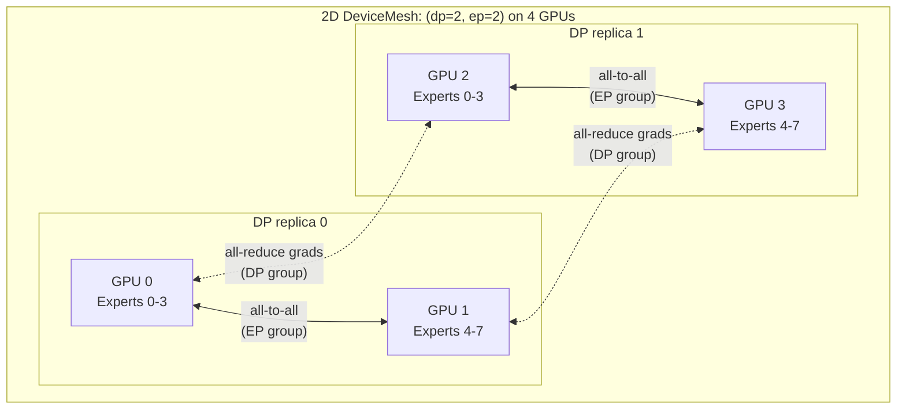
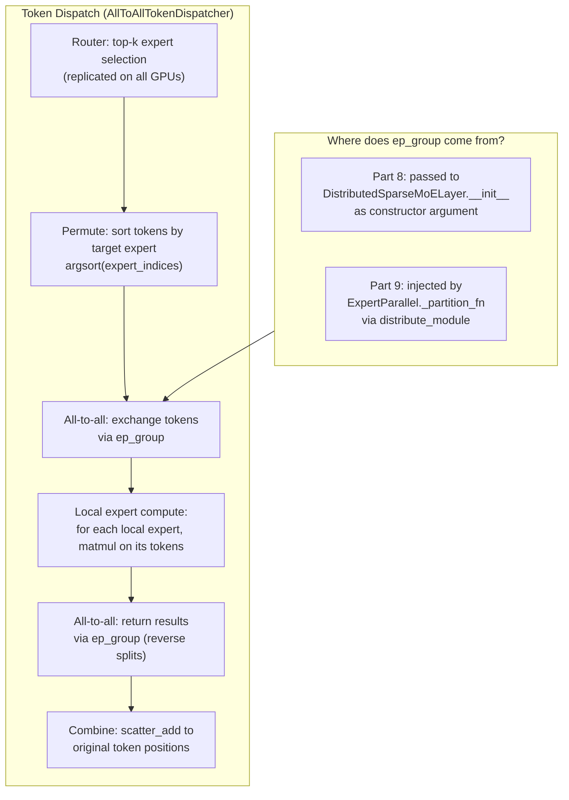

## From Hand-Written Expert Parallelism to DTensor: Same Model, Different Wrapper

*This is Part 9 of a nine-part series on model parallelism. Parts [1](tensor-parallelism-blog.md) and [2](tensor-parallelism-dtensor.md) cover Tensor Parallelism. Parts [3](sequence-parallelism-blog.md) and [4](sequence-parallelism-dtensor.md) cover Sequence Parallelism. Parts [5](context-parallelism-blog.md) and [6](context-parallelism-dtensor.md) cover Context Parallelism. [Part 7](expert-parallelism/SLM_Dense_vs_MoE_TinyStories.ipynb) introduces Mixture of Experts on a single GPU. [Part 8](expert-parallelism/src/train_gpt_ep.py) builds hand-written Expert Parallelism with all-to-all dispatch.*

In [Part 8](expert-parallelism/src/train_gpt_ep.py) we built Expert Parallelism by hand: manual process group creation, explicit `all_to_all_dispatch` and `all_to_all_combine` functions, per-rank expert slicing with `nn.ModuleList`, and a separate `sync_dp_gradients` function that inspects parameter names to decide which gradients to all-reduce. The whole thing works - tokens route to the right experts, gradients flow correctly, EP composes with DP - but the model constructor must accept `ep_size` and `ep_group` as arguments, tying the model definition to the parallelism strategy.

This article replaces all of that with PyTorch's `ExpertParallel` DTensor `ParallelStyle`. The result is [train_gpt_ep_dtensor.py](expert-parallelism/src/train_gpt_ep_dtensor.py): a model whose `__init__` and `forward` are **identical to a single-GPU MoE GPT**. The 2D `DeviceMesh`, the `Shard(0)` placement on expert weights, and the `ep_group` injection into the token dispatcher all happen in a single `distribute_module` call outside the model. The model itself has no knowledge of parallelism.


### What PyTorch Provides for Expert Parallelism

Three components from `torch.distributed.tensor` make the DTensor EP approach possible:

**1. `GroupedExperts` -- 3D weight tensors.** Instead of an `nn.ModuleList` of individual `ExpertFFN` modules (each with its own `W1` and `W2`), the DTensor approach stores all expert weights as 3D tensors:

```python
# Hand-written (Part 8): separate nn.Module per expert
self.experts = nn.ModuleList(
    [ExpertFFN(config) for _ in range(self.experts_per_rank)]
)

# DTensor (Part 9): all experts in 3D weight tensors
self.w1 = nn.Parameter(torch.empty(num_experts, d_ff, d_model))    # (E, d_ff, d_model)
self.w2 = nn.Parameter(torch.empty(num_experts, d_model, d_ff))    # (E, d_model, d_ff)
```

Why 3D? Because DTensor's `Shard(0)` can slice along the expert dimension - splitting 8 experts across 4 GPUs means each GPU gets a `(2, d_ff, d_model)` shard. With `nn.ModuleList`, there is no single tensor to shard; you must manually index into the list and assign subsets to each GPU.

**2. `ExpertParallel` -- a `ParallelStyle` that shards on dim 0.** Just as `ColwiseParallel` shards linear layers for Tensor Parallelism (Parts 1-2), `ExpertParallel` shards expert weight tensors for Expert Parallelism. It does two things:
- Applies `Shard(0)` to 3D parameters in the `GroupedExperts` module (the expert weights)
- Sets `ep_group` on the module's `token_dispatcher`, so the dispatcher knows which process group to use for all-to-all communication

**3. `AllToAllTokenDispatcher` -- handles permute, all-to-all, and combine.** The dispatcher encapsulates the same logic we wrote by hand in Part 8: sort tokens by target expert, compute split counts, exchange tokens via `all_to_all_single`, run local experts, and reverse the dispatch. The key difference: `ep_group` is injected by `ExpertParallel` rather than passed through the model constructor.


### The Key Contrast: Model Code Side by Side

The most important comparison is between the model constructors. In Part 8, every layer of the model must know about EP:

```python
# Part 8: Hand-written EP -- parallelism is wired into the model

class DistributedSparseMoELayer(nn.Module):
    def __init__(self, config, ep_size, ep_group):    # <-- must know about EP
        self.ep_size = ep_size
        self.ep_group = ep_group
        self.experts_per_rank = config.num_experts // ep_size
        self.experts = nn.ModuleList(
            [ExpertFFN(config) for _ in range(self.experts_per_rank)]
        )                                              # <-- only local experts
        self.router = Router(config.d_model, config.num_experts, config.top_k)

class MoETransformerBlock(nn.Module):
    def __init__(self, config, ep_size, ep_group):    # <-- must pass through
        self.moe = DistributedSparseMoELayer(config, ep_size, ep_group)

class MoEGPT(nn.Module):
    def __init__(self, config, ep_size, ep_group):    # <-- must pass through
        self.blocks = nn.ModuleList(
            [MoETransformerBlock(config, ep_size, ep_group)
             for _ in range(config.n_layers)]
        )

# Construction requires distributed state
model = MoEGPT(config, ep_size, ep_group).to(device)
```

In Part 9, the model is a plain `nn.Module` with no parallelism awareness:

```python
# Part 9: DTensor EP -- model is parallelism-agnostic

class GroupedExperts(nn.Module):
    def __init__(self, config):                        # <-- no EP arguments
        self.w1 = nn.Parameter(
            torch.empty(config.num_experts, config.d_ff, config.d_model)
        )                                              # (E, d_ff, d_model) -- ALL experts
        self.w2 = nn.Parameter(
            torch.empty(config.num_experts, config.d_model, config.d_ff)
        )                                              # (E, d_model, d_ff) -- ALL experts
        self.token_dispatcher = AllToAllTokenDispatcher(
            config.num_experts, config.top_k,
        )
        # NOTE: Router lives OUTSIDE this module -- see "A Subtle Pitfall" below

class MoETransformerBlock(nn.Module):
    def __init__(self, config):                        # <-- no EP arguments
        self.router = Router(config.d_model, ...)      # <-- Router is here, not in GroupedExperts
        self.moe = GroupedExperts(config)

class MoEGPT(nn.Module):
    def __init__(self, config):                        # <-- no EP arguments
        self.blocks = nn.ModuleList(
            [MoETransformerBlock(config) for _ in range(config.n_layers)]
        )

# Construction is parallelism-free
model = MoEGPT(config).to(device)

# Parallelism is applied externally, after construction
apply_expert_parallelism(model, ep_mesh)
```

The model can run on a single GPU with zero modifications. All distributed logic lives in the `apply_expert_parallelism` wrapper.


### 2D DeviceMesh for EP+DP

Expert Parallelism rarely runs alone. In practice, EP composes with Data Parallelism (DP): experts are sharded across the EP dimension, while the rest of the model (attention, embeddings, LayerNorm, router) is replicated across the DP dimension. The 2D `DeviceMesh` declares this layout in a single line:

```python
# 4 GPUs: ep_size=2, dp_size=2
# mesh_2d = [[0, 1], [2, 3]]
#             ^^^^^    ^^^^^
#             EP grp0  EP grp1
#
# DP groups: {0,2} and {1,3} (same position across EP groups)
mesh = DeviceMesh("cuda", mesh_2d, mesh_dim_names=("dp", "ep"))
ep_mesh = mesh["ep"]    # 1D sub-mesh for expert sharding
dp_mesh = mesh["dp"]    # 1D sub-mesh for gradient sync
```

Compare this to the hand-written setup from Part 8, which requires 15+ lines of manual group construction:

```python
# Part 8: manual process group creation
ep_start = (rank // ep_size) * ep_size
ep_ranks = list(range(ep_start, ep_start + ep_size))
ep_group = dist.new_group(ranks=ep_ranks)
ep_rank = dist.get_rank(ep_group)

dp_group = None
dp_rank = 0
if dp_size > 1:
    dp_ranks = [rank % ep_size + i * ep_size for i in range(dp_size)]
    dp_group = dist.new_group(ranks=dp_ranks)
    dp_rank = dist.get_rank(dp_group)
```

The `DeviceMesh` approach is not just shorter -- it is composable. Adding a third dimension (e.g., TP within each node) means reshaping the mesh from 2D to 3D and slicing a `mesh["tp"]` sub-mesh. With manual groups, you would need to write a third nested loop of `dist.new_group` calls.



**EP groups** (solid arrows): GPUs 0-1 and GPUs 2-3 exchange tokens via all-to-all. Each EP group holds a full set of experts.

**DP groups** (dashed arrows): GPUs 0,2 and GPUs 1,3 all-reduce gradients for replicated parameters (attention, embeddings, router). Expert gradients are NOT all-reduced -- each GPU's expert shard receives gradients only from its own tokens.


### How `ExpertParallel._partition_fn` Works

The `ExpertParallel` class is a `ParallelStyle` (the same base class used by `ColwiseParallel` and `RowwiseParallel` in TP). Its `_partition_fn` does two things in a single pass over the module:

```python
class ExpertParallel(ParallelStyle):
    def _partition_fn(self, name, mod, device_mesh):
        # 1. Shard 3D expert weight tensors on dim 0 (the expert dimension).
        #    Skip 2D params -- see "A Subtle Pitfall" below for why.
        for param_name, param in mod.named_parameters(recurse=False):
            if param.dim() >= 3:
                dist_param = nn.Parameter(
                    distribute_tensor(param, device_mesh, [Shard(0)])
                )
                mod.register_parameter(param_name, dist_param)

        # 2. Set ep_group on the token dispatcher (only GroupedExperts has one)
        if hasattr(mod, "token_dispatcher"):
            mod.token_dispatcher.ep_group = device_mesh.get_group()

    def _apply(self, module, device_mesh):
        return distribute_module(module, device_mesh, partition_fn=self._partition_fn)
```

**Step 1: `distribute_tensor(param, device_mesh, [Shard(0)])`** takes a full-size parameter (e.g., `w1` with shape `(8, d_ff, d_model)`) and converts it to a `DTensor` with `Shard(0)` placement. On each GPU, the local shard is `(8 / ep_size, d_ff, d_model)`. With `ep_size=4`, each GPU holds `(2, d_ff, d_model)` -- exactly 2 experts worth of weights. The `dim >= 3` guard is defensive: since the Router lives outside `GroupedExperts`, there should be no 2D params to skip, but the guard protects against future refactoring.

**Step 2: `mod.token_dispatcher.ep_group = device_mesh.get_group()`** injects the process group into the dispatcher. The dispatcher uses this group for `all_to_all_single` calls. This is the "wiring" that the hand-written version does in the model constructor. The `hasattr` check lets the same `_partition_fn` be called on any submodule without crashing.

The `_apply` method wraps it all via `distribute_module`, which calls `_partition_fn` for the target module. The entire application is a single function call per MoE layer:

```python
def apply_expert_parallelism(model, ep_mesh):
    ep_style = ExpertParallel()
    for block in model.blocks:
        ep_style._apply(block.moe, ep_mesh)
    return model
```

This replaces the hand-written approach where each `DistributedSparseMoELayer.__init__` must compute `experts_per_rank`, slice the `nn.ModuleList`, and store the `ep_group`.


### A Subtle Pitfall: Why the Router Lives Outside `GroupedExperts`

You might wonder why the `Router` is in `MoETransformerBlock` rather than inside `GroupedExperts`. In our first implementation, we put the Router inside `GroupedExperts` -- the natural single-GPU structure. It crashed immediately:

```
RuntimeError: aten.mm.default got mixed torch.Tensor and DTensor,
need to convert all torch.Tensor to DTensor before calling
distributed operators!
```

The problem is `distribute_module`. When you call `distribute_module(block.moe, ep_mesh, partition_fn)`, it walks **every submodule** recursively, calling `_partition_fn` on each one. With the Router inside `GroupedExperts`, the call chain looks like:

```
distribute_module(grouped_experts, ep_mesh, _partition_fn)
  -> _partition_fn("", grouped_experts, ...)     # shards w1, w2, sets ep_group -- OK
  -> _partition_fn("router", router, ...)        # visits Router submodule
  -> _partition_fn("router.gate", gate_linear, ...)  # visits gate nn.Linear
```

Even if `_partition_fn` skips 2D parameters (the router's gate weight is `(num_experts, d_model)`), `distribute_module` still wraps submodules in a way that creates DTensor/Tensor mismatches at the boundary. When the forward pass reaches `self.gate(x)` -- a regular `F.linear` call -- the weight has been touched by the DTensor framework but the input `x` is a plain tensor. The mixed-type `mm` operation fails.

Our first attempted fix was to guard the sharding:

```python
def _partition_fn(self, name, mod, device_mesh):
    for param_name, param in mod.named_parameters(recurse=False):
        if param.dim() >= 3:   # only shard 3D expert weights
            ...
    if hasattr(mod, "token_dispatcher"):   # only set ep_group on GroupedExperts
        ...
```

This avoided the explicit sharding of 2D weights, but `distribute_module`'s internal processing still caused the DTensor/Tensor mismatch on the Router's gate weight.

The clean fix: **move the Router out of `GroupedExperts` entirely**. Now `GroupedExperts` contains only 3D weight parameters (`w1`, `w2`) and the `token_dispatcher`. `distribute_module` visits no child modules with 2D weights. The Router lives in `MoETransformerBlock`, which is never passed to `distribute_module`:

```python
class MoETransformerBlock(nn.Module):
    def __init__(self, config):
        self.router = Router(config.d_model, config.num_experts, config.top_k)
        self.moe = GroupedExperts(config)    # <-- only w1, w2, token_dispatcher

    def forward(self, x):
        h = self.ln2(x)
        routing_weights, selected_experts, router_logits = self.router(h)  # plain tensors
        moe_out = self.moe(h, routing_weights, selected_experts)           # DTensor-safe
        ...
```

This is exactly how torchtitan structures it: `GroupedExperts` holds only expert parameters and the dispatcher, while routing logic lives in the parent `MoELayer`. The separation is not just for aesthetics -- it is required by `distribute_module`'s recursive submodule walk.

**Lesson:** When using `distribute_module` with a custom `_partition_fn`, keep the target module's submodule tree clean. Only modules whose parameters should participate in the DTensor placement should be children of the module passed to `distribute_module`. Everything else -- routers, norms, projections with different sharding needs -- should live outside.


### The Expert Forward: DTensor to Local

Inside `_experts_forward`, there is one important pattern: converting DTensor parameters back to local tensors before computation:

```python
def _experts_forward(self, x, num_tokens_per_expert):
    from torch.distributed.tensor import DTensor
    w1 = self.w1.to_local() if isinstance(self.w1, DTensor) else self.w1  # (E/ep, d_ff, d_model)
    w2 = self.w2.to_local() if isinstance(self.w2, DTensor) else self.w2  # (E/ep, d_model, d_ff)

    x_splits = torch.split(x, num_tokens_per_expert.tolist(), dim=0)

    outputs = []
    for i, x_expert in enumerate(x_splits):
        if x_expert.shape[0] == 0:
            outputs.append(x_expert)
            continue
        h = F.gelu(x_expert @ w1[i].T)                 # (n_i, d_ff)
        h = h @ w2[i].T                                # (n_i, d_model)
        outputs.append(h)

    return torch.cat(outputs, dim=0)
```

Why `.to_local()`? The dispatcher has already routed the correct tokens to this GPU -- the number of tokens per expert varies dynamically based on routing decisions. This dynamic shape cannot be easily expressed as a DTensor. So we drop to regular tensors for the matmul, just as torchtitan does in its production `GroupedExperts._experts_forward`. The DTensor metadata (Shard placement, mesh association) is only used for the initial weight distribution; the actual computation is local.

This pattern also appears in the CP DTensor article (Part 6), where `context_parallel()` intercepts SDPA at the API boundary but runs Flash Attention kernels locally. The common theme: DTensor handles distribution, local tensors handle computation.


### The Token Dispatch Flow

The all-to-all token dispatch follows the same four-phase pattern in both implementations. The difference is where the process group comes from:



The dispatch and combine logic is nearly identical between the two implementations. The key structural difference is that Part 8's `DistributedSparseMoELayer` creates `experts_per_rank` experts in its constructor and indexes them directly:

```python
# Part 8: index into nn.ModuleList by local expert ID
for i, expert in enumerate(self.experts):
    mask = (local_expert_ids == i)
    if not mask.any():
        continue
    expert_output[mask] = expert(recv_tokens[mask])     # (n_i, d_model)
```

Part 9's `GroupedExperts` stores all experts in 3D tensors and indexes by slicing:

```python
# Part 9: index into 3D weight tensor by local expert index
for i, x_expert in enumerate(x_splits):
    h = F.gelu(x_expert @ w1[i].T)                     # (n_i, d_ff)
    h = h @ w2[i].T                                    # (n_i, d_model)
```

The 3D tensor approach is what enables `Shard(0)` -- DTensor needs a single tensor with an expert dimension to shard along. `nn.ModuleList` offers no such axis.


### Activation Shape Trace

For a single MoE transformer block with EP degree $E_p$, batch $B$, sequence $T$, hidden dim $C$, $N_e$ total experts, top-$k$ routing:

| Location | Shape | Notes |
|----------|-------|-------|
| Block input | $(B, T, C)$ | Same on all GPUs |
| LayerNorm output | $(B, T, C)$ | Local operation |
| Router logits | $(B, T, N_e)$ | Replicated: all GPUs see all experts |
| Top-k weights | $(B, T, k)$ | Per-token routing decisions |
| Top-k indices | $(B, T, k)$ | Global expert IDs |
| Flattened input | $(B \cdot T, C)$ | Reshape for dispatch |
| **After all-to-all dispatch** | $(\text{recv}, C)$ | Varies per GPU -- depends on routing |
| Local expert weights | $(N_e / E_p, C_{ff}, C)$ | Shard(0) on expert dim |
| Expert output | $(\text{recv}, C)$ | Same shape as dispatched input |
| **After all-to-all combine** | $(B \cdot T, C)$ | Restored to original token count |
| Block output | $(B, T, C)$ | After scatter_add and reshape |

The "recv" dimension is dynamic -- it depends on how many tokens the router sends to each GPU. This is why expert computation drops to local tensors: the shape varies per step and per GPU.


### The Payoff: What Disappears

The mapping table shows what the DTensor approach eliminates:

| Hand-written primitive (Part 8) | Lines | DTensor equivalent (Part 9) | Lines |
|---|---|---|---|
| `dist.new_group()` for EP groups | ~5 | `DeviceMesh("cuda", mesh_2d, ...)` | 1 |
| `dist.new_group()` for DP groups | ~5 | `mesh["dp"]` sub-mesh | 0 |
| `ep_rank`, `ep_size` threading through constructors | ~10 | `ExpertParallel._partition_fn` sets ep_group | 0 |
| `nn.ModuleList` with `experts_per_rank` | ~5 | 3D `nn.Parameter` with `Shard(0)` | 0 |
| `sync_dp_gradients()` -- name-based grad filtering | ~10 | Same (manual all-reduce for non-expert params) | ~10 |
| `all_to_all_dispatch()` function | ~35 | `AllToAllTokenDispatcher.dispatch()` | ~35 |
| `all_to_all_combine()` function | ~15 | `AllToAllTokenDispatcher.combine()` | ~15 |
| Model constructor: `(config, ep_size, ep_group)` | 3 args | Model constructor: `(config)` | 1 arg |
| **Model-parallelism-specific code** | **~35** | **~5** | |

The dispatch/combine logic is roughly the same length in both versions -- the all-to-all communication pattern is inherently complex. The savings come from the setup: process group creation, parameter partitioning, and constructor threading. The 20+ lines of manual group creation collapse into a single `DeviceMesh` declaration, and the model constructor sheds its parallelism arguments entirely.


### How torchtitan Uses the Same Pattern at Scale

torchtitan's production EP implementation ([torchtitan/distributed/expert_parallel.py](https://github.com/pytorch/torchtitan/blob/main/torchtitan/distributed/expert_parallel.py)) uses the exact same `ExpertParallel` pattern, confirming this is the canonical approach:

```python
# From torchtitan/distributed/expert_parallel.py (simplified)

class ExpertParallel(ParallelStyle):
    def _partition_fn(self, name, mod, device_mesh):
        for param_name, param in mod.named_parameters(recurse=False):
            dist_param = nn.Parameter(
                distribute_tensor(param, device_mesh, [Shard(0)])
            )
            mod.register_parameter(param_name, dist_param)

        mod.token_dispatcher.ep_group = device_mesh.get_group()

    def _apply(self, module, device_mesh):
        return distribute_module(module, device_mesh, partition_fn=self._partition_fn)
```

Our implementation is nearly identical. torchtitan can shard unconditionally because its `GroupedExperts` also keeps the Router external -- the module tree passed to `distribute_module` contains only 3D expert weights. torchtitan extends this with two additional styles:

**`TensorParallel` for experts** -- shards w1 and w3 with `Shard(1)` (column-wise) and w2 with `Shard(2)` (row-wise), exactly like standard TP for linear layers but on 3D weight tensors.

**`ExpertTensorParallel`** -- combines EP and TP in a single style using 2D placements like `[Shard(0), Shard(1)]` on a 2D (EP, ETP) mesh. This handles the case where you want to shard experts across GPUs AND shard each expert's weights across GPUs within a node.

torchtitan's `GroupedExperts` also supports `torch._grouped_mm` for batched matrix multiplication across experts, avoiding the sequential for-loop. Our implementation uses the for-loop for clarity.

The `DeviceMesh` in a production torchtitan run might look like:

```python
mesh = DeviceMesh(
    device_type="cuda",
    mesh=torch.arange(64).reshape(2, 4, 8),
    mesh_dim_names=("dp_replicate", "ep", "tp"),
)
# dp_replicate=2: 2 data-parallel replicas
# ep=4: experts split 4 ways
# tp=8: expert weights split 8 ways within each node
```

Each parallelism dimension is orthogonal. The model code never changes -- only the mesh shape and the set of `ParallelStyle` applications change.


### Comparison Table: Hand-Written EP vs DTensor EP

| Aspect | Hand-Written EP (Part 8) | DTensor EP (Part 9) |
|---|---|---|
| **Expert storage** | `nn.ModuleList` of `ExpertFFN` | 3D `nn.Parameter` tensors |
| **Weight shape per GPU** | `experts_per_rank` separate `(d_model, d_ff)` | `(E/ep_size, d_ff, d_model)` single tensor |
| **Process groups** | Manual `dist.new_group()` calls | `DeviceMesh` with named dimensions |
| **Model constructor** | `(config, ep_size, ep_group)` | `(config)` only |
| **Can run on 1 GPU?** | No (requires ep_group) | Yes (skip `apply_expert_parallelism`) |
| **EP+DP composition** | Separate group creation loops | `mesh["ep"]`, `mesh["dp"]` slicing |
| **Adding TP dimension** | Third set of manual groups | Reshape mesh to 3D, add `TensorParallel` |
| **Dispatch mechanism** | Free functions `all_to_all_dispatch/combine` | `AllToAllTokenDispatcher` class with injected group |
| **Gradient sync** | `sync_dp_gradients()` by parameter name | Same (manual all-reduce for non-expert params) |
| **torchtitan alignment** | Custom implementation | Same `ExpertParallel` ParallelStyle |


### Running the Code

```bash
cd expert-parallelism/

# DTensor EP: 4 GPUs, all in one EP group (pure EP, no DP)
torchrun --nproc_per_node=4 src/train_gpt_ep_dtensor.py --config mini --ep-size 4

# DTensor EP+DP: 4 GPUs, ep_size=2 (2 EP groups), dp_size=2 (2 DP replicas)
torchrun --nproc_per_node=4 src/train_gpt_ep_dtensor.py --config mini --ep-size 2

# Hand-written EP (Part 8, for comparison)
torchrun --nproc_per_node=4 src/train_gpt_ep.py --config mini --ep-size 4

# Single-GPU MoE baseline (Part 7)
torchrun --nproc_per_node=1 src/train_gpt_moe.py --config mini
```

Both EP implementations produce JSON results in `outputs/`. Loss values should be similar -- the same routing and expert computation happen in both versions, with differences only in weight initialization ordering (3D tensor init vs per-module init).


### Source Code

| File | Description |
|---|---|
| `train_gpt_moe.py` | Single-GPU MoE GPT ([Part 7](expert-parallelism/SLM_Dense_vs_MoE_TinyStories.ipynb)) |
| `train_gpt_ep.py` | Hand-written Expert Parallelism ([Part 8](expert-parallelism/src/train_gpt_ep.py)) |
| `train_gpt_ep_dtensor.py` | DTensor Expert Parallelism (this article) |

All files under [expert-parallelism/src/](expert-parallelism/src/).


### Series Conclusion: From Tensor Parallelism to Expert Parallelism

This completes the nine-part series on model parallelism. Each pair of articles follows the same arc: build the primitive by hand to understand the mechanics, then translate to DTensor to let PyTorch handle the plumbing. Here is the full journey:

| Part | Topic | What We Built | DTensor Payoff |
|---|---|---|---|
| [1](tensor-parallelism-blog.md) | TP from scratch | Split weight matrices, all-reduce between layers | -- |
| [2](tensor-parallelism-dtensor.md) | TP with DTensor | `ColwiseParallel` / `RowwiseParallel` plans | Zero model changes |
| [3](sequence-parallelism-blog.md) | SP from scratch | Split all-reduce into reduce-scatter + all-gather | -- |
| [4](sequence-parallelism-dtensor.md) | SP with DTensor | `SequenceParallel` plan with `output_layouts` | Zero model changes |
| [5](context-parallelism-blog.md) | CP from scratch | Ring attention with P2P rotation + online softmax | -- |
| [6](context-parallelism-dtensor.md) | CP with DTensor | `context_parallel()` context manager | Zero model changes |
| [7](expert-parallelism/SLM_Dense_vs_MoE_TinyStories.ipynb) | MoE from scratch | Router, top-k gating, auxiliary loss, capacity factor | -- |
| [8](expert-parallelism/src/train_gpt_ep.py) | EP from scratch | All-to-all dispatch/combine, EP+DP groups | -- |
| [9](expert-parallelism-ep-dtensor.md) | EP with DTensor | `ExpertParallel` ParallelStyle with `Shard(0)` | Zero model changes |

The pattern is consistent across all three parallelism dimensions:

- **Tensor Parallelism** splits weight matrices (columns and rows) across GPUs. The model code in Part 1 must call `all_reduce` or `reduce_scatter` explicitly. In Part 2, `ColwiseParallel` and `RowwiseParallel` handle it.

- **Context Parallelism** splits the attention sequence across GPUs. The model code in Part 5 must implement `_ring_rotate`, online softmax merging, and causal mask logic. In Part 6, `context_parallel()` intercepts SDPA and handles it.

- **Expert Parallelism** splits experts across GPUs. The model code in Part 8 must manage process groups, expert subsets, and all-to-all dispatch. In Part 9, `ExpertParallel` with `Shard(0)` handles it.

In each case, the DTensor version starts with a plain `nn.Module` that works on a single GPU. Parallelism is applied externally -- via `parallelize_module`, `context_parallel()`, or `distribute_module` -- and the model code never changes. The `DeviceMesh` provides the composition framework: add a new parallelism dimension by adding a new axis to the mesh and a new `ParallelStyle` application. In production (torchtitan), all of these compose together:

```python
# torchtitan: 5D parallelism on a single model
mesh = DeviceMesh("cuda", ..., mesh_dim_names=("dp_replicate", "dp_shard", "cp", "ep", "tp"))

apply_tp(model, mesh["tp"])                    # Tensor Parallelism
apply_cp(model, mesh["cp"])                    # Context Parallelism
apply_ep(model, mesh["ep"])                    # Expert Parallelism
apply_fsdp(model, mesh["dp_shard"])            # Fully Sharded Data Parallelism
# dp_replicate handles pure replication
```

Same model. Different wrappers. That is the DTensor promise -- and it delivers.


### References

- [torchtitan: Expert Parallelism](https://github.com/pytorch/torchtitan/blob/main/torchtitan/distributed/expert_parallel.py) -- production `ExpertParallel` ParallelStyle
- [torchtitan: GroupedExperts and MoE](https://github.com/pytorch/torchtitan/blob/main/torchtitan/models/common/moe.py) -- 3D weight tensors, `_grouped_mm`, token dispatcher
- [Switch Transformers: Scaling to Trillion Parameter Models with Simple and Efficient Sparsity](https://arxiv.org/abs/2101.03961) (Fedus et al., 2022)
- [GShard: Scaling Giant Models with Conditional Computation and Automatic Sharding](https://arxiv.org/abs/2006.16668) (Lepikhin et al., 2020)
- [DeepSeek-V3 Technical Report](https://arxiv.org/abs/2412.19437) -- auxiliary-loss-free load balancing, node-limited routing
- [PyTorch DTensor: `distribute_tensor`, `distribute_module`](https://pytorch.org/docs/stable/distributed.tensor.html)
- [PyTorch DeviceMesh](https://pytorch.org/docs/stable/distributed.tensor.html#torch.distributed.tensor.DeviceMesh)
- Technical notes: [expert-parallelism/SLM_Dense_vs_MoE_TinyStories.ipynb](expert-parallelism/SLM_Dense_vs_MoE_TinyStories.ipynb)
