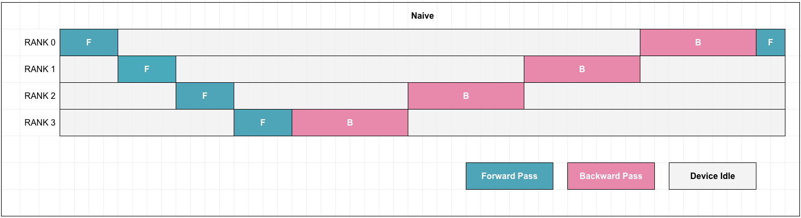
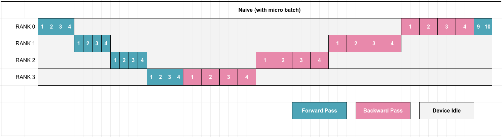
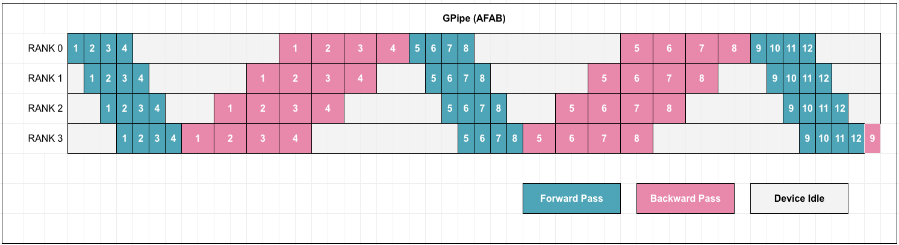
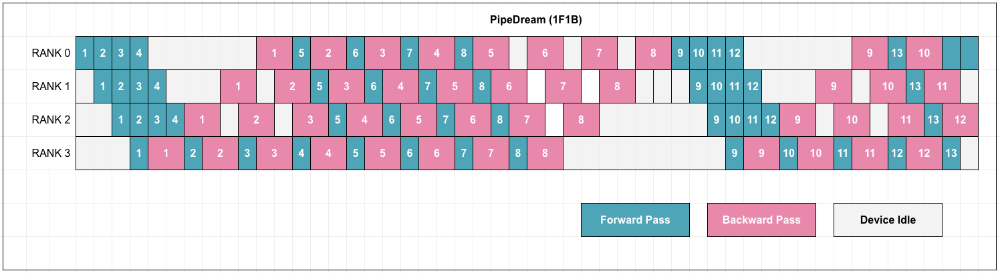

## Pipeline Parallelism

When a model does not fit on one device, **Pipeline Parallelism (PP)** splits **layers** across devices so each rank owns a contiguous **stage** of the network. Unlike [Tensor Parallelism](tensor-parallelism.md), which shards individual weight matrices, PP keeps each stage mostly local and moves **activations** (and backward **gradients**) between ranks with point-to-point communication.

### Outline

1. **Why pipeline parallelism** - memory and why schedules matter.
2. **Learn partitioning with a toy MLP** - one `nn.Module`, `meta`, slice `layers`, `to_empty` (no schedules yet).
3. **From toy MLP to small GPT** - same slice idea; tensors, loss, `get_stage` return tuple.
4. **Pipeline schedules and timelines** - Naive vs GPipe(AfAB) vs Pipedream(1F1B) in one place: definitions, comparison table, figure, timelines.
5. **Bubble formula** - idealized bubble fraction vs microbatch count.
6. **Runnable scripts and benchmark** - `naive.py` / `gpipe.py` / `pipedream.py` on GPT, then `bench_single_vs_pipeline.py`.
7. **DeepSpeed notebook** - demonstrating using DeepSpeed to do Pipeline Parallelism on a large model over 4 x H200 Gpus.
7. **[TODO] Pytorch Distributed notebook** - demonstrating using Pytorch Distributed modules to do Pipeline Parallelism on a large model over 4 x H200 Gpus.
8. **Relation to other parallelisms** and **references**.

The order is intentional: **Partitioning** (what lives on which rank) before **Scheduling** (when forward and backward run).


### Why pipeline parallelism

**Parameter memory** scales with the number of layers on each rank: a depth- $L$  model split across  $n$  stages stores about  $L/n$  layers per rank (ignoring embedding and head placement details).

**Activation memory** depends on the **Schedule**. A schedule that keeps **many microbatches' forwards outstanding** before any backward (for example a raw GPipe-style forward phase with large  $m$ ) can keep **many** activation snapshots live at once. The **1F1B** family limits outstanding forward microbatches in a way that keeps peak activation storage near  **O(number of stages)**  rather than **O(number of microbatches)**  in typical analyses, which is why production trainers often prefer 1F1B-style schedules over a long GPipe-style forward phase when microbatch count is large.


### Understanding partitioning with a toy MLP (establish the idea)

A common misconception is that we rewrite our model into separate per-stage classes (`Stage0`, `Stage1`, etc.). In production we **don't** - the model is defined **once** as a single `nn.Module`, and the pipeline framework **slices it at runtime**. Each rank only materializes the parameters for its own stage; no rank ever allocates the other stages' weights in GPU memory.

**Why we can't just load the full model everywhere**

With a 70B-parameter model at fp16, the weights alone are ~140 GB. A single A100 has 80 GB. We **cannot** do `model = LlamaModel().to(device)` on every rank - we'd OOM before training starts. The whole point of pipeline parallelism is that each rank holds only $\sim L/n$ layers.

**How production frameworks partition**

There are three common approaches, all starting from a single model definition:

1. **Flat layer list + index split** (DeepSpeed `PipelineModule`): the model is expressed as an ordered list of layers, and the framework assigns contiguous chunks to each rank by index.

2. **Cut points on the module tree** (Megatron-LM, PyTorch `PipelineStage`): we specify where to cut (e.g., "after transformer block 15") and the framework splits the module tree at those points.

3. **Automatic device placement** (HuggingFace Accelerate `device_map="auto"`): the library inspects the module tree, estimates memory per child, and assigns children to devices. Primarily used for inference, but same partitioning idea.


The walkthrough below uses **`pipeline-parallelism/src/toy_model.py`**. Each numbered block is one piece of the partitioning story (still no pipeline schedule, no `send`/`recv`).

**1) Model: one class, ordered `layers`**

- `ToyModel` is a single `nn.Module`, same pattern as a real stack: define the model once, slice later.
- `self.layers` is an `nn.ModuleList` in `forward` order. Every index-based partitioner ultimately does `list(full_model.layers)` (or an equivalent ordered list) and takes a contiguous range of indices.
- Inputs stay `(batch, dim)` tensors only: no sequence length, no attention, so the only question for now is `which layer indices` each rank will own.

```python
# pipeline-parallelism/src/toy_model.py (conceptual excerpt)
import torch
import torch.nn as nn


class ToyModel(nn.Module):
    def __init__(self, dim: int) -> None:
        super().__init__()
        self.layers = nn.ModuleList(
            [
                nn.Linear(dim, dim),  # "embed"
                nn.ReLU(),            # "block_0"
                nn.Linear(dim, dim),  # "block_1" (also serves as "head")
            ]
        )

    def forward(self, x: torch.Tensor) -> torch.Tensor:
        for layer in self.layers:
            x = layer(x)
        return x
```

**2) Partition: meta full model, slice indices, materialize local `Sequential`**

`get_stage(dim, rank, world_size, device)` is the whole partition in one function. The real file also logs per rank; this excerpt only shows the math.

```python
# pipeline-parallelism/src/toy_model.py - get_stage (partition core)
def get_stage(
    dim: int, 
    rank: int, 
    world_size: int, 
    device: torch.device
) -> nn.Sequential:
    with torch.device("meta"):
        full_model = ToyModel(dim)

    all_layers = list(full_model.layers)
    n_layers = len(all_layers)
    chunk = (n_layers + world_size - 1) // world_size
    start = rank * chunk
    end = min(start + chunk, n_layers)
    local_layers = all_layers[start:end]

    stage = nn.Sequential(*local_layers)
    stage = stage.to_empty(device=device)
    stage.apply(
        lambda m: m.reset_parameters() if hasattr(m, "reset_parameters") else None
    )
    return stage
```

Reading the excerpt line by line:

- `with torch.device("meta")`: builds the full `ToyModel` tree with no weight storage on GPU (only shapes and dtypes). Same idea as loading a huge config without OOM.
- `list(full_model.layers)`: read the ordered layer handles from the one class definition; the slice is always over global indices `0 .. n_layers-1`.
- `chunk` / `start` / `end`: contiguous index range for this `rank`; that is `which rank owns which slice` of `layers`.
- `nn.Sequential(*local_layers)`: local stage module for this rank only; other ranks never materialize the rest of the weights.
- `to_empty(device=device)`: allocate real uninitialized tensors on the target GPU only for that local `Sequential` module.
- `reset_parameters()` (via `apply`): fill weights for the demo. In production we would `load_state_dict` for this slice instead.

**3) Concrete indices for the default toy (`len(layers) == 3`) and `world_size == 2`**

```python
# ceil split by layer count: chunk = (3 + 2 - 1) // 2 == 2
# rank 0: start=0, end=2  ->  layers[0:2]  ==  Linear, ReLU
# rank 1: start=2, end=3  ->  layers[2:3]  ==  Linear (head)
#
# Each rank's nn.Sequential renumbers submodules from 0 locally:
#   rank 0 stage: (0)=Linear, (1)=ReLU
#   rank 1 stage: (0)=Linear   # global index was layers[2]
```

This is the arithmetic behind `start`/`end` in `get_stage`: same formula, concrete numbers. `nn.Sequential` renumbers child modules from `0` on each rank, so logs often show `local` index `0` on rank 1 even though the `global` layer was `layers[2]`.

**4) What each rank runs before adding schedules or `send`/`recv`**

Every process calls `get_stage` with the same `dim` and `world_size`; only `rank` (and `device`) differ, so each rank materializes <u>its</u> slice and an optimizer over <u>that</u> slice only.

```python
# Same call on every process; each rank materializes a different slice only.
dim, world_size = 32, 2
rank = ...  # from torch.distributed or torchrun
device = torch.device(f"cuda:{local_rank}")

stage = get_stage(dim, rank, world_size, device)
optim = torch.optim.SGD(stage.parameters(), lr=0.01)
```

**5) Optional: two-stage forward skeleton (activations cross ranks later)**

Once partitioning is fixed, **what crosses the wire** between ranks is the **activation** tensor at the stage boundary (here `(batch, dim)`). Training scripts add `dist.send` / `dist.recv` and a schedule; this snippet is only the **local** `forward` shape on each side of that boundary.

```python
# Rank 0: x has shape (batch, dim)
h = stage(x)  # after local layers; h is sent to rank 1 in real training

# Rank 1: recv h with shape (batch, dim), then
out = stage(h)
```

For the default 3-layer `ToyModel` split across 2 ranks, rank 0 only updates the first two modules in `layers` and rank 1 only updates the last (each `stage` is a disjoint slice from `get_stage`).

**Partitioning vs the pipeline schedule**

These are easy to mix up when we are new to PP:

- **Partitioning (model chunking)** answers **which layers live on which pipeline stage / GPU**. Set once before training starts.
- **Schedule** (GPipe, 1F1B, etc.) answers **when** each stage runs forward and backward on **microbatches**. This is runtime ordering to hide the pipeline bubble and control activation memory.

We do **not** re-split the model each step. The schedule assumes the partition is already chosen.

**Layer-wise pipeline**

The model is a list of layers  $[ \ell_0, \ldots, \ell_{L-1} ]$ . Stage  $i$  owns a contiguous slice (for example layers  $[iL/n,\, (i+1)L/n)$ ). This is what most `PipelineModule`-style APIs expect: a flat `nn.ModuleList` or explicit stage boundaries. `get_stage()` in `toy_model.py` implements exactly this split; `get_stage()` in `gpt2_model.py`repeats the same index math on `StandardGPT.layers`.

**Virtual pipeline (interleaved model partition)**

Here, each **physical** GPU holds **multiple** non-contiguous chunks of the model (for example alternating "early" and "late" blocks on the same GPU). Schedulers then run **interleaved 1F1B**, which can **reduce the pipeline bubble** compared to one chunk per GPU at the same pipeline depth. Megatron-LM documents this as virtual pipeline model parallelism; see the Megatron-LM citation below.


### From Toy MLP to small GPT (what changes)

Once we understand the partitioning scheme on `ToyModel`, we can graduate to bigger models now. The schedule scripts under `pipeline-parallelism/src/` switches to `gpt2_model.StandardGPT`. The **partitioning** rule is still the same like that of the toy model: one `nn.ModuleList` called `layers`, build the full model on `meta`, `list(full_model.layers)`, contiguous slice per rank, `to_empty`, then init or load weights. The API is `model_gpt.get_stage(rank, world_size, device, ...)` (no leading `dim`; hyperparameters such as `d_model` and `n_layers` live in defaults or kwargs).

What **does** change is tensors, loss, and a small amount of plumbing:

| Topic | Toy MLP (`toy_model.py`) | Small GPT (`gpt2_model.py` + schedule scripts) |
|-------|----------------------|--------------------------------------------------|
| Input to rank 0 | A float tensor `(batch, dim)` | Token ids `input_ids` `(batch, seq_len)` `int64` into `TokPosEmbedding` |
| Tensor on the wire | Same rank-0 shape `(batch, dim)` | Hidden states `(batch, seq_len, d_model)` between ranks |
| Last-stage target | Often a fixed tensor (e.g. zeros) for a tiny demo | **Causal LM:** `lm_loss(logits, input_ids)` needs the same token ids on the last rank |
| Extra collective | None needed for a toy MLP demo | `dist.broadcast(all_input_ids, src=0)` so rank 1 can compute loss against the same batch |
| **`nn.Sequential` repr** | Local indices `0, 1, ...` per rank | Same: PyTorch renumbers from `0` inside each stage; global layer index is `start + local_i` (logged by `get_stage`) |
| `get_stage` return type** | `nn.Sequential`** only | `tuple[nn.Sequential, int, int]` = `(stage, start, end)` so training scripts and logs can refer to **global** layer indices in `StandardGPT.layers` |

**Partition code for GPT (same math as the toy, different full model and return tuple)**

The slice is still `chunk = ceil(n_mod / world_size)`, `start = rank * chunk`, `end = min(start + chunk, n_mod)`. The only structural differences in the API are: no **`dim`** (we pass `d_model`, `n_layers`, etc. as kwargs or use defaults), and the function returns `start` / `end` alongside `stage`.

```python
# pipeline-parallelism/src/gpt2_model.py
def get_stage(
    rank: int,
    world_size: int,
    device: torch.device,
    d_model: int = DEFAULT_D_MODEL,
    n_heads: int = DEFAULT_N_HEADS,
    d_ff: int = DEFAULT_D_FF,
    n_layers: int = DEFAULT_N_LAYERS,
    vocab_size: int = DEFAULT_VOCAB_SIZE,
    max_seq_len: int = DEFAULT_MAX_SEQ_LEN,
    attn_bias: bool = False,
    ffn_bias: bool = True,
) -> tuple[nn.Sequential, int, int]:
    # load just the model definition,not the weights
    with torch.device("meta"):
        full_model = StandardGPT(
            d_model=d_model,
            n_heads=n_heads,
            d_ff=d_ff,
            n_layers=n_layers,
            vocab_size=vocab_size,
            max_seq_len=max_seq_len,
            attn_bias=attn_bias,
            ffn_bias=ffn_bias,
        )

    all_layers = list(full_model.layers)
    n_mod = len(all_layers)
    chunk = (n_mod + world_size - 1) // world_size
    start = rank * chunk
    end = min(start + chunk, n_mod)
    local_layers = all_layers[start:end]

    stage = nn.Sequential(*local_layers)
    stage = stage.to_empty(device=device)
    stage.apply(
        lambda m: m.reset_parameters() if hasattr(m, "reset_parameters") else None
    )
    return stage, start, end
```

Call sites differ accordingly:

```python
# Toy MLP (toy_model.py)
stage = get_stage(dim, rank, world_size, device)

# Small GPT (gpt2_model.py) — scripts unpack global slice bounds
stage, start, end = get_stage(rank, world_size, device)
```

So: **schedules** and **send/recv ordering** are unchanged in spirit; **shapes** and **loss** match a tiny decoder LM. The toy stays in the repo as the minimal partition reference; the GPT path is what we **`torchrun`** for GPipe / 1F1B runs.


### Pipeline schedules and timelines (Naive, GPipe(AFAB), PipeDream(1F1B) together)

This section answers **when** each stage runs forward and backward. Keep it separate from **partitioning** (which layers sit on which rank): the schedule assumes the partition is already fixed.

**Naive pipeline parallelism** means: layers are split across devices, but each optimizer step pushes **one full minibatch** through the pipe in lockstep. Forward visits rank 0, then rank 1, ... then backward returns in reverse. At most one stage is doing useful work on that batch at a time, so the **bubble** is large. See Simon Boehm's blog post [Pipeline-Parallelism: Distributed Training via Model Partitioning](https://siboehm.com/articles/22/pipeline-parallel-training) and `naive.py` in this repo.



If we divide the mini batch into micro batches. 



**GPipe-style (two-phase)** keeps the same partition, splits the logical batch into  $m$  **microbatches**, and runs **all microbatch forwards** through the pipeline, then **all backwards** (often reverse microbatch order). Gradients **accumulate** over microbatches so the effective batch size matches the global batch. The idle gap between the forward phase and the backward phase shrinks as  $m$  grows relative to pipeline depth  $n$ .



**1F1B / PipeDream-Flush** adds a short **warmup** of forwards, then a steady state that **interleaves** one backward with one forward (last stage starts **B** on the oldest finished microbatch while newer **F**s are still in flight), then a **cooldown** of remaining backwards. DeepSpeed's pipeline module and Megatron-LM's non-interleaved schedule follow this pattern. Peak activation memory on early ranks is often analyzed as scaling with **pipeline depth**, not with  $m$ , unlike a long GPipe-style forward phase that keeps all  $m$  forwards outstanding before any backward.



**Figure timelines (one optimizer step, four stages,  $m = 4$  microbatches)**

The figures show the **same** three families side by side. `F` is forward, `B` is backward; gaps are idle time (bubble).

- **Naive:** only one rank is active on the batch at a time; bubble is maximal.
- **GPipe:** rank 0 runs **F0..F3** back-to-back, then idle while backwards drain; all **m** forward activations for that wave can be live on rank 0 until backward starts.
- **1F1B:** backward on the oldest microbatch starts while later forwards still run; bubble sits mostly in warmup/cooldown. On rank 0, stored activations during the steady part are often analyzed as about **`num_warmup + 1`** (here **3** for  $n = 4$  stages), vs **m = 4** in the GPipe forward phase for the same **m**.

**Comparison (same layer split across ranks)**

| | Naive PP | GPipe-style (two-phase) | 1F1B / PipeDream-Flush |
|---|----------|---------------------------|-------------------------|
| Microbatches in flight along the pipe | no (one minibatch) | yes | yes |
| Gradient accumulation over microbatches | no | yes | yes |
| Forward / backward pattern | full F chain, then full B chain per minibatch | all **F** for all microbatches, then all **B** | warmup **F**, then **B/F** interleaved, then cooldown **B** |
| Bubble (qualitative) | largest | smaller when  $m \gg n$  | often better peak memory on rank 0 than GPipe for large  $m$  |

**Other schedule families (brief)**

- **PipeDream (non-flush):** stages may use **stale weights** on some forwards; higher throughput possible, but we must reason about asynchrony and staleness bounds.
- **Interleaved 1F1B with virtual stages:** multiple non-contiguous chunks per physical GPU and a richer schedule; see Megatron-LM and the **Virtual pipeline** paragraph under partitioning above.


### Pipeline bubble and microbatches

Split a global batch into  $m$  microbatches. With  $n$  pipeline stages, a widely used ideal model of flush-style schedules gives a *bubble* fraction (idle time fraction along the critical path of stage utilization) of:

```math
\text{Bubble} \;=\; 1 - \frac{m}{m + n - 1}
```

Larger  $m$  (more microbatches per batch) **shrinks** the bubble but increases **per-step work** and activation-related memory unless the schedule caps outstanding forwards (as 1F1B does). A common rule of thumb is to aim for  $m \gtrsim 4n$  if we want the bubble under roughly 20 percent in this idealized model.

The companion notebook `pipeline-parallelism/DeepSpeed_Pipeline_Parallelism.ipynb` measures throughput while sweeping  $m$  on four A100 GPUs and compares against this formula.


### Runnable schedule scripts (`naive.py`, `gpipe.py`, `pipedream.py`)

These three scripts implement the naive, GPipe, and 1F1B schedules from **Pipeline schedules and timelines** on **two ranks** using `model_gpt.StandardGPT`. 

They share **`num_samples=64`** and **`gbs=16`**, so each run performs **4 optimizer steps** over the synthetic data. `naive.py` sends the full 16-sample batch through the pipe once per step (no microbatches inside the step). 

`gpipe.py` splits each batch into `n_micro=4` microbatches of 4 samples, runs **all forwards then all backwards** per step. `pipedream.py` uses the same microbatch split with a **1F1B (PipeDream-Flush)** interleaved schedule.

Each rank calls `model_gpt.get_stage(..., )` to get the chunk of layers for that rank. Each rank builds `torch.optim.SGD` over **its stage only**. Activations and gradients on the boundary are `(batch, seq_len, d_model)`; `dist.broadcast` keeps `input_ids` identical on both ranks for `lm_loss`. There is no `torch.distributed` autograd: the cut is `detach()`, `backward(grad)`, and `send`/`recv`, exactly as in the toy story but with GPT-shaped tensors.

```python
# Sketch of the pattern in naive.py, gpipe.py, pipedream.py (GPT path)
stage, start, end = get_stage(rank, world_size, device)  # model_gpt
optim = torch.optim.SGD(stage.parameters(), lr=lr)

# Rank 0: first submodule is TokPosEmbedding(input_ids) -> (B, T, d_model)
h0 = stage(input_ids)
dist.send(h0.detach().contiguous(), dst=1)

# Rank 1: recv hidden, forward rest of layers -> logits (B, T, vocab)
buf = torch.empty(batch_size, seq_len, d_model, device=device)
dist.recv(buf, src=0)
h1 = buf.clone().requires_grad_(True)
logits = stage(h1)
loss = lm_loss(logits, input_ids)
loss.backward()
dist.send(h1.grad.detach().contiguous(), dst=0)

# Rank 0: recv d(loss)/d(hidden), backward through early layers
grad_h = torch.empty(batch_size, seq_len, d_model, device=device)
dist.recv(grad_h, src=1)
h0.backward(grad_h)
```

The scripts differ only in **when** these operations happen (the schedule):

**1. Naive schedule** (`naive.py`)

One full minibatch per optimizer step - no microbatches. Forward propagates through stages in sequence, then backward. Maximum pipeline bubble. Matches the naive model parallelism timetables in Simon Boehm's article.

```bash
cd pipeline-parallelism/src && torchrun --standalone --nproc_per_node=2 naive.py
```

**2. GPipe schedule** (`gpipe.py`)

Splits each batch into `n_micro=4` microbatches. All microbatch forwards run first, then all backwards in reverse order. Shrinks the bubble vs naive, but all `m` activations must be stored simultaneously on rank 0.

```bash
cd pipeline-parallelism/src && torchrun --standalone --nproc_per_node=2 gpipe.py
```

**3. 1F1B schedule** (`pipedream.py`, PipeDream-Flush style)

Interleaves forward and backward after a short warmup. Rank 0 does `num_warmup = n_stages - 1` warmup forwards, then alternates 1 backward + 1 forward in steady state, then drains remaining backwards in cooldown. Rank 1 (last stage) processes each microbatch end-to-end: recv, forward, backward, send grad. Peak stored activations on rank 0 is `num_warmup + 1` vs `m` in GPipe — the memory advantage grows with more microbatches.

```bash
cd pipeline-parallelism/src && torchrun --standalone --nproc_per_node=2 pipedream.py
```


### Correctness benchmark (`bench_single_vs_pipeline.py`)

The toy MLP is enough to learn **partitioning**. The schedule scripts add **realistic shapes** and a **language-model loss**. But, I added a benchmark script that answers a separate question: **if we hand-implement a 2-rank naive pipeline, does it match one GPU mathematically** when the split is the same and the data batch is the same ? How can we deterministally prove that the partitioning logic is correct ?

**Why align weights first ?** If each rank called `get_stage` and only `reset_parameters()`, random init would differ per run and per rank. The benchmark instead builds **one** `StandardGPT` on rank 0, takes its full `state_dict()` on CPU, and `dist.broadcast_object_list` so every rank receives the **same** tensors. Then `load_stage_from_full_state_dict` (in `gpt2_model.py`) maps keys `layers.{global_idx}.*` into each rank's `nn.Sequential` keys `{local_idx}.*`. After that, the pipeline stages are literally the same weights as the single full model, only stored on two GPUs.

**Forward check (no training yet).**

1. Both pipeline stages are set to `eval()`, then a barrier, so LayerNorm matches a reference `StandardGPT.eval()` forward.
2. `input_ids` is built on rank 0 and **broadcast** so both ranks share one batch.
3. Rank 0 runs the pipeline forward (send activations, rank 1 returns logits, logits gathered to rank 0).
4. Rank 0 loads the same `state_dict` into a fresh `StandardGPT` and runs `forward(input_ids)` in `no_grad()`.
5. The script reports **max absolute logits difference** and **absolute loss difference** (`lm_loss` on both logits tensors). With identical weights and *`eval()`, these are often **exactly zero** in float32 for this small model.

**One SGD step check.**

1. On rank 0 only: load the shared `state_dict` into a `StandardGPT`, run **one** `SGD` step on the full model (same `input_ids`, same learning rate as the pipeline script).
2. Snapshot `state_dict` to CPU as the reference **after** that step.
3. **Reload** both pipeline stages from the **original** CPU `state_dict` (not the updated one), rebuild optimizers, and run `pipeline_naive_one_step`: same pattern as `naive.py` (rank 0 forward, send, recv grad, `backward(grad)`; rank 1 recv, forward, `lm_loss`, backward, send input grad).
4. Rank 1 `broadcast_object_list` its stage `state_dict` to rank 0; rank 0 merges rank 0 and rank 1 shards with `merge_pipeline_stage_state_dicts_to_full` (inverse of the per-stage key map).
5. Compare merged tensors to the single-GPU reference **elementwise max absolute difference** across all parameters. When the manual backward is equivalent to one full-graph backward, this is also **zero** (or tiny if nondeterministic ops appear).

**CLI and pass/fail.** Defaults: `--forward-atol 5e-5`, `--weights-atol 1e-4`, plus `--batch-size`, `--seq-len`, `--lr`, `--seed`. Rank 0 evaluates pass/fail and `broadcast`s a scalar so all processes exit with code **0** or **1**.

```bash
cd pipeline-parallelism/src && torchrun --standalone --nproc_per_node=2 bench_single_vs_pipeline.py
```

**Expected output when everything matches.** `torchrun` often prints lines from `torch/distributed/run.py` about setting `OMP_NUM_THREADS=1` per process; that is normal launcher noise, not a test failure. On rank 0 we should see forward and weight diffs at or below the configured tolerances and a final `PASS` line. Exact zeros are common in float32 for this small model when weights and `eval()` mode line up:

```
INFO [rank 0] __main__: Forward: max abs logits diff = 0.000e+00 | loss diff = 0.000e+00
INFO [rank 0] __main__: After 1x SGD: max abs weight diff = 0.000e+00 (worst key None)
INFO [rank 0] __main__: PASS: forward atol <= 5.000e-05 and weight atol <= 1.000e-04
```

Exit code **0** means pass. If forward or weight diffs exceed the atol thresholds, rank 0 logs **`FAIL`** and the job exits **1**.

**Reading the logs.** `worst key` `None` means the script never saw a parameter with a strictly larger max diff than the previous best, so the "worst parameter name" field was never set. On an exact all-zero diff that is expected, not an error.

**Limitations (on purpose).** The benchmark checks **one** forward and **one** optimizer step, not long training or `gpipe`/`pipedream` schedules. It does not replace integration tests in a framework. It **does** give a strong sanity check that our `send`/`recv`/`backward(grad)` story matches `autograd` on a single process for the same partition.


### DeepSpeed notebook (larger scale)

`pipeline-parallelism/deepspeed/DeepSpeed_Pipeline_Parallelism.ipynb` trains a ~1.5B-parameter GPT-style stack with DeepSpeed `PipelineModule`, compares a single-GPU baseline to four pipeline stages, and sweeps microbatch counts against the bubble formula above.


### Why this layout

Many articles stop at schedule diagrams. This one strings together runnable steps: **Toy MLP** for partitioning only, then a **Small GPT** for tensor shapes and LM loss, then `bench_single_vs_pipeline.py` to show that a 2-rank manual naive step matches one GPU when weights and data are aligned. From there the bubble formula, `torchrun` on GPipe / 1F1B, and the timeline figures tie back to the same code. That is the gap between diagram-only explanations and something we can actually diff against when a PP run misbehaves.


### Relation to data and tensor parallelism

- **Data Parallelism (DP)** replicates the full model; no stage-wise activation pipeline, but **all-reduce** (or reduce-scatter) of gradients across replicas.
- **Tensor Parallelism (TP)** shards matrices inside a layer; see [Tensor Parallelism](tensor-parallelism.md). TP and PP are often composed (**3D parallelism**: DP + TP + PP) for very large models.
- **Sequence Parallelism** reduces redundant activation memory next to TP; see [Sequence Parallelism](sequence-parallelism.md).


### References

1. Yanping Huang, Youlong Cheng, Ankur Bapna, Orhan Firat, Dehao Chen, Mia Chen, HyoukJoong Lee, Jiquan Ngiam, Quoc V. Le, Yonghui Wu, Zhifeng Chen. **GPipe: Efficient Training of Giant Neural Networks using Pipeline Parallelism.** NeurIPS 2019. arXiv:1811.06965. https://arxiv.org/abs/1811.06965

2. Deepak Narayanan, Aaron Harlap, Amar Phanishayee, Vivek Seshadri, Nikhil R. Devanur, Greg Ganger, Phil Gibbons, Matei Zaharia. **PipeDream: General Pipeline Parallelism for DNN Training.** SOSP 2019. arXiv:1806.03377. https://arxiv.org/abs/1806.03377

3. Deepak Narayanan, Amar Phanishayee, Kaiyu Shi, Xie Chen, Matei Zaharia. **Memory-Efficient Pipeline-Parallel DNN Training.** ICML 2021. arXiv:2004.09505. (PipeDream-Flush / 1F1B memory analysis.) https://arxiv.org/abs/2004.09505

4. Mohammad Shoeybi, Mostofa Patwary, Raul Puri, Patrick LeGresley, Jared Casper, Bryan Catanzaro. **Megatron-LM: Training Multi-Billion Parameter Language Models Using Model Parallelism.** arXiv:1909.08053. https://arxiv.org/abs/1909.08053

5. Shigang Li, Torsten Hoefler. **Chimera: Efficiently Training Large-Scale Neural Networks with Bidirectional Pipelines.** SC 2021. https://doi.org/10.1145/3458817.3476145

6. Penghui Qi, Xinyi Wan, Guangxing Huang, Min Lin. **Zero Bubble Pipeline Parallelism.** ICLR 2024. arXiv:2401.10241. https://arxiv.org/abs/2401.10241

7. Samyam Rajbhandari, Jeff Rasley, Olatunji Ruwase, Yuxiong He. **ZeRO: Memory Optimizations Toward Training Trillion Parameter Models.** SC 2020. arXiv:1910.02054. (Optimizer state sharding; often combined with PP in large training stacks.) https://arxiv.org/abs/1910.02054

8. Simon Boehm. **Pipeline-Parallelism: Distributed Training via Model Partitioning.** Blog post, October 2022. https://siboehm.com/articles/22/pipeline-parallel-training
