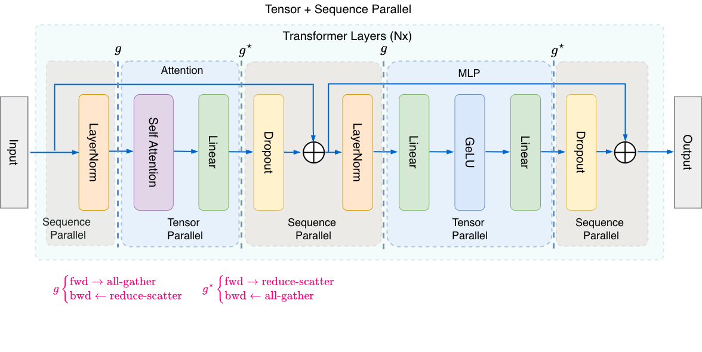

## Sequence Parallelism from Scratch: Saving Activation Memory Without Extra Communication

*This is Part 3 of a four-part series on model parallelism. Parts [1](tensor-parallelism-blog.md) and [2](tensor-parallelism-dtensor.md) cover Tensor Parallelism (hand-written and DTensor). In this article we extend TP with Sequence Parallelism. [Part 4](sequence-parallelism-dtensor.md) translates the combined TP+SP to the DTensor API.*

The complete source code is in [model_gpt_tp_sp.py](sequence-parallelism/src/model_gpt_tp_sp.py). The vanilla TP baseline for comparison is in [model_gpt_tp.py](sequence-parallelism/src/model_gpt_tp.py).


### The Problem: Tensor Parallelism Leaves Memory on the Table

In our [Tensor Parallelism](tensor-parallelism.md) article, we split weight matrices across GPUs. Column-parallel linear layers shard the output dimension; row-parallel linear layers shard the input dimension. The result: each GPU stores only `1/N` of the model parameters. For a 7B-parameter model on 8 GPUs, that is roughly 1.7 GB of parameter memory per GPU instead of 14 GB.

But parameter memory is only half the story. During training, the dominant memory consumer is not the weights -- it is the **activations** stored for backpropagation. And in vanilla TP, the operations between the parallelized layers -- LayerNorm, Dropout, and residual connections -- all operate on the **full** hidden dimension. Their activations are replicated identically on every GPU:

```
Operations PARALLELIZED by TP:              Operations NOT parallelized by TP:
  - W_q, W_k, W_v (column-parallel)           - LayerNorm (needs full d_model)
  - W_o (row-parallel)                         - Dropout (needs full d_model)
  - W1 (column-parallel)                       - Residual connections (full d_model)
  - W2 (row-parallel)                          - Activation storage between layers
```

For a 7B model with batch size 8 and sequence length 2048 on 8 GPUs, the replicated activations (LayerNorm, Dropout, residuals) consume roughly 5.4 GB per GPU -- memory that is redundant across all 8 GPUs. As sequence lengths grow (4K, 8K, 32K tokens) and model depth increases, activation memory becomes the bottleneck that prevents further scaling.

Sequence Parallelism (SP), introduced by [Korthikanti et al. (2022)](https://arxiv.org/abs/2205.05198) as an extension to the Megatron-LM framework, addresses exactly this problem.


### The Key Insight: Unrolling the All-Reduce

The trick begins with a simple observation about all-reduce.

In vanilla TP, after a row-parallel layer (e.g., `W_o` or `W2`), each GPU holds a **partial sum** of shape `(B, S, h)`. An all-reduce sums these partials so every GPU gets the identical full result. Then LayerNorm and Dropout operate on the full `(B, S, h)` tensor -- performing exactly the same computation on every GPU. This is redundant work and wasted memory.

But all-reduce is not an atomic operation. Internally, every all-reduce is a **reduce-scatter** followed by an **all-gather**:

```
ALL-REDUCE = REDUCE-SCATTER + ALL-GATHER

Reduce-scatter:  sum partials AND scatter result across GPUs
                 each GPU gets 1/N of the summed result

All-gather:      gather all 1/N pieces back together
                 every GPU gets the full summed result
```

Sequence Parallelism exploits this decomposition. Instead of running all-reduce as a single fused operation, SP **splits the two halves apart** and inserts useful computation between them:

```
Vanilla TP:
  [row-parallel W_o] ---> [ALL-REDUCE] ---> [LayerNorm on (B,S,h)] ---> [column-parallel W_q]
                           (fused)          full tensor, redundant

TP + SP:
  [row-parallel W_o] ---> [REDUCE-SCATTER] ---> [LayerNorm on (B,S/N,h)] ---> [ALL-GATHER] ---> [column-parallel W_q]
                           sum + scatter        1/N of the data                reconstruct
```

After the reduce-scatter, each GPU holds the correct final result for its `1/N` chunk of the sequence -- shape `(B, S/N, h)` instead of `(B, S, h)`. LayerNorm and Dropout now operate on this smaller tensor. Before the next column-parallel layer (which needs the full sequence), an all-gather reconstructs the full `(B, S, h)`.

The total bytes on the wire are **identical** to vanilla TP. We are just separating the two phases of all-reduce in time and inserting useful computation between them. Zero extra communication.


### Two Regions, Two Transitions

This decomposition creates two distinct regions in the transformer block, each with its own sharding scheme:

- **TP region** (blue in the diagram): activations are sharded on the **hidden dimension**. `W_q`, `W_k`, `W_v` produce `(B, S, h/N)` per GPU. Attention and FFN operate on local shards.
- **SP region** (cyan in the diagram): activations are sharded on the **sequence dimension**. LayerNorm, Dropout, and residual adds operate on `(B, S/N, h)` per GPU.



The diagram shows a single transformer block under vanilla TP (left) and TP+SP (right). In vanilla TP, `f` (identity forward, all-reduce backward) and `f*` (all-reduce forward, identity backward) bracket the TP region. In TP+SP, these are replaced by `g` (all-gather forward, reduce-scatter backward) and `g*` (reduce-scatter forward, all-gather backward), which transition between the two regions.

The transitions between regions are where the collectives happen:

| Transition | Direction | Collective | Shape change |
|---|---|---|---|
| SP -> TP | Before column-parallel layers | All-gather | `(B, S/N, h) -> (B, S, h)` |
| TP -> SP | After row-parallel layers | Reduce-scatter | `(B, S, h) -> (B, S/N, h)` |


### Building the Primitives

TP+SP requires three `torch.autograd.Function` primitives. Each primitive's backward pass is the inverse of its forward pass, ensuring correct gradient flow.

**Primitive 1: `_CopyToTPRegion`** -- unchanged from vanilla TP. Identity in forward, all-reduce in backward. Used inside column-parallel layers to synchronize gradients.

```python
class _CopyToTPRegion(torch.autograd.Function):
    @staticmethod
    def forward(ctx, x: torch.Tensor) -> torch.Tensor:
        return x

    @staticmethod
    def backward(ctx, grad: torch.Tensor):
        dist.all_reduce(grad, op=dist.ReduceOp.SUM)
        return grad
```

**Primitive 2: `_AllGatherFromSPRegion`** (`g` in the Megatron diagram) -- placed before column-parallel layers. All-gather in forward reconstructs the full sequence for the matmul. Reduce-scatter in backward scatters gradients back to the SP region.

```python
class _AllGatherFromSPRegion(torch.autograd.Function):
    @staticmethod
    def forward(ctx, x: torch.Tensor) -> torch.Tensor:
        return _all_gather_along_seq(x)  # (B, S/N, h) -> (B, S, h)

    @staticmethod
    def backward(ctx, grad: torch.Tensor):
        return _reduce_scatter_along_seq(grad)  # (B, S, h) -> (B, S/N, h)
```

**Primitive 3: `_ReduceScatterToSPRegion`** (`g*` in the Megatron diagram) -- placed after row-parallel layers. Reduce-scatter in forward sums partials and scatters to the SP region. All-gather in backward gathers gradients for the TP region.

```python
class _ReduceScatterToSPRegion(torch.autograd.Function):
    @staticmethod
    def forward(ctx, x: torch.Tensor) -> torch.Tensor:
        return _reduce_scatter_along_seq(x)  # (B, S, h) -> (B, S/N, h)

    @staticmethod
    def backward(ctx, grad: torch.Tensor):
        return _all_gather_along_seq(grad)  # (B, S/N, h) -> (B, S, h)
```

These rely on two communication helpers that operate along the sequence dimension (dim=1):

```python
def _all_gather_along_seq(x: torch.Tensor) -> torch.Tensor:
    """(B, S/N, h) -> (B, S, h)"""
    ws = dist.get_world_size()
    gathered = [torch.empty_like(x) for _ in range(ws)]
    dist.all_gather(gathered, x.contiguous())
    return torch.cat(gathered, dim=1)

def _reduce_scatter_along_seq(x: torch.Tensor) -> torch.Tensor:
    """(B, S, h) -> (B, S/N, h)"""
    ws = dist.get_world_size()
    B, S, h = x.shape
    S_local = S // ws
    chunks = list(x.split(S_local, dim=1))
    output = torch.empty(B, S_local, h, device=x.device, dtype=x.dtype)
    dist.reduce_scatter(output, chunks, op=dist.ReduceOp.SUM)
    return output
```

**Why `g` and `g*` are conjugate pairs.** The backward pass of `g` does exactly what the forward pass of `g*` does, and vice versa. This symmetry is required for correct gradient flow: when a forward pass gathers data across GPUs, the backward pass must scatter gradients back.

| | Forward | Backward |
|---|---|---|
| `g` (`_AllGatherFromSPRegion`) | all-gather | reduce-scatter |
| `g*` (`_ReduceScatterToSPRegion`) | reduce-scatter | all-gather |

This mirrors the vanilla TP conjugate pair `f`/`f*`, where `f` is identity forward / all-reduce backward and `f*` is all-reduce forward / identity backward.


### The One Code Change: Row-Parallel Linear

The linear layer modules are almost identical to vanilla TP. `ColumnParallelLinear` is unchanged. The only structural change is in `RowParallelLinear`: replace all-reduce with reduce-scatter.

**Vanilla TP:**

```python
class RowParallelLinear(nn.Module):
    def forward(self, x: torch.Tensor) -> torch.Tensor:
        out = F.linear(x, self.weight, self.bias)
        return _ReduceFromTPRegion.apply(out)  # ALL-REDUCE -> (B, S, h)
```

**TP + SP:**

```python
class RowParallelLinear(nn.Module):
    def forward(self, x: torch.Tensor) -> torch.Tensor:
        out = F.linear(x, self.weight, self.bias)
        return _ReduceScatterToSPRegion.apply(out)  # REDUCE-SCATTER -> (B, S/N, h)
```

One line changed. The weight sharding (`d_out, d_in // ws`) is the same. The forward matmul is the same. Only the collective that combines partial results is different.

There is a subtle detail with bias: since reduce-scatter sums the partial results from all GPUs, if every GPU adds bias, it would be summed `N` times. The implementation adds bias only on rank 0:

```python
self.bias = None
if bias and dist.get_rank() == 0:
    self.bias = nn.Parameter(torch.empty(d_out))
```


### The Transformer Block: Where Memory is Saved

The transformer block is where the two regions become visible. In vanilla TP, all operations use the full `(B, S, h)` tensor. With SP, the block input arrives in the SP region at `(B, S/N, h)`:

```python
class TPSPTransformerBlock(nn.Module):
    def forward(self, x: torch.Tensor) -> torch.Tensor:
        # x: (B, S/N, h) -- SP region, sequence is sharded

        # --- Attention sub-block ---
        residual = x                                          # (B, S/N, h)
        x = _AllGatherFromSPRegion.apply(self.norm1(x))       # (B, S/N, h) -> (B, S, h)
        x = self.attn(x)                                      # (B, S, h) -> (B, S/N, h)
        x = residual + self.resid_dropout(x)                  # (B, S/N, h)

        # --- FFN sub-block ---
        residual = x                                          # (B, S/N, h)
        x = _AllGatherFromSPRegion.apply(self.norm2(x))       # (B, S/N, h) -> (B, S, h)
        x = self.ffn(x)                                       # (B, S, h) -> (B, S/N, h)
        x = residual + self.resid_dropout(x)                  # (B, S/N, h)

        return x  # (B, S/N, h) -- stays in SP region
```

The pattern for each sub-block:

1. **LayerNorm** in the SP region at `(B, S/N, h)` -- memory saved.
2. **All-gather** reconstructs the full sequence for the TP matmul.
3. **TP computation** (attention or FFN) -- column-parallel then row-parallel.
4. **Reduce-scatter** transitions back to the SP region.
5. **Dropout and residual add** in the SP region at `(B, S/N, h)` -- memory saved.

Compare this with the vanilla TP block, which is deceptively simple but hides the replicated memory cost:

```python
class TPGPTTransformerBlock(nn.Module):
    def forward(self, x: torch.Tensor) -> torch.Tensor:
        # x: (B, S, h) -- FULL tensor, identical on all GPUs
        x = x + self.resid_dropout(self.attn(self.norm1(x)))
        x = x + self.resid_dropout(self.ffn(self.norm2(x)))
        return x  # (B, S, h) -- still FULL
```

Every intermediate tensor in the vanilla version is `(B, S, h)` -- fully replicated. In the SP version, everything outside the TP matmuls is `(B, S/N, h)`.


### Tracing the Shapes Through a Block

To make the memory savings concrete, here are the exact shapes on each GPU for a small configuration: `B=2`, `S=4`, `h=4`, `N=2` GPUs.

**Vanilla TP:**

```
Step                          GPU-0 Shape       GPU-1 Shape       Note
----------------------------------------------------------------------
Input to block                (2, 4, 4)         (2, 4, 4)         full, replicated
LayerNorm 1                   (2, 4, 4)         (2, 4, 4)         full, replicated [X]

Enter TP: W_q, W_k, W_v       (2, 4, 2)         (2, 4, 2)         h sharded (h/N=2)
Attention                     (2, 4, 2)         (2, 4, 2)         local heads only
Exit TP: W_o + ALL-REDUCE     (2, 4, 4)         (2, 4, 4)         h restored

Residual add                  (2, 4, 4)         (2, 4, 4)         full, replicated [X]
LayerNorm 2                   (2, 4, 4)         (2, 4, 4)         full, replicated [X]

Enter TP: W1                  (2, 4, 8)         (2, 4, 8)         d_ff sharded (16/2=8)
GeLU                          (2, 4, 8)         (2, 4, 8)         local
Exit TP: W2 + ALL-REDUCE      (2, 4, 4)         (2, 4, 4)         h restored

Dropout                       (2, 4, 4)         (2, 4, 4)         full, replicated [X]
Residual add                  (2, 4, 4)         (2, 4, 4)         full, replicated [X]
Output                        (2, 4, 4)         (2, 4, 4)         full, replicated
```

**TP + SP:**

```
Step                          GPU-0 Shape       GPU-1 Shape       Note
----------------------------------------------------------------------
Input to block                (2, 2, 4)         (2, 2, 4)         s sharded! (s/N=2)
LayerNorm 1                   (2, 2, 4)         (2, 2, 4)         s sharded [SAVED]

ALL-GATHER (SP -> TP)         (2, 4, 4)         (2, 4, 4)         reconstruct full seq
Enter TP: W_q, W_k, W_v       (2, 4, 2)         (2, 4, 2)         h sharded
Attention                     (2, 4, 2)         (2, 4, 2)         local heads only
Exit TP: W_o + REDUCE-SCATTER (2, 2, 4)         (2, 2, 4)         s sharded again!

Residual add                  (2, 2, 4)         (2, 2, 4)         s sharded [SAVED]
LayerNorm 2                   (2, 2, 4)         (2, 2, 4)         s sharded [SAVED]

ALL-GATHER (SP -> TP)         (2, 4, 4)         (2, 4, 4)         reconstruct full seq
Enter TP: W1                  (2, 4, 8)         (2, 4, 8)         d_ff sharded
GeLU                          (2, 4, 8)         (2, 4, 8)         local
Exit TP: W2 + REDUCE-SCATTER  (2, 2, 4)         (2, 2, 4)         s sharded again!

Dropout                       (2, 2, 4)         (2, 2, 4)         s sharded [SAVED]
Residual add                  (2, 2, 4)         (2, 2, 4)         s sharded [SAVED]
Output                        (2, 2, 4)         (2, 2, 4)         s sharded
```

Every `[X]` in vanilla TP becomes `[SAVED]` in TP+SP. The TP region shapes are identical -- SP only changes the operations outside the parallelized matmuls.


### The Embedding Layer: Entering the SP Region

The embedding layer must transition the model into the SP region at the very start. After the standard embedding lookup produces `(B, S, h)`, each GPU extracts its chunk of the sequence:

```python
class TPSPGPT(nn.Module):
    def forward(self, input_ids: torch.Tensor) -> torch.Tensor:
        B, S = input_ids.shape
        S_local = S // self.ws

        pos = torch.arange(S, device=input_ids.device).unsqueeze(0)
        x = self.tok_emb(input_ids) + self.pos_emb(pos)  # (B, S, h)

        # Enter SP region: each GPU takes its chunk of the sequence
        start = self.rank * S_local
        x = x[:, start : start + S_local, :].contiguous()  # (B, S/N, h)
        x = self.emb_dropout(x)

        for block in self.blocks:
            x = block(x)  # stays in SP region

        # Exit SP region for output
        x = self.norm_f(x)                    # (B, S/N, h) -- SP region
        x = _AllGatherFromSPRegion.apply(x)   # (B, S, h)  -- full sequence
        return self.lm_head(x)                # (B, S, vocab/N)
```

The scatter at the embedding layer is a simple slice, not a `dist.reduce_scatter` call. The embedding output is identical on all GPUs -- there is nothing to reduce. Each GPU just picks its chunk of the already-correct full tensor. The output layer reverses this: a final all-gather reconstructs the full sequence before the LM head projects to vocabulary logits.


### Communication Cost: Identical to Vanilla TP

This is the key result. SP adds **zero** communication overhead compared to vanilla TP.

```
Vanilla TP (per transformer block):
  After W_o:   ALL-REDUCE    (B, S, h) = 2 x ALL-REDUCE per block

TP + SP (per transformer block):
  Before W_q:  ALL-GATHER     (B, S/N, h) -> (B, S, h)
  After W_o:   REDUCE-SCATTER (B, S, h) -> (B, S/N, h)
  Before W1:   ALL-GATHER     (B, S/N, h) -> (B, S, h)
  After W2:    REDUCE-SCATTER (B, S, h) -> (B, S/N, h)
  Total:       2 x ALL-GATHER + 2 x REDUCE-SCATTER per block
```

This looks like 4 operations vs 2. But recall: **all-reduce = reduce-scatter + all-gather**. The vanilla TP all-reduce is internally doing both operations fused into one call. TP+SP just separates them in time, inserting useful computation (LayerNorm, Dropout) between the reduce-scatter and all-gather. Same bytes on the wire.


### Memory Savings at Scale

For a realistic configuration -- 7B parameters, `B=8`, `S=2048`, `h=4096`, `N=8` GPUs:

```
                              Vanilla TP (N=8)    TP + SP (N=8)
--------------------------------------------------------------
LayerNorm activations         B x S x h = 64 MB   B x (S/N) x h = 8 MB
Dropout activations           B x S x h = 64 MB   B x (S/N) x h = 8 MB
Residual saved                B x S x h = 64 MB   B x (S/N) x h = 8 MB
FFN intermediate              B x S x (d_ff/N) = 88 MB   (same)
QKV projections               B x S x (h/N) = 8 MB       (same)
Attention scores              B x (H/N) x S x S = 128 MB (same)
--------------------------------------------------------------
Per-layer total               ~416 MB              ~248 MB
Savings:                                           40%
--------------------------------------------------------------
32 layers:                    ~13.3 GB             ~7.9 GB
Savings:                                           5.4 GB per GPU!
```

The TP-region activations (QKV, attention scores, FFN intermediate) are unchanged -- SP does not affect the matmul computations. SP only reduces the non-TP activations (LayerNorm, Dropout, residuals) by a factor of `N`. The savings grow linearly with the TP degree and sequence length.


### Benchmark Results

Both models use the same configuration (`d_model=1024`, `n_heads=16`, `d_ff=4096`, 8 layers, vocab 32K) and were benchmarked with batch size 4, sequence length 512, on 2 GPUs.

| Metric | Vanilla TP | TP + SP | Delta |
|---|---|---|---|
| Parameters per GPU | 100,591,616 | 100,591,616 | same |
| Model memory | 384.73 MB | 384.73 MB | same |
| **Peak memory** | **3,314.73 MB** | **3,229.60 MB** | **-85 MB (-2.6%)** |
| Forward | 122.30 ms | 131.99 ms | +7.9% |
| Backward | 139.92 ms | 188.48 ms | +34.7% |
| Full step | 285.01 ms | 336.63 ms | +18.1% |
| Throughput | 7,186 tok/s | 6,084 tok/s | -15.3% |

The memory saving is modest at this small scale (2 GPUs, 8 layers, 512 sequence length). The benefit grows with more GPUs, longer sequences, and deeper models -- exactly the conditions where activation memory becomes the bottleneck. At `N=8` with a 7B model, the savings are multiple GB per GPU.

The throughput overhead comes from our naive implementation: separate `dist.reduce_scatter` and `dist.all_gather` calls with synchronization between them. Production frameworks (Megatron-LM, DeepSpeed) fuse these with computation overlap and async communication, eliminating the overhead entirely.


### When to Use Sequence Parallelism

The short answer: **always, whenever you are using TP.**

SP provides the same communication volume as vanilla TP, 30-50% reduction in activation memory (depending on model depth and TP degree), and enables larger batch sizes or longer sequences within the same GPU memory budget. It is implemented in all major distributed training frameworks.

The only "cost" is implementation complexity -- which we have now built from scratch. In practice, frameworks handle this automatically. And as we will see in [Part 2](sequence-parallelism-dtensor.md), PyTorch's DTensor API reduces the entire implementation to a declarative sharding plan of roughly 60 lines.


### Running the Code

From the `sequence-parallelism/` directory:

```bash
# Vanilla TP baseline
torchrun --nproc_per_node=2 src/model_gpt_tp.py

# TP + Sequence Parallelism
torchrun --nproc_per_node=2 src/model_gpt_tp_sp.py

# With more GPUs (n_heads must be divisible by world size)
torchrun --nproc_per_node=4 src/model_gpt_tp_sp.py --n-heads 8

# Communication analysis (verifies all-reduce = reduce-scatter + all-gather)
torchrun --nproc_per_node=2 src/analyze_comm.py

# Activation shape trace
torchrun --nproc_per_node=2 src/trace_shapes.py
```


### Source Code

| File | Description |
|---|---|
| [model_gpt_tp.py](sequence-parallelism/src/model_gpt_tp.py) | Vanilla TP GPT (baseline for comparison) |
| [model_gpt_tp_sp.py](sequence-parallelism/src/model_gpt_tp_sp.py) | TP + SP GPT (this article) |
| [config.py](sequence-parallelism/src/config.py) | Shared model and benchmark configuration |
| [analyze_comm.py](sequence-parallelism/src/analyze_comm.py) | Communication cost analysis |
| [trace_shapes.py](sequence-parallelism/src/trace_shapes.py) | Activation shape trace |


### What's Next

Building TP+SP from scratch gives us a concrete understanding of the communication patterns: which collectives fire, where the region transitions happen, and why the total communication volume is unchanged. But the implementation has a significant drawback: the model architecture is entangled with the parallelism strategy. `ColumnParallelLinear`, `RowParallelLinear`, and `TPAttention` fuse model logic with distribution logic. The model cannot run on a single GPU without modification, and composing with other parallelism strategies (FSDP, pipeline parallelism) requires invasive changes.

In [Part 2: From Hand-Written TP+SP to PyTorch DTensor](sequence-parallelism-dtensor.md), we translate this implementation to PyTorch's `torch.distributed.tensor.parallel` API. A plain `nn.Module` with no parallelism in its definition is parallelized entirely by a declarative sharding plan. The same model code runs on 1 GPU or 8, with TP, TP+SP, or TP+SP+FSDP -- all determined by configuration, not architecture.


### References

- Shoeybi et al., "Megatron-LM: Training Multi-Billion Parameter Language Models Using Model Parallelism," [arXiv:1909.08053](https://arxiv.org/abs/1909.08053), 2019.
- Korthikanti et al., "Reducing Activation Recomputation in Large Transformer Models," [arXiv:2205.05198](https://arxiv.org/abs/2205.05198), 2022.
- PyTorch, "Large Scale Transformer model training with Tensor Parallel (TP)," [docs.pytorch.org/tutorials/intermediate/TP_tutorial.html](https://docs.pytorch.org/tutorials/intermediate/TP_tutorial.html).
