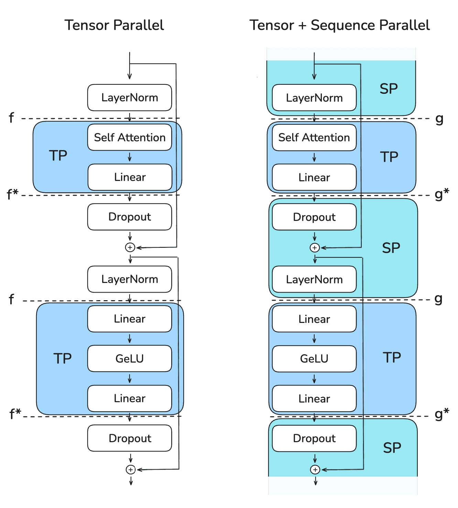
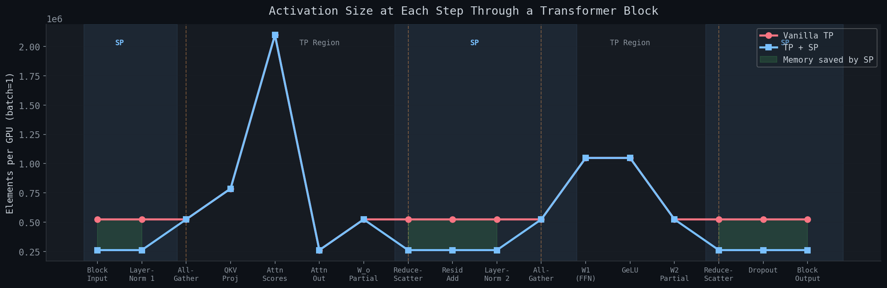
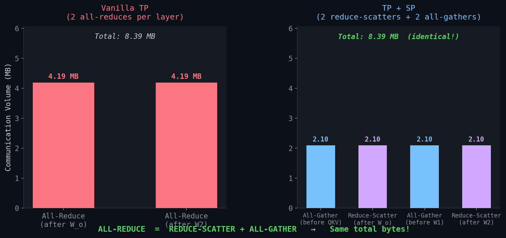
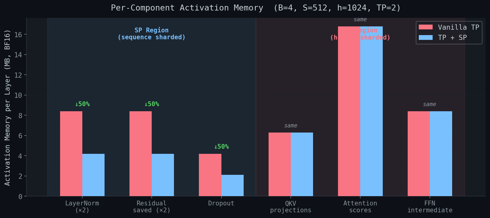

## Sequence Parallelism

In our [Tensor Parallelism](tensor-parallelism.md) write-up, we saw that TP splits the large weight matrices across GPUs, giving us ~1/N memory for model parameters. But TP has a limitation: the operations *between* the parallelized layers - LayerNorm, Dropout, and residual connections - all require the **full hidden dimension** on every GPU. Their activations are **replicated**, so we get no memory savings for them.

```
Operations PARALLELIZED by TP:              Operations NOT parallelized by TP:
  - W_q, W_k, W_v (column-parallel)           - LayerNorm (needs full d_model)
  - W_o (row-parallel)                         - Dropout (needs full d_model)
  - W1 (column-parallel)                       - Residual connections (full d_model)
  - W2 (row-parallel)                          - Activation storage between layers
```

**Sequence Parallelism (SP)** fixes this by splitting along the **sequence dimension** instead of the hidden dimension for these operations.


### The Key Insight: Swapping All-Reduce for Reduce-Scatter + All-Gather

In vanilla TP, after a row-parallel layer (e.g., $W_o$ or $W_2$), each GPU holds a partial sum of shape $(B, S, h)$. An **all-reduce** sums these partials so every GPU gets the full result. Then LayerNorm and Dropout operate on the full $(B, S, h)$ tensor - *identically on every GPU*. This is redundant work and wasted memory.



The diagram shows a single transformer block under vanilla TP (left) and TP+SP (right). The dashed lines mark the communication boundaries between regions. In vanilla TP, `f` (identity forward, all-reduce backward) and `f*` (all-reduce forward, identity backward) bracket the TP region. In TP+SP, these are replaced by `g` (all-gather forward, reduce-scatter backward) and `g*` (reduce-scatter forward, all-gather backward), which transition between TP regions (blue, hidden-dim sharded) and SP regions (cyan, sequence-dim sharded). LayerNorm, Dropout, and residual adds now live in the SP region at $(B, S/N, h)$ instead of the full $(B, S, h)$.

SP reorganizes the communication. Instead of all-reduce, we use **reduce-scatter**: sum the partials *and* scatter along the sequence dimension. Each GPU ends up with the correct result for *its chunk of tokens* - shape $(B, S/N, h)$ instead of $(B, S, h)$. LayerNorm and Dropout now operate on 1/N of the data.

Before the next column-parallel layer (which needs the full sequence), an **all-gather** reconstructs $(B, S, h)$ from the chunks.

```
Vanilla TP:
  [row-parallel] -> [ALL-REDUCE] -> [LayerNorm on (B,S,h)] -> [column-parallel]
                     (fused)        full tensor, redundant

TP + SP:
  [row-parallel] -> [REDUCE-SCATTER] -> [LayerNorm on (B,S/N,h)] -> [ALL-GATHER] -> [column-parallel]
                     (explicit)         1/N of the data              (explicit)
```

The total communication volume is **identical** - we are just "unrolling" the all-reduce (which is internally reduce-scatter + all-gather) and inserting useful computation between the two halves.


### The Autograd Primitives

SP replaces the two TP communication primitives with a conjugate pair that transitions between TP and SP regions. Each primitive's backward pass is the inverse of its forward pass, so gradients flow correctly.

<details>
<summary><code>_AllGatherFromSPRegion</code> - all-gather in forward, reduce-scatter in backward (<code>g</code> in the Megatron diagram)</summary>

Placed *before* column-parallel layers (SP -> TP transition). Reconstructs the full sequence for the matmul, then scatters gradients back to the SP region.

```python
class _AllGatherFromSPRegion(torch.autograd.Function):
    """Forward: all-gather (SP -> TP). Backward: reduce-scatter (TP -> SP)."""

    @staticmethod
    def forward(ctx, x: torch.Tensor) -> torch.Tensor:
        return _all_gather_along_seq(x)

    @staticmethod
    def backward(ctx, grad: torch.Tensor):
        return _reduce_scatter_along_seq(grad)
```

</details>

<details>
<summary><code>_ReduceScatterToSPRegion</code> - reduce-scatter in forward, all-gather in backward (<code>g*</code> in the Megatron diagram)</summary>

Placed *after* row-parallel layers (TP -> SP transition). Sums partial results and scatters to the SP region, then gathers gradients back to the TP region.

```python
class _ReduceScatterToSPRegion(torch.autograd.Function):
    """Forward: reduce-scatter (TP -> SP). Backward: all-gather (SP -> TP)."""

    @staticmethod
    def forward(ctx, x: torch.Tensor) -> torch.Tensor:
        return _reduce_scatter_along_seq(x)

    @staticmethod
    def backward(ctx, grad: torch.Tensor):
        return _all_gather_along_seq(grad)
```

</details>

<details>
<summary>Communication helpers: <code>_all_gather_along_seq</code> and <code>_reduce_scatter_along_seq</code></summary>

Both operate along dim=1 (the sequence dimension):

```python
def _all_gather_along_seq(x: torch.Tensor) -> torch.Tensor:
    """Gather along sequence dim: (B, S/N, h) -> (B, S, h)."""
    ws = dist.get_world_size()
    gathered = [torch.empty_like(x) for _ in range(ws)]
    dist.all_gather(gathered, x.contiguous())
    return torch.cat(gathered, dim=1)

def _reduce_scatter_along_seq(x: torch.Tensor) -> torch.Tensor:
    """Reduce-scatter along sequence dim: (B, S, h) -> (B, S/N, h)."""
    ws = dist.get_world_size()
    B, S, h = x.shape
    S_local = S // ws
    chunks = list(x.split(S_local, dim=1))
    output = torch.empty(B, S_local, h, device=x.device, dtype=x.dtype)
    dist.reduce_scatter(output, chunks, op=dist.ReduceOp.SUM)
    return output
```

</details>

Note that `_CopyToTPRegion` (identity forward, all-reduce backward) is still used inside column-parallel layers, unchanged from vanilla TP.

**Why `g` and `g*` are conjugate pairs:** The backward pass of `g` does exactly what the forward pass of `g*` does, and vice versa. This is required for correct gradient flow -- when a forward pass gathers data across GPUs, the corresponding backward pass must scatter gradients back, and when a forward pass reduces and scatters, the backward pass must gather gradients. The symmetry means the same two communication operations (all-gather and reduce-scatter) appear in both directions, just swapped:

| | Forward | Backward |
|---|---|---|
| `g` (`_AllGatherFromSPRegion`) | all-gather | reduce-scatter |
| `g*` (`_ReduceScatterToSPRegion`) | reduce-scatter | all-gather |

This mirrors the vanilla TP conjugate pair `f`/`f*`, where `f` is identity forward / all-reduce backward and `f*` is all-reduce forward / identity backward.

**Primitive comparison with vanilla TP:**

| | Vanilla TP | TP + SP |
|---|---|---|
| Before column-parallel | `_CopyToTPRegion` (identity fwd) | `_CopyToTPRegion` (identity fwd) |
| After row-parallel | `_ReduceFromTPRegion` (all-reduce fwd) | `_ReduceScatterToSPRegion` (reduce-scatter fwd) |
| SP -> TP transition | N/A | `_AllGatherFromSPRegion` (all-gather fwd) |


### The Code Change: Row-Parallel Linear

The only structural change in the linear layers is in `RowParallelLinear`. Instead of all-reduce, it uses reduce-scatter:

**Vanilla TP** ([sequence-parallelism/src/model_gpt_tp.py](sequence-parallelism/src/model_gpt_tp.py)):

```python
class RowParallelLinear(nn.Module):
    def forward(self, x: torch.Tensor) -> torch.Tensor:
        out = F.linear(x, self.weight, self.bias)
        return _ReduceFromTPRegion.apply(out)  # ALL-REDUCE -> (B, S, h)
```

**TP + SP** ([sequence-parallelism/src/model_gpt_tp_sp.py](sequence-parallelism/src/model_gpt_tp_sp.py)):

```python
class RowParallelLinear(nn.Module):
    def forward(self, x: torch.Tensor) -> torch.Tensor:
        out = F.linear(x, self.weight, self.bias)
        return _ReduceScatterToSPRegion.apply(out)  # REDUCE-SCATTER -> (B, S/N, h)
```


### The Code Change: Transformer Block

The transformer block is where the SP/TP transitions become visible. In vanilla TP, everything operates on the full $(B, S, h)$. With SP, the block input is already in the SP region at $(B, S/N, h)$.

**Vanilla TP:**

```python
class TPGPTTransformerBlock(nn.Module):
    def forward(self, x: torch.Tensor) -> torch.Tensor:
        # x: (B, S, h) - FULL tensor, identical on all GPUs
        x = x + self.resid_dropout(self.attn(self.norm1(x)))
        x = x + self.resid_dropout(self.ffn(self.norm2(x)))
        return x  # (B, S, h) - still FULL
```

**TP + SP:**

```python
class TPSPTransformerBlock(nn.Module):
    def forward(self, x: torch.Tensor) -> torch.Tensor:
        # x: (B, S/N, h) - SP region, sequence is sharded

        # --- Attention sub-block ---
        residual = x                                          # (B, S/N, h)
        x = _AllGatherFromSPRegion.apply(self.norm1(x))       # (B, S/N, h) -> (B, S, h)
        x = self.attn(x)                                      # (B, S, h) -> (B, S/N, h) via reduce-scatter
        x = residual + self.resid_dropout(x)                  # (B, S/N, h)

        # --- FFN sub-block ---
        residual = x                                          # (B, S/N, h)
        x = _AllGatherFromSPRegion.apply(self.norm2(x))       # (B, S/N, h) -> (B, S, h)
        x = self.ffn(x)                                       # (B, S, h) -> (B, S/N, h) via reduce-scatter
        x = residual + self.resid_dropout(x)                  # (B, S/N, h)

        return x  # (B, S/N, h) - stays in SP region
```

The pattern for each sub-block:
1. LayerNorm in SP region at $(B, S/N, h)$ - **memory saved**
2. All-gather to reconstruct full sequence for TP matmul
3. TP computation (attention or FFN)
4. Reduce-scatter back to SP region
5. Dropout and residual add in SP region at $(B, S/N, h)$ - **memory saved**


### Activation Shapes Throughout a Transformer Block

Tracing the shapes on each GPU for $B=2$, $S=4$, $h=4$, $N=2$ GPUs:

**Vanilla TP:**

```
Step                          GPU-0 Shape       GPU-1 Shape       Note
----------------------------------------------------------------------
Input to block                (2, 4, 4)         (2, 4, 4)         full, replicated
LayerNorm 1                   (2, 4, 4)         (2, 4, 4)         full, replicated [X]

Enter TP: W_q, W_k, W_v       (2, 4, 2)         (2, 4, 2)         h sharded (h/N=2)
Attention                     (2, 4, 2)         (2, 4, 2)         local heads only
Exit TP: W_o + ALL-REDUCE     (2, 4, 4)         (2, 4, 4)         h restored

Residual add                  (2, 4, 4)         (2, 4, 4)         full, replicated [X]
LayerNorm 2                   (2, 4, 4)         (2, 4, 4)         full, replicated [X]

Enter TP: W1                  (2, 4, 8)         (2, 4, 8)         d_ff sharded (16/2=8)
GeLU                          (2, 4, 8)         (2, 4, 8)         local
Exit TP: W2 + ALL-REDUCE      (2, 4, 4)         (2, 4, 4)         h restored

Dropout                       (2, 4, 4)         (2, 4, 4)         full, replicated [X]
Residual add                  (2, 4, 4)         (2, 4, 4)         full, replicated [X]
Output                        (2, 4, 4)         (2, 4, 4)         full, replicated
```

**TP + SP:**

```
Step                          GPU-0 Shape       GPU-1 Shape       Note
----------------------------------------------------------------------
Input to block                (2, 2, 4)         (2, 2, 4)         s sharded! (s/N=2)
LayerNorm 1                   (2, 2, 4)         (2, 2, 4)         s sharded [SAVED]

ALL-GATHER (SP -> TP)         (2, 4, 4)         (2, 4, 4)         reconstruct full seq
Enter TP: W_q, W_k, W_v       (2, 4, 2)         (2, 4, 2)         h sharded
Attention                     (2, 4, 2)         (2, 4, 2)         local heads only
Exit TP: W_o + REDUCE-SCATTER (2, 2, 4)         (2, 2, 4)         s sharded again!

Residual add                  (2, 2, 4)         (2, 2, 4)         s sharded [SAVED]
LayerNorm 2                   (2, 2, 4)         (2, 2, 4)         s sharded [SAVED]

ALL-GATHER (SP -> TP)         (2, 4, 4)         (2, 4, 4)         reconstruct full seq
Enter TP: W1                  (2, 4, 8)         (2, 4, 8)         d_ff sharded
GeLU                          (2, 4, 8)         (2, 4, 8)         local
Exit TP: W2 + REDUCE-SCATTER  (2, 2, 4)         (2, 2, 4)         s sharded again!

Dropout                       (2, 2, 4)         (2, 2, 4)         s sharded [SAVED]
Residual add                  (2, 2, 4)         (2, 2, 4)         s sharded [SAVED]
Output                        (2, 2, 4)         (2, 2, 4)         s sharded
```

Every `[X]` in vanilla TP becomes `[SAVED]` in TP+SP. The TP region shapes are identical - SP only changes the non-TP operations.




### Communication Cost: Identical to Vanilla TP

This is the key result - SP adds **zero** communication overhead.

```
Vanilla TP (per transformer block):
  After W_o:   ALL-REDUCE    (B, S, h) = 32 elements x 2 bytes = 64 B
  After W2:    ALL-REDUCE    (B, S, h) = 32 elements x 2 bytes = 64 B
  Total:       128 bytes per block

TP + SP (per transformer block):
  Before W_q:  ALL-GATHER     (B, S/N, h) -> (B, S, h) = 64 B
  After W_o:   REDUCE-SCATTER (B, S, h) -> (B, S/N, h) = 64 B
  Before W1:   ALL-GATHER     (B, S/N, h) -> (B, S, h) = 64 B
  After W2:    REDUCE-SCATTER (B, S, h) -> (B, S/N, h) = 64 B
  Total:       256 bytes per block ???
```

This looks like 2x the communication, but **all-reduce = reduce-scatter + all-gather** under the hood. The vanilla TP all-reduce is internally doing both operations fused into one call. TP+SP just separates them in time, inserting useful computation (LayerNorm, Dropout) between the reduce-scatter and all-gather. Same bytes on the wire.

The [analyze_comm.py](sequence-parallelism/src/analyze_comm.py) script verifies this empirically by timing all-reduce vs reduce-scatter + all-gather independently.




### Memory Savings

For a real model (7B, $B=8$, $S=2048$, $h=4096$, $N=8$ GPUs):

```
                              Vanilla TP (N=8)    TP + SP (N=8)
--------------------------------------------------------------
LayerNorm activations         B x S x h = 64 MB   B x (S/N) x h = 8 MB
Dropout activations           B x S x h = 64 MB   B x (S/N) x h = 8 MB
Residual saved                B x S x h = 64 MB   B x (S/N) x h = 8 MB
FFN intermediate              B x S x (d_ff/N) = 88 MB   (same)
QKV projections               B x S x (h/N) = 8 MB       (same)
Attention scores              B x (H/N) x S x S = 128 MB (same)
--------------------------------------------------------------
Per-layer total               ~416 MB              ~248 MB
Savings:                                           40%
--------------------------------------------------------------
32 layers:                    ~13.3 GB             ~7.9 GB
Savings:                                           5.4 GB per GPU!
```

The TP-region activations (QKV, attention scores, FFN intermediate) are unchanged. SP only reduces the non-TP activations (LayerNorm, Dropout, residuals) by a factor of N.




### The Embedding Layer with SP

The embedding layer also transitions into the SP region. After the standard embedding lookup produces $(B, S, h)$, each GPU extracts its chunk of the sequence:

```python
# Embedding (same on all GPUs, full sequence)
pos = torch.arange(S, device=input_ids.device).unsqueeze(0)
x = self.tok_emb(input_ids) + self.pos_emb(pos)  # (B, S, h)

# Scatter to SP region: each GPU takes its chunk of the sequence
start = self.rank * S_local
x = x[:, start : start + S_local, :].contiguous()  # (B, S/N, h)
x = self.emb_dropout(x)
```

Note that the scatter here is a simple slice (`x[:, start:start+S_local, :]`), not a `dist.reduce_scatter` call. Unlike the row-parallel output where each GPU holds a *different partial sum* that must be reduced, the embedding output is *identical* on all GPUs -- there is nothing to reduce. Each GPU just picks its chunk of the already-correct full tensor. The result is the same: we enter the SP region at $(B, S/N, h)$, but we skip the reduction step entirely.

For the output, the final LayerNorm stays in the SP region, then an all-gather reconstructs the full sequence for the LM head:

```python
x = self.norm_f(x)                            # (B, S/N, h) - SP region
x = _AllGatherFromSPRegion.apply(x)            # (B, S, h)  - full sequence
return self.lm_head(x)                         # (B, S, vocab/N)
```


### Benchmark Results

Both models use the same configuration ($d_{model}=1024$, $n_{heads}=16$, $d_{ff}=4096$, 8 layers, vocab 32k) and were benchmarked with batch size 4, sequence length 512, on 2 GPUs.

| Metric | Vanilla TP | TP + SP | Delta |
|---|---|---|---|
| Parameters per GPU | 100,591,616 | 100,591,616 | same |
| Model memory | 384.73 MB | 384.73 MB | same |
| **Peak memory** | **3,314.73 MB** | **3,229.60 MB** | **-85 MB (-2.6%)** |
| Forward | 122.30 ms | 131.99 ms | +7.9% |
| Backward | 139.92 ms | 188.48 ms | +34.7% |
| Full step | 285.01 ms | 336.63 ms | +18.1% |
| Throughput | 7,186 tok/s | 6,084 tok/s | -15.3% |

The memory saving is modest at this small scale (2 GPUs, 8 layers, 512 seq len). The benefit grows with more GPUs, longer sequences, and deeper models - exactly the conditions where activation memory becomes the bottleneck. At $N=8$ with a 7B model, the savings are multiple GB per GPU.

The throughput overhead comes from our naive implementation using separate `dist.reduce_scatter` and `dist.all_gather` calls. Production frameworks (Megatron-LM, DeepSpeed) fuse these with computation overlap and async communication, eliminating the overhead.


### Running the Benchmarks

From the `sequence-parallelism/` directory:

```bash
# Vanilla TP baseline
CUDA_VISIBLE_DEVICES=0,1 torchrun --nproc_per_node=2 src/model_gpt_tp.py

# TP + Sequence Parallelism
CUDA_VISIBLE_DEVICES=0,1 torchrun --nproc_per_node=2 src/model_gpt_tp_sp.py

# Communication analysis (verifies all-reduce = reduce-scatter + all-gather)
CUDA_VISIBLE_DEVICES=0,1 torchrun --nproc_per_node=2 src/analyze_comm.py

# Activation shape trace
CUDA_VISIBLE_DEVICES=0,1 torchrun --nproc_per_node=2 src/trace_shapes.py
```

See [developer.md](developer.md) for full setup and CLI flags.


### When to Use Sequence Parallelism

Always use SP when using TP. There is essentially no downside:

- Same communication volume as vanilla TP
- 30-50% reduction in activation memory (depending on model and TP degree)
- Enables larger batch sizes or longer sequences
- Implemented in all major frameworks (Megatron-LM, DeepSpeed, etc.)

The only "cost" is implementation complexity, which is already handled by the frameworks. SP is standard practice for any serious large-scale training.


### Source Code

| File | Description |
|---|---|
| [sequence-parallelism/src/config.py](sequence-parallelism/src/config.py) | Shared model and benchmark configuration |
| [sequence-parallelism/src/model_gpt_tp.py](sequence-parallelism/src/model_gpt_tp.py) | Vanilla TP GPT (baseline for comparison) |
| [sequence-parallelism/src/model_gpt_tp_sp.py](sequence-parallelism/src/model_gpt_tp_sp.py) | TP + SP GPT |
| [sequence-parallelism/src/analyze_comm.py](sequence-parallelism/src/analyze_comm.py) | Communication cost analysis |
| [sequence-parallelism/src/trace_shapes.py](sequence-parallelism/src/trace_shapes.py) | Activation shape trace |
