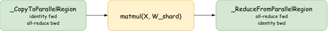

## Tensor Parallelism

When a model is too large for a single GPU, we split its weight matrices across multiple GPUs. This is **Tensor Parallelism (TP)**. But splitting matrices introduces a coordination problem - GPUs need to communicate to reassemble the correct result. The primitives that manage this communication are subtle, and the payoff for understanding them is a beautiful optimization: when we chain two layers together, an entire communication round disappears.

Tensor Parallelism leverages two fundamental properties of matrix multiplication $A \cdot B$:

```math
\begin{aligned}
&\text{1. Column split:} \quad A \cdot B = A \cdot \begin{bmatrix} B_1 & B_2 & \cdots \end{bmatrix} = \begin{bmatrix} AB_1 & AB_2 & \cdots \end{bmatrix} \\
&\text{2. Row split:} \quad A \cdot B = \begin{bmatrix} A_1 & A_2 & \cdots \end{bmatrix} \begin{bmatrix} B_1 \\ B_2 \\ \vdots \end{bmatrix} = \sum_{i=1}^n A_i B_i
\end{aligned}
```

We can compute a matrix product by either (1) multiplying each column of $B$ individually, or (2) multiplying each row individually and summing the results. Choosing column vs. row sharding requires different communication primitives.

We walk through TP step by step using concrete matrices on 2 GPUs: first Column-Parallel Linear, then Row-Parallel Linear, then both combined - revealing the cancellation that makes TP efficient in real Transformers.


### Setup: The Matrices


Every example uses the same input matrix $X$ and two weight matrices $W^1$ and $W^2$:

```math
X = \begin{bmatrix} 0 & 1 \\ 2 & 3 \\ 4 & 5 \\ 6 & 7 \end{bmatrix}_{4 \times 2}
\quad
W^1 = \begin{bmatrix} 1 & 3 \\ 2 & 4 \end{bmatrix}_{2 \times 2}
\quad
W^2 = \begin{bmatrix} 5 & 7 \\ 6 & 8 \end{bmatrix}_{2 \times 2}
```

On a single GPU:

```math
Y_1 = X \cdot W^1 = \begin{bmatrix} 2 & 4 \\ 8 & 18 \\ 14 & 32 \\ 20 & 46 \end{bmatrix}
\qquad
Y = Y_1 \cdot W^2 = \begin{bmatrix} 34 & 46 \\ 148 & 200 \\ 262 & 354 \\ 376 & 508 \end{bmatrix}
```

**Goal:** get the same results when the weights are split across 2 GPUs.

### Equivalence checks: hand primitives vs DTensor

The article uses the same reference tensors as two runnable checks under `tensor-parallelism/src/`:

- `test_tp_primitives.py` - explicit `torch.autograd.Function` primitives (`_CopyToParallelRegion`, `_ScatterToParallelRegion`, `_ReduceFromParallelRegion`, `_AllGatherFromParallelRegion`) plus local matmuls.
- `test_tp_primitives_dtensor.py``torch.distributed.tensor` (`DeviceMesh`, `parallelize_module`, `ColwiseParallel`, `RowwiseParallel`) on `nn.Linear` layers.

Both scripts require **2 CUDA ranks** (same `torchrun` pattern). From the repo root:

```bash
cd tensor-parallelism
torchrun --nproc_per_node=2 src/test_tp_primitives.py
torchrun --nproc_per_node=2 src/test_tp_primitives_dtensor.py
```

**Layout vs `nn.Linear`:** the diagrams use $Y = X W$ with $W$ shaped like the math above. `nn.Linear` implements $y = x W^\top$ in the sense `output = x @ weight.T`, so the DTensor tests set `linear.weight` to $W^\top$ to match the same numeric $X W$ as the hand path.

| Step | Hand primitives test | DTensor test |
|------|----------------------|--------------|
| 1. Column-parallel linear only | `_CopyToParallelRegion`; `W1` split on dim 1; `X @ W1_local`; optional `_AllGatherFromParallelRegion` vs full `X @ W1` | `ColwiseParallel` on `lin1`; assert local output equals the corresponding column shard of `X @ W1`; `dist.all_gather` to compare to full `X @ W1` |
| 2. Row-parallel linear only | `_ScatterToParallelRegion` on last dim; `W2` split on dim 0; `X_local @ W2_local`; `_ReduceFromParallelRegion` vs `X @ W2` | `X` split manually like scatter; `RowwiseParallel(input_layouts=Shard(-1))` on `lin2`; assert output matches `X @ W2` |
| 3. Column then row | Fused path: Copy, column matmul, **no** all-gather/scatter between layers, row matmul, Reduce vs `reference_Y()` | `ColThenRow` module; `parallelize_module` with `ColwiseParallel` + `RowwiseParallel` vs `reference_Y()` |

Passing both runs is the strongest sanity check that the narrative, the custom autograd primitives, and PyTorch's TP sharding styles describe the same math and collectives (up to the stated `atol`).


### The Autograd Primitives

TP communication is implemented as `torch.autograd.Function` subclasses. Each one defines what happens in the forward pass and what happens in the backward pass, so gradients flow correctly through the distributed computation.

<details>
<summary><code>_CopyToParallelRegion</code> - identity in forward, all-reduce in backward (Click to expand)</summary>

Placed *before* column-parallel layers.

```python
class _CopyToParallelRegion(torch.autograd.Function):
    @staticmethod
    def forward(ctx, x):
        return x

    @staticmethod
    def backward(ctx, grad):
        dist.all_reduce(grad, op=dist.ReduceOp.SUM)
        return grad
```

</details>

<details>
<summary><code>_ReduceFromParallelRegion</code> - all-reduce in forward, identity in backward (Click to expand)</summary>

Placed *after* row-parallel layers to combine partial sums.

```python
class _ReduceFromParallelRegion(torch.autograd.Function):
    @staticmethod
    def forward(ctx, x):
        dist.all_reduce(x, op=dist.ReduceOp.SUM)
        return x

    @staticmethod
    def backward(ctx, grad):
        return grad
```

</details>

<details>
<summary><code>_ScatterToParallelRegion</code> - scatter in forward, all-gather in backward (Click to expand)</summary>

Placed *before* row-parallel layers to split the input across ranks.
Conjugate of `_AllGatherFromParallelRegion`.

```python
class _ScatterToParallelRegion(torch.autograd.Function):
    @staticmethod
    def forward(ctx, x):
        ws = dist.get_world_size()
        rank = dist.get_rank()
        ctx.ws = ws
        chunks = x.chunk(ws, dim=-1)
        return chunks[rank].contiguous()

    @staticmethod
    def backward(ctx, grad):
        gathered = [torch.zeros_like(grad) for _ in range(ctx.ws)]
        dist.all_gather(gathered, grad.contiguous())
        return torch.cat(gathered, dim=-1)
```

</details>

<details>
<summary><code>_AllGatherFromParallelRegion</code> - all-gather in forward, scatter in backward (Click to expand)</summary>

Placed *after* column-parallel layers to reconstruct full output.
Conjugate of `_ScatterToParallelRegion`.

```python
class _AllGatherFromParallelRegion(torch.autograd.Function):
    @staticmethod
    def forward(ctx, y):
        ws = dist.get_world_size()
        ctx.ws = ws
        gathered = [torch.zeros_like(y) for _ in range(ws)]
        dist.all_gather(gathered, y.contiguous())
        return torch.cat(gathered, dim=-1)

    @staticmethod
    def backward(ctx, grad):
        rank = dist.get_rank()
        chunks = grad.chunk(ctx.ws, dim=-1)
        return chunks[rank].contiguous()
```

</details>


### Column-Parallel Linear

**Key idea:** Split $W$ by *columns*. Each GPU holds a vertical slice. Every GPU receives the full input $X$, multiplies by its local shard, and produces a *slice* of the output.


$W^1$ is $(2,2)$. We split it by columns into two $(2,1)$ shards:

```math
\text{GPU 0: } W^1_0 = \begin{bmatrix} 1 \\ 2 \end{bmatrix}
\qquad
\text{GPU 1: } W^1_1 = \begin{bmatrix} 3 \\ 4 \end{bmatrix}
```

Each GPU computes its local output:

```math
\text{GPU 0: } X \cdot W^1_0 = \begin{bmatrix} 2 \\ 8 \\ 14 \\ 20 \end{bmatrix}_{4 \times 1}
\qquad
\text{GPU 1: } X \cdot W^1_1 = \begin{bmatrix} 4 \\ 18 \\ 32 \\ 46 \end{bmatrix}_{4 \times 1}
```

Each GPU holds one column of $Y$. To reconstruct the full $(4,2)$ result, we **all-gather** the outputs:

```math
Y_{\text{full}} = \begin{bmatrix} 2 & 4 \\ 8 & 18 \\ 14 & 32 \\ 20 & 46 \end{bmatrix}
= X \cdot W^1
```

<details>
<summary>Code: Column-Parallel Linear test (Click to expand)</summary>

```python
def test_column_linear(self):
    W1_local = self.W1.chunk(self.ws, dim=1)[self.rank]

    X_local = _CopyToParallelRegion.apply(self.X)
    Y_local = X_local @ W1_local

    Y_local_expected = (self.X @ self.W1).chunk(self.ws, dim=1)[self.rank]
    assert torch.allclose(Y_local, Y_local_expected, atol=1e-4)

    Y_full = _AllGatherFromParallelRegion.apply(Y_local)
    assert torch.allclose(Y_full, self.X @ self.W1, atol=1e-4)
```

</details>


### Row-Parallel Linear

**Key idea:** Split $W$ by *rows*. Each GPU holds a horizontal slice. The *input* must also be split - each GPU gets the columns of $X$ that align with its rows of $W$. The outputs are *partial sums* that must be added together.


$W^2$ is $(2,2)$. We split it by rows into two $(1,2)$ shards:

```math
\text{GPU 0: } W^2_0 = \begin{bmatrix} 5 & 7 \end{bmatrix}
\qquad
\text{GPU 1: } W^2_1 = \begin{bmatrix} 6 & 8 \end{bmatrix}
```

$X$ must also be split - each GPU gets one column:

```math
\text{GPU 0: } X_0 = \begin{bmatrix} 0 \\ 2 \\ 4 \\ 6 \end{bmatrix}_{4 \times 1}
\qquad
\text{GPU 1: } X_1 = \begin{bmatrix} 1 \\ 3 \\ 5 \\ 7 \end{bmatrix}_{4 \times 1}
```

Each GPU computes a *partial result*:

```math
\text{GPU 0: } X_0 \cdot W^2_0 = \begin{bmatrix} 0 & 0 \\ 10 & 14 \\ 20 & 28 \\ 30 & 42 \end{bmatrix}_{4 \times 2}
\qquad
\text{GPU 1: } X_1 \cdot W^2_1 = \begin{bmatrix} 6 & 8 \\ 18 & 24 \\ 30 & 40 \\ 42 & 56 \end{bmatrix}_{4 \times 2}
```

These are partial sums. To get the full $Y$, we **all-reduce** (sum across GPUs):

```math
Y_{\text{full}} = \begin{bmatrix} 0{+}6 & 0{+}8 \\ 10{+}18 & 14{+}24 \\ 20{+}30 & 28{+}40 \\ 30{+}42 & 42{+}56 \end{bmatrix}
= \begin{bmatrix} 6 & 8 \\ 28 & 38 \\ 50 & 68 \\ 72 & 98 \end{bmatrix}
= X \cdot W^2
```

<details>
<summary>Code: Row-Parallel Linear test (Click to expand)</summary>

```python
def test_row_linear(self):
    X_local = _ScatterToParallelRegion.apply(self.X)
    W2_local = self.W2.chunk(self.ws, dim=0)[self.rank]

    Y_partial = X_local @ W2_local

    Y_full = _ReduceFromParallelRegion.apply(Y_partial)

    assert torch.allclose(Y_full, self.X @ self.W2, atol=1e-4)
```

</details>


### Column Parallel + Row Parallel Combined: The Cancellation

**Key idea:** In an MLP block, $W^1$ is Column-Parallel and $W^2$ is Row-Parallel. When chained, **a full communication round disappears**.


If used standalone, the all-gather after Column Linear and the scatter before Row Linear sit back-to-back. They are *conjugate* operations - one undoes the other. 
The column output is already in the form that row input needs.

**One all-reduce per forward pass. One all-reduce per backward pass.** That is all the communication a two-layer MLP needs.

The final all-reduce produces the correct result:

```math
Y = \begin{bmatrix} 10{+}24 & 14{+}32 \\ 40{+}108 & 56{+}144 \\ 70{+}192 & 98{+}256 \\ 100{+}276 & 140{+}368 \end{bmatrix}
= \begin{bmatrix} 34 & 46 \\ 148 & 200 \\ 262 & 354 \\ 376 & 508 \end{bmatrix}
= X \cdot W^1 \cdot W^2
```

<details>
<summary>Code: Column + Row combined test (Click to expand)</summary>

```python
def test_column_then_row(self):
    Y_expected = (self.X @ self.W1) @ self.W2

    X_local = _CopyToParallelRegion.apply(self.X)

    W1_local = self.W1.chunk(self.ws, dim=1)[self.rank]
    Y_col_local = X_local @ W1_local

    # NO all-gather or scatter here - they cancel out.
    # Y_col_local is already split, which is what Row Linear needs.

    W2_local = self.W2.chunk(self.ws, dim=0)[self.rank]
    Y_row_local = Y_col_local @ W2_local

    Y_full = _ReduceFromParallelRegion.apply(Y_row_local)

    assert torch.allclose(Y_full, Y_expected, atol=1e-4)
```

</details>




### Tensor Parallelism in a Transformer Block

In a Transformer block, this pattern appears **twice**:

1. **Attention**: Q/K/V projections are Column-Parallel (split heads across GPUs). The output projection $W_o$ is Row-Parallel. The all-gather/scatter between them cancels. &rarr; **1 all-reduce per attention block**.

2. **FFN/MLP**: $W^1$ (up-projection) is Column-Parallel. $W^2$ (down-projection) is Row-Parallel. The intermediate all-gather/scatter cancels. &rarr; **1 all-reduce per MLP block**.

Total communication per Transformer layer: **2 all-reduces in forward, 2 all-reduces in backward.** This is the Megatron-LM TP scheme.

```mermaid
flowchart LR
    subgraph Attention["Attention Block"]
        direction LR
        LN1["LayerNorm"] --> Copy1["Copy<br/><i>identity</i>"]
        Copy1 --> QKV["Q,K,V<br/>(col-parallel)"]
        QKV --> Wo["W_o<br/>(row-parallel)"]
        Wo --> Reduce1["Reduce<br/><i>all-reduce</i>"]
    end

    subgraph MLP["MLP Block"]
        direction LR
        LN2["LayerNorm"] --> Copy2["Copy<br/><i>identity</i>"]
        Copy2 --> W1["W1<br/>(col-parallel)"]
        W1 --> Act["Activation"]
        Act --> W2["W2<br/>(row-parallel)"]
        W2 --> Reduce2["Reduce<br/><i>all-reduce</i>"]
    end

    X["x"] --> Attention
    Attention -- "+ residual" --> MLP
    MLP -- "+ residual" --> Out["output"]

    style Copy1 fill:#cfc,stroke:#090
    style Reduce1 fill:#cfc,stroke:#090
    style Copy2 fill:#cfc,stroke:#090
    style Reduce2 fill:#cfc,stroke:#090
```



For multi-head attention, column parallelism has a natural interpretation: each GPU computes attention for a subset of heads. This works equally well 
for **Multi-Query Attention (MQA)** and **Grouped Query Attention (GQA)**, where K/V heads are shared between queries. The TP degree should not exceed 
the number of K/V heads - otherwise heads must be duplicated across GPUs with additional sync. How this actually works depends on the variant: MHA, GQA, or MQA.

> From [HF: Ultrascale Playbook](https://huggingface.co/spaces/nanotron/ultrascale-playbook?section=tensor_parallelism_in_a_transformer_block):
It's worth noting, however, that the tensor parallelism degree should not exceed the number of attention heads because we shard the QKV projection along 
the `num_attention_heads` dimension. When using Grouped Query Attention (GQA), we have $num_attention_heads$ query heads but only $num_kv_heads$ key/value 
heads (with $num_attention_heads >= num_kv_heads$. In this case, we can still set $TP=num_attention_heads$ , but we'll need to ensure that the K/V heads 
stay properly synchronized across GPUs. For instance, Llama-3 8B has 32 query heads but only 8 key/value heads, so while the TP degree could theoretically 
go up to 32, we would need careful implementation to maintain K/V head synchronization across the tensor-parallel workers.


See [tensor-parallelism/src/model_llama_tp.py](tensor-parallelism/src/model_llama_tp.py) for LLama with Grouped Query Attention (GQA) + TP.  
See [tensor-parallelism/src/model_gpt_tp.py](tensor-parallelism/src/model_gpt_tp.py) for GPT with Multi Head Attention (MHA) + TP.


#### Attention Variants: MHA vs GQA vs MQA

| | MHA (GPT) | GQA (Llama) | MQA |
|---|---|---|---|
| **Q heads** | `n_heads` | `n_heads` | `n_heads` |
| **KV heads** | `n_heads` | `n_kv_heads` (between 1 and n_heads) | 1 |
| **group_size** | 1 | `n_heads / n_kv_heads` | `n_heads` |
| **W_q shape** | `[d_model, d_model]` | `[d_model, n_heads * d_head]` | `[d_model, n_heads * d_head]` |
| **W_k, W_v shape** | `[d_model, d_model]` | `[d_model, n_kv_heads * d_head]` | `[d_model, d_head]` |
| **KV cache size** | `n_heads * d_head * seq_len` | `n_kv_heads * d_head * seq_len` | `d_head * seq_len` |
| **TP constraint** | `n_heads % ws == 0` | `n_heads % ws == 0` AND `n_kv_heads % ws == 0` | `ws == 1` (or replicate KV) |
| **Implementation** | `model_gpt_tp.py` | `model_llama_tp.py` | Not implemented (see below) |

**Key differences in the TP implementations:**

In **MHA** (GPT), all projection matrices have the same shape. Every head - $Q$, $K$, and $V$ -
is sharded identically across GPUs:

```python
# MHA: all projections are d_model -> d_model, symmetric sharding
self.W_q = ColumnParallelLinear(d_model, d_model)
self.W_k = ColumnParallelLinear(d_model, d_model)
self.W_v = ColumnParallelLinear(d_model, d_model)
self.W_o = RowParallelLinear(d_model, d_model)

# Each GPU gets n_heads/ws heads for Q, K, and V
Q = self.W_q(x).view(B, T, self.n_heads_local, self.d_head)
K = self.W_k(x).view(B, T, self.n_heads_local, self.d_head)
V = self.W_v(x).view(B, T, self.n_heads_local, self.d_head)
```

In **GQA** (Llama), $K/V$ projections are smaller because fewer KV heads are used.
Each GPU gets a proportional subset of both $Q$ and $KV$ heads, and locally expands
$KV$ heads to match $Q$ heads via `repeat_interleave` (no communication needed):

```python
# GQA: K/V projections are smallerasymmetric sharding
self.W_q = ColumnParallelLinear(d_model, n_heads * d_head)      # shards Q heads
self.W_k = ColumnParallelLinear(d_model, n_kv_heads * d_head)   # shards KV heads
self.W_v = ColumnParallelLinear(d_model, n_kv_heads * d_head)   # shards KV heads
self.W_o = RowParallelLinear(n_heads * d_head, d_model)

# Each GPU gets n_kv_heads/ws KV heads, then expands locally
K = self.W_k(x).view(B, T, self.n_kv_heads_local, self.d_head)
V = self.W_v(x).view(B, T, self.n_kv_heads_local, self.d_head)
K = K.repeat_interleave(self.group_size, dim=1)  # local expansion, no comm
V = V.repeat_interleave(self.group_size, dim=1)
```

**MQA** is the extreme case of GQA with `n_kv_heads = 1`. Since we cannot split 
1 head across multiple GPUs, `n_kv_heads % ws == 0` fails for any `ws > 1`.
Real implementations handle this by replicating the single $KV$ head on every rank
(the $KV$ weights are tiny: `d_model x d_head`), which means $W_k$ and $W_v$ become
regular `nn.Linear` instead of `ColumnParallelLinear`. In practice, GQA with
`n_kv_heads >= ws` was introduced precisely as the TP-friendly generalization
of MQA - it gives the same KV-cache savings while remaining cleanly divisible.

<!-- TODO: diagram for full transformer block TP, TP scaling graphs -->


### TP Communication Summary

| Scenario              | Forward comm.       | Backward comm.     | Comm. rounds (fwd) |
|-----------------------|---------------------|--------------------|---------------------|
| Column Linear alone   | 1 all-gather        | 1 all-reduce + 1 scatter | 1              |
| Row Linear alone      | 1 scatter + 1 all-reduce | 1 all-gather   | 2                   |
| Column + Row combined | 1 all-reduce        | 1 all-reduce       | 1                   |

In practice, TP communication overhead becomes noticeable beyond 8 GPUs. Within
a single node, fast NVLink interconnects keep overhead low. Going across nodes
requires slower network connections and throughput drops significantly.


### Blog Series

This reference document covers the same material as a two-part blog series written in narrative style:

| Part | Article |
|---|---|
| Part 1 | [Tensor Parallelism from Scratch](tensor-parallelism-blog.md) -- building TP with custom autograd primitives |
| Part 2 | [From Hand-Written TP to PyTorch DTensor](tensor-parallelism-dtensor.md) -- translating to the DTensor API |

See also the Sequence Parallelism series: [Part 3](sequence-parallelism-blog.md) (hand-written TP+SP) and [Part 4](sequence-parallelism-dtensor.md) (DTensor TP+SP).

See [developer.md](developer.md) for full setup and CLI flags.