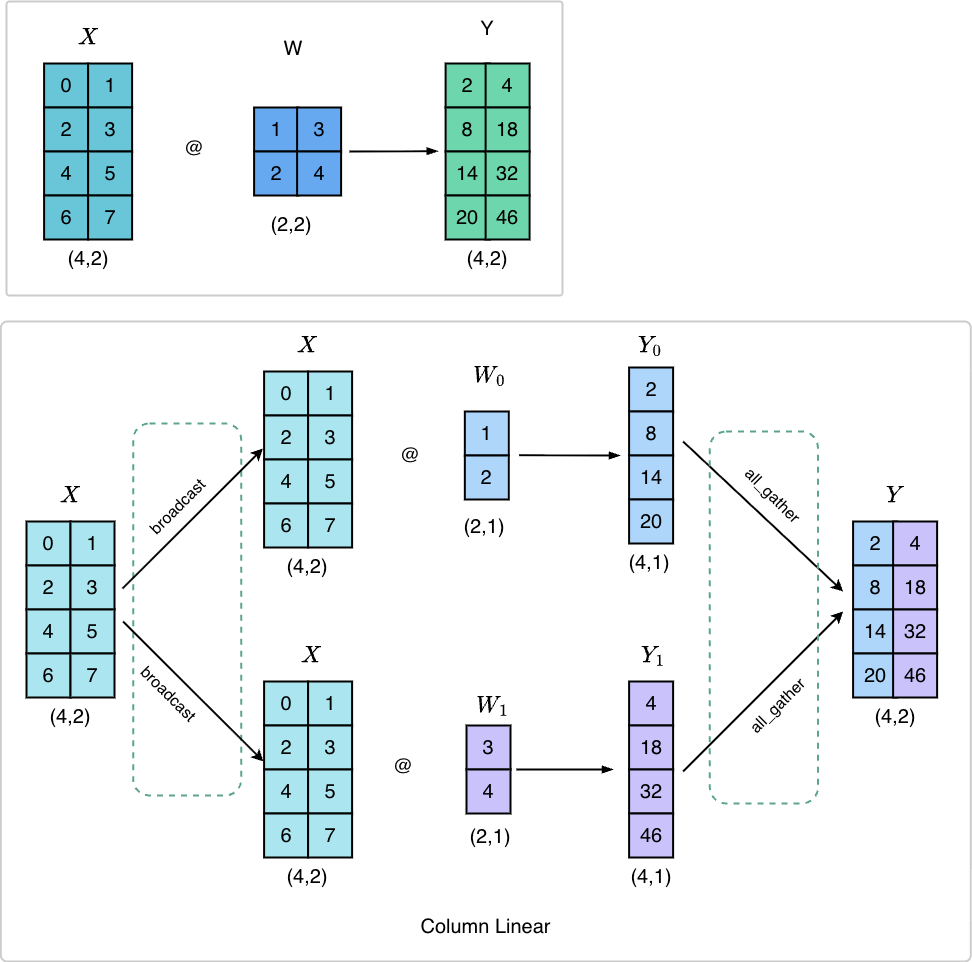
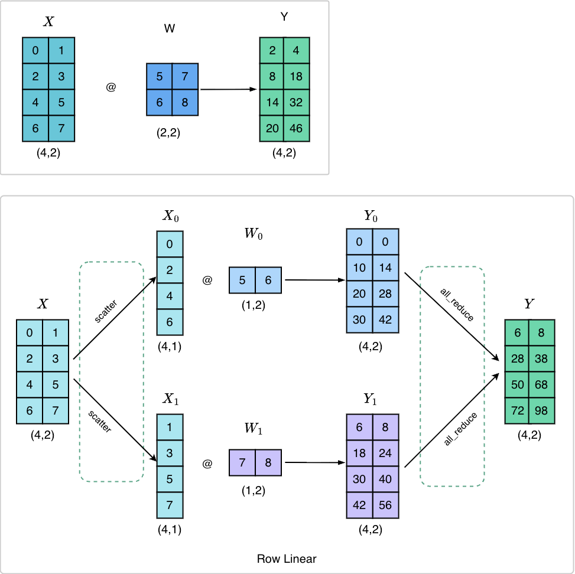
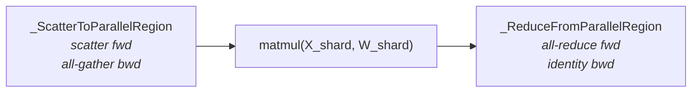
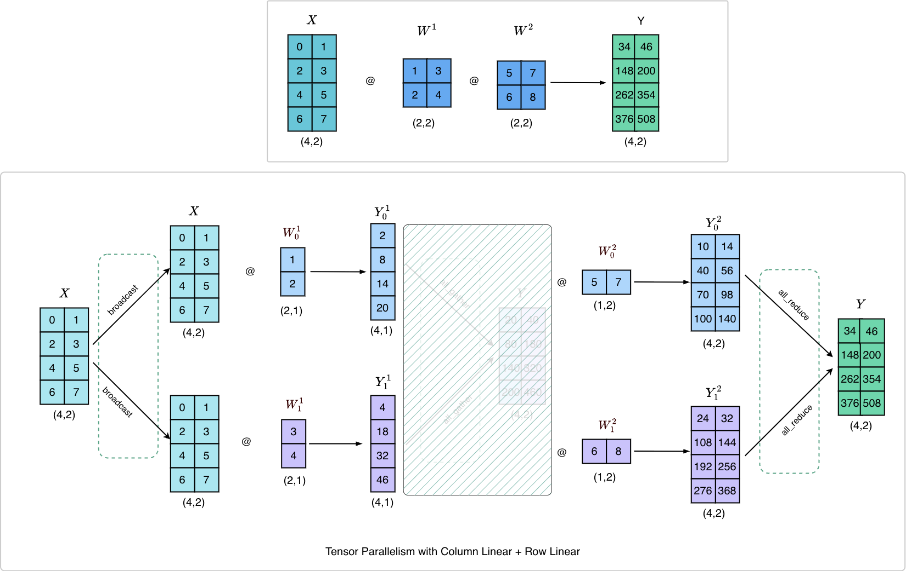
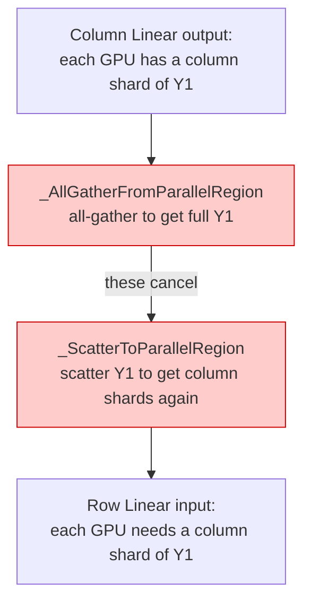
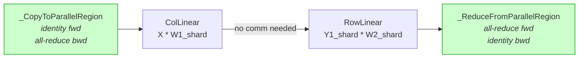

# Tensor Parallelism from Scratch: How Column and Row Linear Work (and Why They Cancel)

When a model is too large for a single GPU, we split its weight matrices across
multiple GPUs. This is **Tensor Parallelism (TP)**. But splitting matrices
introduces a coordination problem - GPUs need to communicate to reassemble
the correct result. The primitives that manage this communication are subtle,
and the payoff for understanding them is a beautiful optimization: when you
chain two layers together, an entire communication round disappears.

This post walks through TP step by step using concrete 4x2 matrices and two
GPUs. We start with Column-Parallel Linear, move to Row-Parallel Linear, and
then combine them - revealing the cancellation that makes TP efficient in
real Transformer models.


## Setup: The Matrices

Every example uses the same input matrix $X$ and two weight matrices $W^1$ and $W^2$:

$$
X = \begin{bmatrix} 0 & 1 \\ 2 & 3 \\ 4 & 5 \\ 6 & 7 \end{bmatrix}_{4 \times 2}
\quad
W^1 = \begin{bmatrix} 1 & 3 \\ 2 & 4 \end{bmatrix}_{2 \times 2}
\quad
W^2 = \begin{bmatrix} 5 & 7 \\ 6 & 8 \end{bmatrix}_{2 \times 2}
$$

On a single GPU, the math is straightforward:

$$
Y_1 = X \cdot W^1 = \begin{bmatrix} 2 & 4 \\ 8 & 18 \\ 14 & 32 \\ 20 & 46 \end{bmatrix}
\qquad
Y = Y_1 \cdot W^2 = \begin{bmatrix} 34 & 46 \\ 148 & 200 \\ 262 & 354 \\ 376 & 508 \end{bmatrix}
$$

Our goal: get the same results when the weights are split across 2 GPUs.


## Part 1: Column-Parallel Linear

**Key idea:** Split $W$ by *columns*. Each GPU holds a vertical slice of the
weight matrix. Every GPU receives the full input $X$, multiplies by its local
shard, and produces a *slice* of the output.



### How it works

$W^1$ is $(2,2)$. We split it by columns into two $(2,1)$ shards:

$$
\text{GPU 0: } W^1_0 = \begin{bmatrix} 1 \\ 2 \end{bmatrix}
\qquad
\text{GPU 1: } W^1_1 = \begin{bmatrix} 3 \\ 4 \end{bmatrix}
$$

Each GPU computes its local output:

$$
\text{GPU 0: } X \cdot W^1_0 = \begin{bmatrix} 2 \\ 8 \\ 14 \\ 20 \end{bmatrix}_{4 \times 1}
\qquad
\text{GPU 1: } X \cdot W^1_1 = \begin{bmatrix} 4 \\ 18 \\ 32 \\ 46 \end{bmatrix}_{4 \times 1}
$$

Each GPU holds one column of $Y$. To reconstruct the full $(4,2)$ result, we
**all-gather** the outputs:

$$
Y_{\text{full}} = \begin{bmatrix} 2 & 4 \\ 8 & 18 \\ 14 & 32 \\ 20 & 46 \end{bmatrix}
= X \cdot W^1
$$

### The communication primitives

Column Linear uses two primitives:

1. **`_CopyToParallelRegion`** - placed *before* the matmul. In the forward pass it is an identity (each GPU already has the full $X$). In the backward pass it performs an **all-reduce** to accumulate gradients.

2. **`_AllGatherFromParallelRegion`** - placed *after* the matmul. In the forward pass it **all-gathers** the column shards to reconstruct the full output. In the backward pass it scatters the gradient back to each GPU's shard.

The pipeline for a standalone Column Linear:


### The code

```python
def test_column_linear(self):
    W1_local = self.W1.chunk(self.ws, dim=1)[self.rank]

    X_local = _CopyToParallelRegion.apply(self.X)
    Y_local = X_local @ W1_local

    Y_local_expected = (self.X @ self.W1).chunk(self.ws, dim=1)[self.rank]
    assert torch.allclose(Y_local, Y_local_expected, atol=1e-4)

    Y_full = _AllGatherFromParallelRegion.apply(Y_local)
    assert torch.allclose(Y_full, self.X @ self.W1, atol=1e-4)
```


## Part 2: Row-Parallel Linear

**Key idea:** Split $W$ by *rows*. Each GPU holds a horizontal slice of the weight matrix. The *input* must also be split - each GPU gets the columns of $X$ that align with its rows of $W$. The outputs are *partial sums* that must be added together.



### How it works

$W^2$ is $(2,2)$. We split it by rows into two $(1,2)$ shards:

$$
\text{GPU 0: } W^2_0 = \begin{bmatrix} 5 & 7 \end{bmatrix}
\qquad
\text{GPU 1: } W^2_1 = \begin{bmatrix} 6 & 8 \end{bmatrix}
$$

$X$ must also be split - each GPU gets one column:

$$
\text{GPU 0: } X_0 = \begin{bmatrix} 0 \\ 2 \\ 4 \\ 6 \end{bmatrix}_{4 \times 1}
\qquad
\text{GPU 1: } X_1 = \begin{bmatrix} 1 \\ 3 \\ 5 \\ 7 \end{bmatrix}_{4 \times 1}
$$

Each GPU computes a *partial result*:

$$
\text{GPU 0: } X_0 \cdot W^2_0 = \begin{bmatrix} 0 & 0 \\ 10 & 14 \\ 20 & 28 \\ 30 & 42 \end{bmatrix}_{4 \times 2}
\qquad
\text{GPU 1: } X_1 \cdot W^2_1 = \begin{bmatrix} 6 & 8 \\ 18 & 24 \\ 30 & 40 \\ 42 & 56 \end{bmatrix}_{4 \times 2}
$$

These are partial sums. To get the full $Y$, we **all-reduce** (sum across GPUs):

$$
Y_{\text{full}} = \begin{bmatrix} 0{+}6 & 0{+}8 \\ 10{+}18 & 14{+}24 \\ 20{+}30 & 28{+}40 \\ 30{+}42 & 42{+}56 \end{bmatrix}
= \begin{bmatrix} 6 & 8 \\ 28 & 38 \\ 50 & 68 \\ 72 & 98 \end{bmatrix}
= X \cdot W^2
$$

### The communication primitives

Row Linear uses two primitives:

1. **`_ScatterToParallelRegion`** - placed *before* the matmul. In the forward pass it **chunks/scatters** the input, giving each GPU its column slice. In the backward pass it **all-gathers** the gradient.

2. **`_ReduceFromParallelRegion`** - placed *after* the matmul. In the forward pass it **all-reduces** the partial sums. In the backward pass it is an identity (each GPU's gradient is already correct).

The pipeline for a standalone Row Linear:



### The code

```python
def test_row_linear(self):
    X_local = _ScatterToParallelRegion.apply(self.X)
    W2_local = self.W2.chunk(self.ws, dim=0)[self.rank]

    Y_partial = X_local @ W2_local

    Y_full = _ReduceFromParallelRegion.apply(Y_partial)

    assert torch.allclose(Y_full, self.X @ self.W2, atol=1e-4)
```


## Part 3: Column + Row Combined - The Cancellation

Here is the key insight that makes Tensor Parallelism efficient in real Transformer models. In an MLP block, the first linear layer ($W^1$) is Column-Parallel and the second linear layer ($W^2$) is Row-Parallel. When you chain them, something remarkable happens: **a full communication round disappears**.



### Why it cancels

Look at what sits between the two layers if we used them standalone:



The all-gather reconstructs what scatter immediately splits back apart. They are *conjugate operations* - one undoes the other. The output of Column Linear is *already* in the form that Row Linear needs. We can skip both.

### What remains

With the cancellation, the combined pipeline simplifies to:



Only two primitives survive:
- **Entry**: `_CopyToParallelRegion` (identity forward, all-reduce backward)
- **Exit**: `_ReduceFromParallelRegion` (all-reduce forward, identity backward)

**One all-reduce per forward pass. One all-reduce per backward pass.** That is
all the communication a two-layer MLP needs.

### Walking through the numbers

Let us trace the combined computation on 2 GPUs:

**Step 1: Entry - `_CopyToParallelRegion`**

Identity. Each GPU has the full $X$ of shape $(4,2)$.

**Step 2: Column Linear ($W^1$)**

Split $W^1$ by columns:

$$
\text{GPU 0: } W^1_0 = \begin{bmatrix} 1 \\ 2 \end{bmatrix}
\qquad
\text{GPU 1: } W^1_1 = \begin{bmatrix} 3 \\ 4 \end{bmatrix}
$$

Each GPU computes:

$$
\text{GPU 0: } X \cdot W^1_0 = \begin{bmatrix} 2 \\ 8 \\ 14 \\ 20 \end{bmatrix}
\qquad
\text{GPU 1: } X \cdot W^1_1 = \begin{bmatrix} 4 \\ 18 \\ 32 \\ 46 \end{bmatrix}
$$

No communication here. Each GPU holds a column shard of $X \cdot W^1$.

**Step 3: Row Linear ($W^2$) - no scatter needed**

The column shard from Step 2 is exactly the right input for Row Linear. Split
$W^2$ by rows:

$$
\text{GPU 0: } W^2_0 = \begin{bmatrix} 5 & 7 \end{bmatrix}
\qquad
\text{GPU 1: } W^2_1 = \begin{bmatrix} 6 & 8 \end{bmatrix}
$$

Each GPU computes its partial sum:

$$
\text{GPU 0: } Y^1_0 \cdot W^2_0 = \begin{bmatrix} 10 & 14 \\ 40 & 56 \\ 70 & 98 \\ 100 & 140 \end{bmatrix}
\qquad
\text{GPU 1: } Y^1_1 \cdot W^2_1 = \begin{bmatrix} 24 & 32 \\ 108 & 144 \\ 192 & 256 \\ 276 & 368 \end{bmatrix}
$$

**Step 4: Exit - `_ReduceFromParallelRegion`**

All-reduce sums the partial results:

$$
Y = \begin{bmatrix} 10{+}24 & 14{+}32 \\ 40{+}108 & 56{+}144 \\ 70{+}192 & 98{+}256 \\ 100{+}276 & 140{+}368 \end{bmatrix}
= \begin{bmatrix} 34 & 46 \\ 148 & 200 \\ 262 & 354 \\ 376 & 508 \end{bmatrix}
= X \cdot W^1 \cdot W^2
$$

### The code

```python
def test_column_then_row(self):
    Y_expected = (self.X @ self.W1) @ self.W2

    X_local = _CopyToParallelRegion.apply(self.X)

    W1_local = self.W1.chunk(self.ws, dim=1)[self.rank]
    Y_col_local = X_local @ W1_local

    Y_col_expected = (self.X @ self.W1).chunk(self.ws, dim=1)[self.rank]
    assert torch.allclose(Y_col_local, Y_col_expected, atol=1e-4)

    # NO all-gather or scatter here - they cancel out.
    # Y_col_local is already split, which is what Row Linear needs.

    W2_local = self.W2.chunk(self.ws, dim=0)[self.rank]
    Y_row_local = Y_col_local @ W2_local

    Y_full = _ReduceFromParallelRegion.apply(Y_row_local)

    assert torch.allclose(Y_full, Y_expected, atol=1e-4)
```


## The Primitives at a Glance

Four autograd functions handle all the communication. Each one defines what
happens in the forward pass and what happens in the backward pass:

| Primitive                        | Forward          | Backward         | Placed...                |
|----------------------------------|------------------|------------------|--------------------------|
| `_CopyToParallelRegion`         | identity         | all-reduce       | before Column Linear     |
| `_AllGatherFromParallelRegion`  | all-gather       | scatter          | after Column Linear (standalone) |
| `_ScatterToParallelRegion`      | scatter          | all-gather       | before Row Linear (standalone)   |
| `_ReduceFromParallelRegion`     | all-reduce       | identity         | after Row Linear         |

The middle two (`_AllGatherFromParallelRegion` and `_ScatterToParallelRegion`)
are conjugates. When Column Linear feeds directly into Row Linear, they cancel
and are removed entirely.


## From Toy Example to Real Transformers

In a Transformer block, this pattern appears twice:

1. **Attention**: Q/K/V projections are Column-Parallel (split heads across GPUs). The output projection $W_o$ is Row-Parallel. The all-gather/scatter
   between them cancels. --> **1 all-reduce per attention block**.

2. **FFN/MLP**: $W^1$ (up-projection) is Column-Parallel. $W^2$ (down-projection)
   is Row-Parallel. Again, the intermediate all-gather/scatter cancels.
   --> **1 all-reduce per MLP block**.

Total communication per Transformer layer: **2 all-reduces in forward,
2 all-reduces in backward.** This is the Megatron-LM TP scheme that powers
models from GPT-3 to Llama.

```mermaid
flowchart LR
    subgraph Attention["Attention Block"]
        direction LR
        LN1["LayerNorm"] --> Copy1["Copy<br/><i>identity</i>"]
        Copy1 --> QKV["Q,K,V<br/>(col-parallel)"]
        QKV --> Wo["W_o<br/>(row-parallel)"]
        Wo --> Reduce1["Reduce<br/><i>all-reduce</i>"]
    end

    subgraph MLP["MLP Block"]
        direction LR
        LN2["LayerNorm"] --> Copy2["Copy<br/><i>identity</i>"]
        Copy2 --> W1["W1<br/>(col-parallel)"]
        W1 --> Act["Activation"]
        Act --> W2["W2<br/>(row-parallel)"]
        W2 --> Reduce2["Reduce<br/><i>all-reduce</i>"]
    end

    X["x"] --> Attention
    Attention -- "+ residual" --> MLP
    MLP -- "+ residual" --> Out["output"]

    style Copy1 fill:#cfc,stroke:#090
    style Reduce1 fill:#cfc,stroke:#090
    style Copy2 fill:#cfc,stroke:#090
    style Reduce2 fill:#cfc,stroke:#090
```



The beauty of the cancellation is that it is not an optimization bolted on
after the fact. It falls directly out of how Column and Row parallelism divide
the matrix dimensions. The output shape of one is the input shape of the other.
No extra communication needed.


## Running the Tests

The complete test script `test_tp_primitives.py` verifies all three scenarios
(Column, Row, Combined) using `torchrun`:

```bash
torchrun --nproc_per_node=2 test_tp_primitives.py
```

It uses the exact matrices from the diagrams, so you can trace every
intermediate value against the pictures and this post. All assertions pass
when the primitives are implemented correctly.


## Summary

| Scenario              | Forward comm.       | Backward comm.     | Comm. rounds (fwd) |
|-----------------------|---------------------|--------------------|---------------------|
| Column Linear alone   | 1 all-gather        | 1 all-reduce + 1 scatter | 1              |
| Row Linear alone      | 1 scatter + 1 all-reduce | 1 all-gather   | 2                   |
| Column + Row combined | 1 all-reduce        | 1 all-reduce       | 1                   |

The combined case is strictly better because the intermediate all-gather and scatter cancel out. This is why every production TP implementation pairs Column-Parallel with Row-Parallel - and why Tensor Parallelism scales well within a single node connected by NVLink.
