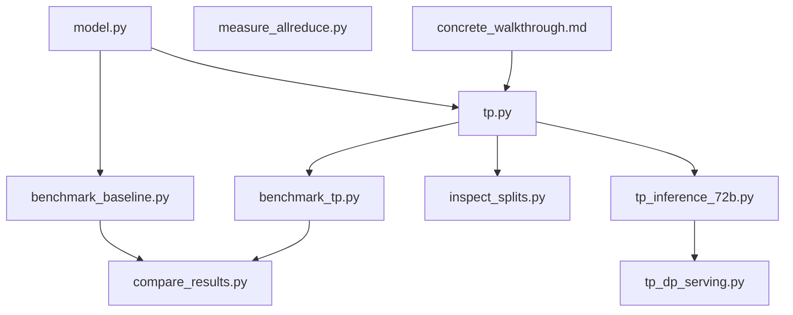

# Tensor Parallelism Mastery -- Study Guide

## Reading Order and Dependency Graph




---

## Phase 1: Foundations -- Understand the Model (Day 1)

### Read: `model.py`

**Goal:** Understand the standard (un-parallelized) GPT architecture that TP will split.

**How to read it:**

1. Start with the **constants** (lines 17-29). These define the model dimensions. Write them down on paper:
  - `D_MODEL=512`, `N_HEADS=8`, `D_HEAD=64`, `D_FF=2048`, `N_LAYERS=6`
  - Calculate: how many parameters does one attention block have? (4 weight matrices of 512x512 = 1,048,576 just for Q/K/V/O)
2. Read `**StandardAttention**` (lines 38-60). Trace the shapes through the forward pass on paper:
  - Input: `(B, T, 512)` -> Q/K/V projections -> reshape to `(B, T, 8, 64)` -> transpose to `(B, 8, T, 64)` -> attention -> back to `(B, T, 512)` -> W_o
3. Read `**StandardFFN**` (lines 63-70). Note: `512 -> 2048 -> 512`. This is the "expand then contract" pattern that TP exploits.
4. Read `**StandardGPT**` (lines 87-101). Note the three components that will NOT be split by TP: `tok_emb`, `pos_emb`, `ln_f`.

**Exercise:** On paper, draw a single transformer block showing every weight matrix with its shape. Mark which ones "expand" (output > input) and which "contract" (output < input).

### Read: `tutorials/vizuara/06-all-about-tensor-parallelism/tensor_parallelism_concrete_walkthrough.md`

**Goal:** Build numeric intuition before reading code.

**How to read it:**

- This uses a **tiny** model (d_model=4, d_ff=16, 2 heads, 2 GPUs) and walks through every single matrix multiplication with actual numbers.
- **Do NOT skim this.** Get a notebook and verify at least 2-3 of the hand computations (e.g., Section 5, Step 1: GPU-0 computes h[0] = x * W1).
- Pay special attention to:
  - Section 3: Column-parallel vs row-parallel -- understand the *shapes* of the slices
  - Section 4: Why col-parallel W1 + row-parallel W2 requires only ONE all-reduce
  - Section 6: The mathematical proof of why this works
  - Section 9: The full block diagram (2 all-reduces per block)

**Exercise:** Trace the FFN forward pass for GPU-1 (token 1) by hand. Verify your partial output matches what the walkthrough shows.

---

## Phase 2: The Core TP Implementation (Day 2)

### Read: `tp.py` -- in three passes

**Pass 1: Autograd primitives (lines 51-97)**

These are the most important 50 lines in the entire project. There are only 3 classes:


| Class                       | Forward    | Backward      | Used where                    |
| --------------------------- | ---------- | ------------- | ----------------------------- |
| `_CopyToParallelRegion`     | identity   | all-reduce    | Before column-parallel layers |
| `_ReduceFromParallelRegion` | all-reduce | identity      | After row-parallel layers     |
| `_AllGatherForTP`           | all-gather | chunk/scatter | For TP cross-entropy          |


**Key insight to internalize:** The forward/backward symmetry is not arbitrary. Column-parallel produces *independent* slices (no forward comm needed), but during backprop the gradient arrives split and must be summed. Row-parallel produces *partial sums* (must all-reduce in forward), but during backprop each GPU only needs its own gradient chunk.

**Exercise:** Draw the forward AND backward data flow for a single FFN (W1 col-parallel -> GELU -> W2 row-parallel). Label where each autograd function fires and what collective operation runs.

**Pass 2: Linear layers (lines 103-152)**

- `ColumnParallelLinear`: weight shape is `(d_out // N, d_in)` -- the OUTPUT is split. Note `_CopyToParallelRegion.apply(x)` before the matmul.
- `RowParallelLinear`: weight shape is `(d_out, d_in // N)` -- the INPUT is split. Note `_ReduceFromParallelRegion.apply(out)` after the matmul. Also note: bias is only on rank 0 (since all-reduce sums, adding bias on every rank would multiply it by N).

**Exercise:** If `D_MODEL=512`, `D_FF=2048`, `world_size=4`: what are the exact weight shapes for W1 and W2 on each GPU?

- W1 (col-parallel): `(512, 512)` -- each GPU has 512 of the 2048 output dims
- W2 (row-parallel): `(512, 512)` -- each GPU has 512 of the 2048 input dims

**Pass 3: Model assembly (lines 158-262)**

- `TPAttention`: Q/K/V are column-parallel (split heads). W_o is row-parallel. Note `n_heads_local = n_heads // ws`.
- `TPFFN`: W1 col-parallel, W2 row-parallel. Simplest possible TP pattern.
- `TPGPT`: `lm_head` is also column-parallel (splits vocab output across GPUs), which is why `tp_cross_entropy` needs `_AllGatherForTP` to reconstruct the full logits before computing loss.

**Exercise:** Count the total all-reduces per forward pass of the full TPGPT model. Answer: 2 per block x 6 blocks = 12, plus none for lm_head (it's col-parallel, no forward comm).

---

## Phase 3: Benchmarking and Analysis (Day 3)

### Run and read: `benchmark_baseline.py`

Run it first (`python benchmark_baseline.py`), then read the code. Note the measurement methodology:

- Warmup runs (lines 47-53) to fill CUDA caches
- `torch.cuda.reset_peak_memory_stats` after warmup
- `torch.cuda.synchronize()` around each timing section
- Separate forward/backward/step timing

### Run and read: `benchmark_tp.py`

Run it (`torchrun --nproc_per_node=2 benchmark_tp.py`). Compare with baseline:

- Note `dist.barrier()` before each timing iteration (all GPUs start together)
- Note `tp_cross_entropy` instead of plain `cross_entropy`
- Only rank 0 writes results

### Run and read: `compare_results.py`

Run it after both benchmarks. Study the output. Key questions to answer:

- Why is param reduction ~40% and not 50%? (LayerNorm + embeddings are replicated)
- Why is peak memory reduction only ~30%? (Activations for LN are full d_model)
- Why is efficiency only ~30%? (Model is too small -- all-reduce overhead dominates)

### Run and read: `inspect_splits.py`

This is the "aha" script. Run it and study the output table. Verify your Phase 2 exercise answers match the actual weight shapes reported.

### Run and read: `measure_allreduce.py`

This quantifies WHY TP efficiency is low for small models:

- Small all-reduce is latency-bound (~100us regardless of size)
- The matmul for this small model is only ~24us
- So communication (45us) exceeds compute (24us) -- 187% overhead
- For large models (d=4096+), compute dominates and TP becomes efficient

**Exercise:** Based on the all-reduce measurements, predict what would happen with D_MODEL=4096, D_FF=16384, N_LAYERS=32. Would TP efficiency improve? Why?

---

## Phase 4: Production TP (Day 4)

### Read: `tp_inference_72b.py`

**Key difference from Phase 2:** This uses PyTorch's built-in `torch.distributed.tensor.parallel` instead of from-scratch layers. Compare:


| From scratch (tp.py)                | Native PyTorch (tp_inference_72b.py)    |
| ----------------------------------- | --------------------------------------- |
| `ColumnParallelLinear(d_in, d_out)` | `ColwiseParallel()`                     |
| `RowParallelLinear(d_in, d_out)`    | `RowwiseParallel()`                     |
| Manual model rewrite                | `parallelize_module(layer, mesh, plan)` |


Study the TP plan (lines 89-103):

```
Attention: q_proj, k_proj, v_proj -> ColwiseParallel
           o_proj -> RowwiseParallel
MLP:       gate_proj, up_proj -> ColwiseParallel
           down_proj -> RowwiseParallel
```

This is the same Megatron-LM pattern you implemented by hand -- now applied to a real 72B model.

### Read: `tp_dp_serving.py`

The key concept: **2D device mesh**.

- `init_device_mesh("cuda", (n_replicas, TP_SIZE), mesh_dim_names=("dp", "tp"))`
- TP within a replica (fast NVLink), DP across replicas (independent)
- Each replica handles different requests concurrently
- Throughput scales linearly with replica count

**Exercise:** If you have 8 GPUs and a model that needs TP=2 minimum, what are your options? (Answer: TP=2 x DP=4, TP=4 x DP=2, TP=8 x DP=1). What tradeoff does each make?

---

## Phase 5: Mastery Exercises (Day 5+)

Once you've read everything, these exercises will cement your understanding:

1. **Modify `tp.py**` to support GQA (Grouped Query Attention) where n_kv_heads < n_heads. This is how real models like Llama and Qwen work.
2. **Add sequence parallelism** to `tp.py`. In the current code, LayerNorm and dropout operate on the full sequence on every GPU. Sequence parallelism splits these operations too, reducing activation memory further. This is the "TP + SP" combination.
3. **Scale up the model** in `model.py` (D_MODEL=2048, N_HEADS=16, D_FF=8192, N_LAYERS=12) and re-run benchmarks. Verify that TP efficiency improves dramatically.
4. **Deploy on K8s**: Write a training script that uses your from-scratch TP and deploy it using the `k8s/hpto_fsdp.yaml` template with a HyperPod PyTorchJob.
5. **Combine TP + FSDP**: Use TP within a node (8 GPUs) and FSDP across nodes. This is the real-world 5D parallelism pattern.

